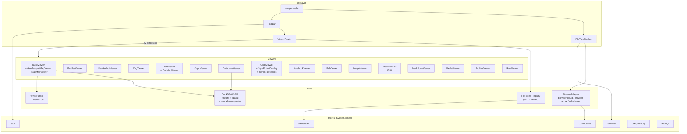

# Contributing to objex

## Setup

```bash
pnpm install
pnpm dev          # http://localhost:5173
```

## Build & Deploy

```bash
pnpm -w run build                       # dev build (base = /)
BASE_PATH=/objex pnpm -w run build      # production (base = /objex)
```

GitHub Actions deploys to GitHub Pages on push to `main` with `BASE_PATH=/objex`.

## Code Quality

```bash
pnpm -w run format        # Biome format (src/ + packages/)
pnpm -w run lint:fix       # Biome lint + autofix
pnpm -w run check          # svelte-check type checking
```

All three must pass before committing. Biome config: `biome.json`. Tabs, single quotes, semicolons, 100 char width.

## npm Packages

Two packages are published from this repo:

| Package | What | Build |
|---------|------|-------|
| `@walkthru-earth/objex` | Full Svelte 5 library (components + stores + utils) | `pnpm -w run package` |
| `@walkthru-earth/objex-utils` | Pure TS utilities (zero Svelte dependency) | `pnpm --filter @walkthru-earth/objex-utils run build` |

Publishing is automated via `.github/workflows/publish.yml` — create a GitHub Release to trigger.

## Stack

| Layer | Tech |
|-------|------|
| Framework | SvelteKit 2 + Svelte 5 (static adapter, CSR-only) |
| Styling | Tailwind CSS 4 + bits-ui (headless Svelte primitives) |
| Query engine | DuckDB-WASM (in-browser SQL, cancellable via `conn.send()` / `cancelSent()`) |
| Maps | MapLibre GL 5 + deck.gl 9 |
| Storage auth | aws4fetch (SigV4) / Azure SAS |
| Code quality | Biome + svelte-check |
| Package manager | pnpm 10 |

## Architecture



## Project Structure

```
src/
├── routes/              # Single-page app (SPA)
├── lib/
│   ├── components/
│   │   ├── viewers/     # 18+ file-type viewers
│   │   ├── browser/     # File tree, breadcrumbs, upload
│   │   ├── layout/      # Sidebar, tabs, status bar
│   │   ├── editor/      # CodeMirror SQL editor
│   │   ├── map/         # Shared map components
│   │   └── ui/          # Headless primitives (bits-ui)
│   ├── stores/          # Svelte 5 rune stores
│   ├── storage/         # Cloud adapters (S3, Azure, URL)
│   ├── query/           # DuckDB-WASM engine
│   ├── utils/           # WKB parser, GeoArrow, URL state
│   ├── i18n/            # Translations (en, ar)
│   └── file-icons/      # Extension → viewer/icon registry
packages/
└── objex-utils/         # Pure TS sub-package
docs/                    # Architecture & research docs
```

## Geospatial Pipeline

The TableViewer + GeoParquetMapViewer share a unified query pipeline:

### Stage 1: Metadata Detection (hyparquet fast path)

Before DuckDB-WASM finishes booting, hyparquet reads the Parquet footer via a single HTTP range request (~512 KB):

| What | How | Fallback |
|------|-----|----------|
| Row count | Sum of `row_groups[].num_rows` | DuckDB `parquet_file_metadata()` |
| Schema | `mapParquetType()` maps logical/physical types | DuckDB `DESCRIBE SELECT *` |
| GeoParquet metadata | Parse `"geo"` KV metadata key | DuckDB `parquet_kv_metadata()` |
| Legacy GeoParquet | Detect `schema_version` without `version` (geopandas <0.12) | -- |
| Native Parquet GEOMETRY | `logical_type.type === 'GEOMETRY'` (Format 2.11+) | `findGeoColumn()` heuristic |
| CRS | PROJJSON from `geo.columns[col].crs` | DuckDB `parquet_schema()` logical_type |
| Bbox | `geo.columns[col].bbox` → initial map bounds | -- |
| Geometry types | `geo.columns[col].geometry_types` → deck.gl layer hint | WKB type byte detection |

### Stage 2: Geometry Column Detection

Five-priority heuristic in `findGeoColumn()`:

1. Column type contains geo keyword (`GEOMETRY`, `POINT`, `POLYGON`, `LINESTRING`, etc.)
2. Well-known column name + binary type (`geometry`, `geom`, `wkb_geometry`, `the_geom`, `shape`)
3. Well-known column name, any type
4. Name contains geo hint (`geom`, `wkt`, `shape`) + binary type
5. Name contains geo hint, any type

### Stage 3: DuckDB GeoParquet Conversion Bypass

`enable_geoparquet_conversion = false` globally — prevents DuckDB from rejecting legacy GeoParquet files (missing `"version"` field). All geometry columns read as `BLOB`.

| File type | DuckDB type | SQL path |
|-----------|-------------|----------|
| GeoParquet (WGS84) | BLOB | `"geometry" AS __wkb` (zero-copy) |
| GeoParquet (non-WGS84) | BLOB | `ST_AsWKB(ST_Transform(ST_GeomFromWKB("geometry"), ...))` |
| Legacy GeoParquet v0.x | BLOB | Same as above |
| GeoJSON column | VARCHAR | `ST_AsWKB(ST_GeomFromGeoJSON("geometry"))` |
| Non-geo Parquet / CSV | -- | `SELECT * FROM source` |

### Stage 4: CRS Detection & Reprojection

1. **GeoParquet `"geo"` KV metadata** — PROJJSON `crs.id.authority === "EPSG"`
2. **Native Parquet 2.11 `logical_type`** — `GeometryType(crs=srid:NNNN)`
3. **Fallback** — assume WGS84 (EPSG:4326)

Non-WGS84 sources reprojected with `ST_Transform(..., always_xy := true)`.

### Stage 5: WKB Extraction & Map Rendering

1. **Table query** — `SELECT * EXCLUDE("geometry"), wkb_expr AS __wkb FROM source LIMIT N OFFSET M`
2. **Map query** — wraps user SQL with `__wkb` and `__geom_type` columns
3. **GeoArrow conversion** — `buildGeoArrowTables()` parses WKB, splits by geometry type
4. **deck.gl rendering** — one GeoArrow layer per geometry type

### Query Cancellation

- **Graceful** — `conn.cancelSent()` between Arrow batches
- **Force** — `db.terminate()` kills worker (auto-reinitializes)
- **Tab close** — cleanup cancels in-flight handle

### Near-Zero-Copy Extraction

- **Numeric columns** — `.toArray()` zero-copy typed array view
- **WKB geometry** — `Uint8Array` used directly
- **WGS84 pass-through** — BLOB renamed to `__wkb` without conversion
- **Binary columns** — skipped during map attribute extraction

## Supported Formats

| Category | Formats | How |
|----------|---------|-----|
| **Tabular** | Parquet, CSV, TSV, JSONL, NDJSON | DuckDB SQL |
| **Geo vector** | GeoParquet, GeoJSON, Shapefile, GeoPackage, FlatGeobuf | DuckDB + MapLibre / deck.gl |
| **Geo raster** | COG, PMTiles (vector + raster), Zarr v2/v3 | geotiff.js / MapLibre / deck.gl |
| **Point cloud** | COPC, LAZ, LAS | viewer.copc.io iframe |
| **Notebooks** | Jupyter (.ipynb), marimo (.py) | notebookjs / marimo WASM |
| **Code** | 30+ languages | Shiki |
| **Documents** | Markdown, PDF, text, logs | Milkdown / pdf.js |
| **Media** | Images, video, audio | Native elements |
| **3D** | GLB, glTF, OBJ, STL, FBX | Babylon.js |
| **Archives** | ZIP, TAR, GZ, 7Z, RAR | zip.js streaming |
| **Database** | DuckDB, SQLite | DuckDB-WASM |
| **Raw** | Any (fallback) | Hex dump |

## Viewers & Sources

### Data Viewers

| Viewer | Formats | Powered by |
|--------|---------|------------|
| **TableViewer** | Parquet, CSV, TSV, JSONL, GeoJSON, Shapefile, GeoPackage | DuckDB-WASM, Apache Arrow, CodeMirror |
| **DatabaseViewer** | DuckDB, SQLite | DuckDB-WASM |

### Map Viewers

| Viewer | Formats | Powered by |
|--------|---------|------------|
| **GeoParquetMapViewer** | GeoParquet, GeoJSON, Shapefile, GeoPackage | deck.gl, @geoarrow/deck.gl-layers, MapLibre GL, custom WKB parser |
| **PmtilesViewer** | PMTiles (vector + raster) | pmtiles, MapLibre GL |
| **FlatGeobufViewer** | FlatGeobuf | flatgeobuf, deck.gl, MapLibre GL |
| **CogViewer** | Cloud Optimized GeoTIFF | geotiff.js v3, @developmentseed/deck.gl-geotiff, proj4js |
| **ZarrViewer** | Zarr v2/v3 | zarrita, @carbonplan/zarr-layer, MapLibre GL |
| **StacMapViewer** | STAC GeoParquet | stac-map iframe |
| **CopcViewer** | COPC, LAZ, LAS | viewer.copc.io iframe |

### Smart Content Detection

CodeViewer auto-detects: marimo notebooks, MapLibre styles (Maputnik), TileJSON, STAC catalogs, Kepler.gl configs.

## Storage Providers

Works with any S3-compatible API: **AWS S3**, **Cloudflare R2**, **Google GCS**, **Azure Blob**, **MinIO**, **Wasabi**, **DigitalOcean Spaces**, **Storj**. Also supports direct HTTPS URLs.

Credentials stay in-memory (never persisted to disk). Connection configs (without secrets) saved to localStorage.

## i18n

English and Arabic with automatic RTL layout. Translation: `t(key, params?)` with `{param}` interpolation.

## URL Sharing

```
https://walkthru.earth/objex/?url=<storage-url>#<view>
```

Hashes: `#table`, `#map`, `#query`, `#stac`, `#inspect`, `#code`, `#maputnik`, `#stac-browser`, `#kepler`, `#marimo`.

## Performance Guidelines

See CLAUDE.md for the full do's/don'ts list that applies to all code changes.

## Viewer Checklist

When adding a new viewer component:

- [ ] `cleanup()` function that nulls all heavy state
- [ ] `$effect` with `tabResources.register(tab.id, cleanup)` + return unregister
- [ ] `onDestroy(cleanup)` as safety net
- [ ] `AbortController` in load `$effect`, signal passed to `adapter.read()`
- [ ] `$effect` return aborts the controller
- [ ] Large data arrays use `$state.raw`
- [ ] Generation counter or abort check after every `await`
- [ ] `URL.revokeObjectURL()` for any blob URLs created
- [ ] WebGL/canvas resources explicitly disposed
- [ ] No `document.addEventListener` without matching removal
- [ ] Cancel query handles in cleanup
- [ ] Clear any `setTimeout` timers in cleanup

## Reference Docs

| Doc | Content |
|-----|---------|
| `docs/cog-viewer-architecture.md` | COG viewer dual-pipeline design, monkey-patch strategy |
| `docs/arrow-table-grid-research.md` | TableGrid rewrite plan, quak analysis |
| `docs/duckdb-v1.5-geometry-upgrade.md` | DuckDB v1.5 geometry/CRS changes, migration plan |
| `docs/svelte5-performance-guide.md` | Svelte 5 reactivity patterns, $state.raw, $effect |
| `docs/performance-audit.md` | Viewer-by-viewer memory/perf audit |
| `docs/performance-optimization.md` | Overall optimization strategies |
| `docs/duckdb-wasm-concurrency-research.md` | DuckDB worker threading model |

## License

[CC BY 4.0](https://creativecommons.org/licenses/by/4.0/) -- hi@walkthru.earth
