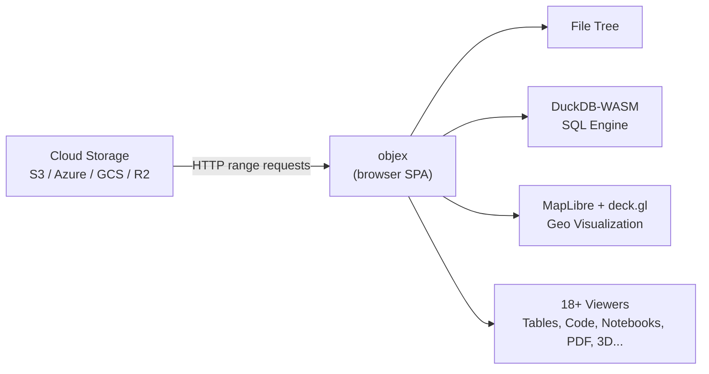

# objex

Cloud storage explorer that runs entirely in the browser. Connect to S3, Azure, GCS, R2, MinIO -- browse files, query data with SQL, and visualize geospatial formats on interactive maps. No backend required.



## Features

- **Browse** cloud storage (S3, GCS, Azure, R2, MinIO, Wasabi, Storj, direct URLs)
- **Query** Parquet, CSV, JSONL with SQL (DuckDB-WASM, cancellable queries)
- **Visualize** GeoParquet, GeoJSON, COG, PMTiles, FlatGeobuf, Zarr on maps (MapLibre + deck.gl)
- **View** 100+ file formats: code (30+ languages), Jupyter notebooks, PDF, 3D models, archives, media
- **Share** via URL -- `?url=<storage-url>#<view>` encodes full viewer state
- **i18n** -- English + Arabic with automatic RTL layout
- **Zero backend** -- everything runs client-side

## Supported Formats

| Category | Formats |
|----------|---------|
| Tabular | Parquet, CSV, TSV, JSONL, NDJSON |
| Geo vector | GeoParquet, GeoJSON, Shapefile, GeoPackage, FlatGeobuf |
| Geo raster | COG, PMTiles, Zarr v2/v3 |
| Point cloud | COPC, LAZ, LAS |
| Notebooks | Jupyter (.ipynb), marimo |
| Code | 30+ languages (Python, TS, Rust, Go, SQL...) |
| Documents | Markdown, PDF, text, logs |
| Media | Images, video, audio |
| 3D | GLB, glTF, OBJ, STL, FBX |
| Archives | ZIP, TAR, GZ, 7Z, RAR |
| Database | DuckDB, SQLite |

## npm Packages

Two packages are published for downstream use:

### `@walkthru-earth/objex` -- Full Svelte 5 Library

Components, stores, and utilities for building geospatial storage explorers.

```bash
npm install @walkthru-earth/objex
```

```ts
import { parseStorageUrl, formatFileSize } from '@walkthru-earth/objex';
import { UrlAdapter } from '@walkthru-earth/objex/storage';
import { parseWKB } from '@walkthru-earth/objex/utils/wkb';
import { buildGeoArrowTables } from '@walkthru-earth/objex/utils/geoarrow';
import { readParquetMetadata } from '@walkthru-earth/objex/utils/parquet-metadata';
import { getFileTypeInfo } from '@walkthru-earth/objex/file-icons';
```

Requires `svelte ^5` and `@sveltejs/kit ^2` as peer dependencies. Heavy deps (DuckDB, deck.gl, MapLibre, Arrow, hyparquet) are optional peers -- only install what you need.

### `@walkthru-earth/objex-utils` -- Pure TypeScript Utilities

Zero Svelte dependency. Works with any JS framework or Node.js.

```bash
npm install @walkthru-earth/objex-utils
```

```ts
import {
  parseStorageUrl,
  parseWKB,
  buildGeoArrowTables,
  readParquetMetadata,
  getFileTypeInfo,
  formatFileSize,
  generateHexDump,
  classifyType
} from '@walkthru-earth/objex-utils';
```

### Exports

| Export path | What |
|-------------|------|
| `@walkthru-earth/objex` | All types, utils, storage, query engine |
| `./storage` | `StorageAdapter`, `UrlAdapter` |
| `./query` | `QueryEngine`, `QueryCancelledError` |
| `./utils/wkb` | `parseWKB`, `toBinary`, `findGeoColumn` |
| `./utils/geoarrow` | `buildGeoArrowTables`, `normalizeGeomType` |
| `./utils/storage-url` | `parseStorageUrl`, `looksLikeUrl` |
| `./utils/parquet-metadata` | `readParquetMetadata`, `extractEpsgFromGeoMeta` |
| `./utils/format` | `formatFileSize`, `formatDate`, `getFileExtension` |
| `./utils/hex` | `generateHexDump` |
| `./utils/column-types` | `classifyType`, `typeColor`, `typeBadgeClass` |
| `./file-icons` | `getFileTypeInfo`, `getDuckDbReadFn`, `getViewerKind` |
| `./types` | `FileEntry`, `Connection`, `Tab`, `WriteResult`, `Theme` |

## Quick Start (Development)

```bash
pnpm install
pnpm dev          # http://localhost:5173
```

## Contributing

See [CONTRIBUTING.md](CONTRIBUTING.md) for development setup, architecture, geospatial pipeline docs, and viewer checklist.

## License

[CC BY 4.0](https://creativecommons.org/licenses/by/4.0/) -- hi@walkthru.earth
