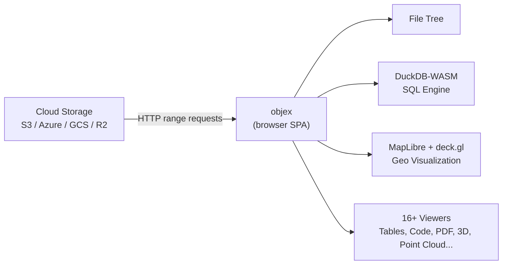
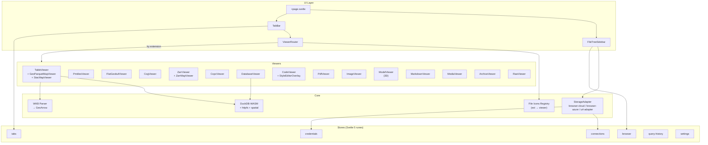

# objex

Cloud storage explorer that runs entirely in the browser. Connect to S3, Azure, GCS, R2, MinIO — browse files, query data with SQL, and visualize geospatial formats on interactive maps. No backend required.



## Stack

| Layer | Tech |
|-------|------|
| Framework | SvelteKit 2 + Svelte 5 (static adapter, CSR-only) |
| Styling | Tailwind CSS 4 + bits-ui (headless Svelte primitives) |
| Query engine | DuckDB-WASM (in-browser SQL) |
| Maps | MapLibre GL 5 + deck.gl 9 |
| Storage auth | aws4fetch (SigV4) / Azure SAS |
| Code quality | Biome + svelte-check |
| Package manager | pnpm 10 |

## Architecture



## Supported Formats

| Category | Formats | How |
|----------|---------|-----|
| **Tabular** | Parquet, CSV, TSV, JSONL, NDJSON | DuckDB SQL queries |
| **Geo vector** | GeoParquet, GeoJSON, Shapefile, GeoPackage, FlatGeobuf | DuckDB + MapLibre / deck.gl |
| **Geo raster** | Cloud Optimized GeoTIFF, PMTiles (vector + raster), Zarr v2/v3 | geotiff.js / MapLibre / deck.gl |
| **Point cloud** | COPC, LAZ, LAS | [viewer.copc.io](https://viewer.copc.io) (iframe) |
| **Code** | 30+ languages (Python, TS, Rust, Go, SQL, etc.) | Shiki syntax highlighting |
| **Config** | JSON, XML, YAML, TOML, INI, .env | Shiki syntax highlighting |
| **Documents** | Markdown, PDF, plain text, logs | Milkdown / pdf.js |
| **Media** | PNG, JPEG, GIF, WebP, AVIF, SVG, BMP, ICO | Native `` |
| **Video** | MP4, WebM, MOV, AVI, MKV | Native `<video>` |
| **Audio** | MP3, WAV, OGG, FLAC, AAC | Native `<audio>` |
| **3D** | GLB, glTF, OBJ, STL, FBX | Babylon.js |
| **Archives** | ZIP, TAR, GZ, TGZ, 7Z, RAR, BZ2 | zip.js (progressive streaming) |
| **Database** | DuckDB, SQLite | DuckDB-WASM |
| **Raw** | Any (fallback) | Hex dump |

## Viewers & Sources

### Data Viewers

| Viewer | Formats | Powered by | URL Hash |
|--------|---------|------------|----------|
| **TableViewer** | Parquet, CSV, TSV, JSONL, GeoJSON, Shapefile, GeoPackage | [DuckDB-WASM](https://github.com/duckdb/duckdb-wasm), [Apache Arrow](https://github.com/apache/arrow), [CodeMirror](https://codemirror.net) (SQL editor) | `#table` |
| **DatabaseViewer** | DuckDB, SQLite | [DuckDB-WASM](https://github.com/duckdb/duckdb-wasm) | — |

### Map Viewers

| Viewer | Formats | Powered by | URL Hash |
|--------|---------|------------|----------|
| **GeoParquetMapViewer** | GeoParquet, GeoJSON, Shapefile, GeoPackage (any geo-detected tabular format) | [deck.gl](https://deck.gl), [@geoarrow/deck.gl-layers](https://github.com/geoarrow/deck.gl-layers), [MapLibre GL](https://maplibre.org), custom WKB parser | `#map` |
| **PmtilesViewer** | PMTiles (vector + raster) | [pmtiles](https://github.com/protomaps/PMTiles), [MapLibre GL](https://maplibre.org) | — |
| **FlatGeobufViewer** | FlatGeobuf | [flatgeobuf](https://github.com/flatgeobuf/flatgeobuf), [deck.gl](https://deck.gl), [MapLibre GL](https://maplibre.org) | — |
| **CogViewer** | Cloud Optimized GeoTIFF | [geotiff.js](https://github.com/geotiffjs/geotiff.js) v3, [@developmentseed/deck.gl-geotiff](https://github.com/developmentseed/deck.gl-geotiff), [proj4js](https://github.com/proj4js/proj4js) | — |
| **ZarrViewer** | Zarr v2/v3 | [zarrita](https://github.com/manzt/zarrita.js), [@carbonplan/zarr-layer](https://github.com/carbonplan/maps), [MapLibre GL](https://maplibre.org) | `#map`, `#inspect` |
| **StacMapViewer** | STAC GeoParquet | [stac-map](https://developmentseed.org/stac-map) by Development Seed (iframe) | `#stac` |
| **CopcViewer** | COPC, LAZ, LAS | [viewer.copc.io](https://viewer.copc.io) (iframe) | — |

### Document & Code Viewers

| Viewer | Formats | Powered by | URL Hash |
|--------|---------|------------|----------|
| **CodeViewer** | 30+ languages (JSON, Python, TS, Rust, Go, SQL, etc.) | [Shiki](https://github.com/shikijs/shiki) | `#code` |
| **MarkdownViewer** | Markdown | [Marked](https://github.com/markedjs/marked), [Milkdown](https://milkdown.dev), [Mermaid](https://mermaid.js.org) | — |
| **PdfViewer** | PDF | [PDF.js](https://mozilla.github.io/pdf.js/) | — |

### Media Viewers

| Viewer | Formats | Powered by | URL Hash |
|--------|---------|------------|----------|
| **ImageViewer** | PNG, JPEG, GIF, WebP, AVIF, SVG, BMP, ICO | Native `` with CSS transforms | — |
| **MediaViewer** | MP4, WebM, MOV, AVI, MKV, MP3, WAV, OGG, FLAC, AAC | Native `<video>` / `<audio>` | — |
| **ModelViewer** | GLB, glTF, OBJ, STL, FBX | [Babylon.js](https://www.babylonjs.com) | — |

### Other Viewers

| Viewer | Formats | Powered by | URL Hash |
|--------|---------|------------|----------|
| **ArchiveViewer** | ZIP, TAR, GZ, TGZ, 7Z, RAR, BZ2 | [zip.js](https://github.com/nicbarker/zip.js) (streaming + progressive chunking) | — |
| **RawViewer** | Any (fallback) | Custom hex dump | — |

### Smart JSON Detection

The CodeViewer auto-detects special JSON files and offers contextual actions:

| JSON Kind | Detection | Action | URL Hash |
|-----------|-----------|--------|----------|
| **MapLibre Style** | `version === 8` + `sources` + `layers` | "Edit Style" — opens [Maputnik](https://maplibre.org/maputnik/) (iframe) | `#maputnik` |
| **TileJSON** | `tilejson` + `tiles` | Badge only | — |
| **STAC Catalog** | `type === "Catalog"` + `stac_version` | "Browse" — opens [STAC Browser](https://radiantearth.github.io/stac-browser/) (iframe) | `#stac-browser` |
| **STAC Collection** | `type === "Collection"` + `stac_version` | "Browse" — opens [STAC Browser](https://radiantearth.github.io/stac-browser/) (iframe) | `#stac-browser` |
| **STAC Item** | `type === "Feature"` + `stac_version` | "Browse" — opens [STAC Browser](https://radiantearth.github.io/stac-browser/) (iframe) | `#stac-browser` |
| **Kepler.gl** | `info.app === "kepler.gl"` + `config` | "Open Map" — opens [Kepler.gl](https://kepler.gl/demo) (iframe) | `#kepler` |

### Basemaps & External Services

| Service | Source | Used by |
|---------|--------|---------|
| Basemap (light) | [CARTO Positron](https://basemaps.cartocdn.com/gl/positron-gl-style/style.json) | All map viewers |
| Basemap (dark) | [CARTO Dark Matter](https://basemaps.cartocdn.com/gl/dark-matter-gl-style/style.json) | All map viewers |
| RTL text plugin | [@mapbox/mapbox-gl-rtl-text](https://unpkg.com/@mapbox/mapbox-gl-rtl-text@0.3.0/) | MapLibre GL |
| STAC Map | [Development Seed stac-map](https://developmentseed.org/stac-map) | StacMapViewer |
| STAC Browser | [Radiant Earth STAC Browser](https://radiantearth.github.io/stac-browser/) | CodeViewer |
| Maputnik | [MapLibre Maputnik](https://maplibre.org/maputnik/) | CodeViewer |
| Kepler.gl | [Kepler.gl Demo](https://kepler.gl/demo) | CodeViewer |
| COPC Viewer | [viewer.copc.io](https://viewer.copc.io) | CopcViewer |

## Geospatial Pipeline

The TableViewer + GeoParquetMapViewer share a unified query pipeline:

1. **Schema detection** — DuckDB reads Parquet metadata (cheap range requests, no full download)
2. **Geometry column detection** — scans schema for known geo types (GEOMETRY, WKB_BLOB, BLOB, JSON geo columns)
3. **CRS detection** — reads GeoParquet `"geo"` KV metadata → native Parquet 2.11 logical_type → fallback WGS84
4. **CRS reprojection** — `ST_Transform(..., always_xy := true)` for non-WGS84 sources
5. **WKB extraction** — `ST_AsWKB()` adds a `__wkb` column alongside table data
6. **GeoArrow rendering** — `buildGeoArrowTables()` splits mixed WKBs by geometry type → one deck.gl layer per type (Point, LineString, Polygon, Multi*)

## URL Sharing

URLs encode the full viewer state for shareable links:

```
https://walkthru.earth/objex/?url=<storage-url>#<view>
```

| Hash | View |
|------|------|
| `#table` | Table / SQL query |
| `#map` | Map visualization |
| `#query` | Custom SQL mode |
| `#stac` | STAC map viewer |
| `#inspect` | Zarr variable inspector |
| `#code` | Code / syntax view |
| `#maputnik` | Maputnik style editor |
| `#stac-browser` | STAC Browser |
| `#kepler` | Kepler.gl map |

## i18n

Supports **English** and **Arabic** with automatic RTL layout. Translation function: `t(key, params?)` with `{param}` placeholder interpolation.

## Quick Start

```bash
pnpm install
pnpm dev          # http://localhost:5173
```

## Build & Deploy

```bash
pnpm build                       # dev build (base = /)
BASE_PATH=/objex pnpm build      # production (base = /objex)
```

GitHub Actions deploys to GitHub Pages on push to `main`. The workflow sets `BASE_PATH=/objex` so the app is served at `https://walkthru.earth/objex/`.

## Project Structure

```
src/
├── routes/              # Single-page app (SPA)
├── lib/
│   ├── components/
│   │   ├── viewers/     # 16+ file-type viewers
│   │   ├── browser/     # File tree, breadcrumbs, upload
│   │   ├── layout/      # Sidebar, tabs, status bar
│   │   ├── editor/      # CodeMirror SQL editor
│   │   ├── map/         # Shared map components
│   │   └── ui/          # Headless primitives (bits-ui)
│   ├── stores/          # Svelte 5 rune stores
│   ├── storage/         # Cloud adapters (S3, Azure, URL)
│   ├── query/           # DuckDB-WASM engine
│   ├── utils/           # WKB parser, GeoArrow, URL state, archive streaming
│   ├── i18n/            # Translations (en, ar)
│   └── file-icons/      # Extension → viewer/icon registry
```

## Storage Providers

Works with any S3-compatible API: **AWS S3**, **Cloudflare R2**, **Google GCS**, **Azure Blob**, **MinIO**, **Wasabi**, **DigitalOcean Spaces**, **Storj**. Also supports direct HTTPS URLs (no auth).

Credentials stay in-memory (never persisted to disk). Connection configs (without secrets) saved to localStorage.

## License

[CC BY 4.0](https://creativecommons.org/licenses/by/4.0/) — hi@walkthru.earth
