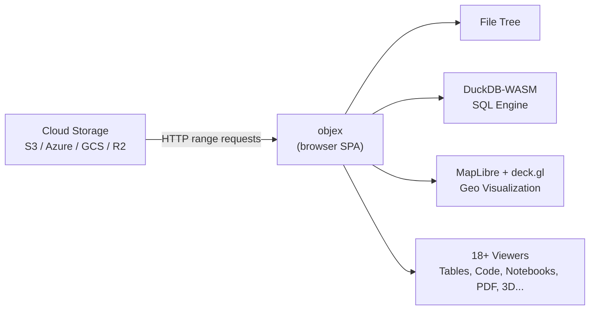

# objex

[](https://www.npmjs.com/package/@walkthru-earth/objex)
[](https://www.npmjs.com/package/@walkthru-earth/objex-utils)
[](https://github.com/walkthru-earth/objex/actions/workflows/ci.yml)
[](https://creativecommons.org/licenses/by/4.0/)

Cloud storage explorer that runs entirely in the browser. Connect to S3, Azure, GCS, R2, MinIO - browse files, query data with SQL, and visualize geospatial formats on interactive maps. No backend required.


```mermaid
graph LR
    Cloud["Cloud Storage<br/>S3 / Azure / GCS / R2"] -->|HTTP range requests| App["objex<br/>(browser SPA)"]
    App --> Browse[File Tree]
    App --> Query["DuckDB-WASM<br/>SQL Engine"]
    App --> Map["MapLibre + deck.gl<br/>Geo Visualization"]
    App --> View["18+ Viewers<br/>Tables, Code, Notebooks, PDF, 3D..."]
```

## Features

- **Browse** cloud storage (S3, GCS, Azure, R2, B2, DigitalOcean, Wasabi, Storj, Hetzner, Contabo, Linode, OVHcloud, MinIO, direct URLs)
- **Query** Parquet, CSV, JSONL with SQL (DuckDB-WASM, cancellable queries)
- **Visualize** GeoParquet, GeoJSON, COG, PMTiles, FlatGeobuf, Zarr (incl. GeoZarr), STAC catalogs, and stac-geoparquet on maps (MapLibre + deck.gl)
- **View** 100+ file formats: code (30+ languages), Jupyter notebooks, PDF, 3D models, archives, media
- **Share** via URL - `?url=<storage-url>#<view>` encodes full viewer state
- **Configure** without a rebuild - bundled `config.json` (or remote `?config=<url>`) sets defaults, basemaps, and seed connections, with an in-app settings panel
- **i18n** - English + Arabic with automatic RTL layout
- **Zero backend** - everything runs client-side

## Supported Formats

| Category | Formats |
|----------|---------|
| Tabular | Parquet, CSV, TSV, JSONL, NDJSON |
| Geo vector | GeoParquet, GeoJSON, Shapefile, GeoPackage, FlatGeobuf |
| Geo raster | COG, PMTiles, Zarr v2/v3, GeoZarr |
| Geo catalog | STAC Item / Collection / Catalog / FeatureCollection (JSON), stac-geoparquet |
| Point cloud | COPC, LAZ, LAS |
| Notebooks | Jupyter (.ipynb), marimo |
| Code | 30+ languages (Python, TS, Rust, Go, SQL...) |
| Documents | Markdown, PDF, text, logs |
| Media | Images, video, audio |
| 3D | GLB, glTF, OBJ, STL, FBX |
| Archives | ZIP, TAR, GZ, 7Z, RAR |
| Database | DuckDB, SQLite |

## npm Packages

Two packages are published for downstream use:

### `@walkthru-earth/objex` - Full Svelte 5 Library

Components, stores, and utilities for building geospatial storage explorers.

```bash
npm install @walkthru-earth/objex
```

```ts
import { parseStorageUrl, formatFileSize } from '@walkthru-earth/objex';
import { UrlAdapter } from '@walkthru-earth/objex/storage';
import { getFileTypeInfo } from '@walkthru-earth/objex/file-icons';
```

Requires `svelte ^5` and `@sveltejs/kit ^2` as peer dependencies. Heavy deps (DuckDB, deck.gl, MapLibre, Arrow, hyparquet, hyparquet-compressors, yaml) are optional peers - only install what you need.

### `@walkthru-earth/objex-utils` - Pure TypeScript Utilities

Zero Svelte dependency. Works with any JS framework or Node.js.

```bash
npm install @walkthru-earth/objex-utils
```

```ts
import {
  parseStorageUrl,
  parseWKB,
  buildGeoArrowTables,
  readParquetMetadata,
  isStacGeoparquetSchema,
  stacRowToItem,
  getFileTypeInfo,
  formatFileSize,
  generateHexDump,
  classifyType
} from '@walkthru-earth/objex-utils';
```

Full per-module reference docs: [`packages/objex-utils/docs/`](packages/objex-utils/docs/README.md).

### Exports

| Export path | What |
|-------------|------|
| `@walkthru-earth/objex` | All types, pure utils, storage, query engine |
| `./storage` | `StorageAdapter`, `UrlAdapter` |
| `./query` | `QueryEngine`, `QueryCancelledError` |
| `./file-icons` | `getFileTypeInfo`, `getDuckDbReadFn`, `getViewerKind` |
| `./types` | `FileEntry`, `Connection`, `Tab`, `WriteResult`, `Theme` |

The pure utilities live in `@walkthru-earth/objex-utils` and are also re-exported from the package root, so `parseStorageUrl`, `parseWKB`, `buildGeoArrowTables`, `readParquetMetadata`, `formatFileSize`, `generateHexDump`, `classifyType`, and the rest are importable straight from `@walkthru-earth/objex`. The root export also includes `copyToClipboard`, `handleLoadError`, the stac-geoparquet helpers (`isStacGeoparquetSchema`, `stacRowToItem`, `flattenStacBbox`, `pickStacPrimaryAsset`, `resolveStacAssetHref`), and shared constants (`WGS84_CODES`, `STORAGE_KEYS`, `DEFAULT_TARGET_CRS`, etc.).

## Configuration

objex reads a bundled `static/config.json` at startup, so a host can customize the app without rebuilding. Pass `?config=<url>` to load a remote config that overrides the bundled one.

`config.json` sets the default theme and language, query and mosaic row limits, the basemap list with a per-theme default basemap, and seed connections that load on first visit. The `ui` block toggles whether the connection rail, file tree, and settings panel are shown.

Several of these are also reachable as query params, handy for embedding and deep links.

| Param | Effect |
|-------|--------|
| `?config=<url>` | Load a remote `config.json` instead of the bundled one |
| `?panel=settings` | Open the settings panel on load |
| `?rail=hide` / `?rail=show` | Hide or show the connection rail |
| `?tree=hide` / `?tree=show` | Hide or show the file tree |

Users can change theme, language, query limit, and basemap from the in-app settings panel (gear icon). Their changes persist locally and take precedence over config defaults, while settings they never touched keep following the config.

## Quick Start (Development)

```bash
pnpm install
pnpm dev          # http://localhost:5173
```

## Contributing

See [CONTRIBUTING.md](CONTRIBUTING.md) for development setup, architecture, geospatial pipeline docs, and viewer checklist.

## License

[CC BY 4.0](https://creativecommons.org/licenses/by/4.0/) - hi@walkthru.earth
