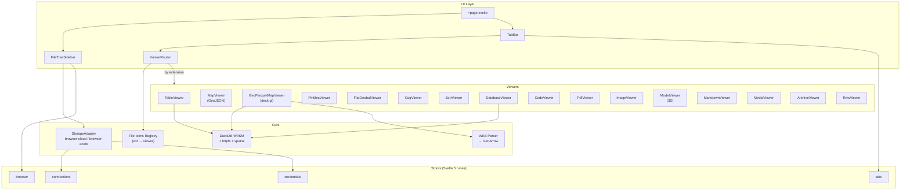

# objex

> **Early development** — not everything listed below is fully working yet. Expect breaking changes.

Cloud storage explorer that runs entirely in the browser. Connect to S3, Azure, GCS, R2, MinIO — browse files, query data with SQL, and visualize geospatial formats on interactive maps. No backend required.


## Stack

| Layer | Tech |
|-------|------|
| Framework | SvelteKit 5 (static adapter, CSR-only) |
| Styling | TailwindCSS 4 + Bits UI |
| Query engine | DuckDB-WASM (in-browser SQL) |
| Maps | MapLibre GL + deck.gl |
| Storage auth | aws4fetch (SigV4) / Azure SAS |
| Linting | Biome |
| Package manager | pnpm |

## Architecture



## Supported Formats

| Category | Formats | How |
|----------|---------|-----|
| **Tabular** | Parquet, CSV, TSV, JSON, JSONL, Arrow, Feather | DuckDB SQL queries |
| **Geo vector** | GeoParquet, GeoJSON, Shapefile, GeoPackage, FlatGeobuf | MapLibre / deck.gl |
| **Geo raster** | PMTiles (vector+raster), Cloud Optimized GeoTIFF, Zarr | MapLibre / deck.gl |
| **Code** | 30+ languages (Python, TS, Rust, Go, SQL, etc.) | Shiki syntax highlight |
| **Documents** | Markdown, PDF, plain text | Milkdown / pdf.js |
| **Media** | PNG, JPEG, GIF, WebP, SVG, MP4, WebM, MP3, WAV | Native / OpenSeadragon |
| **3D** | GLB, glTF, OBJ, STL, FBX | Babylon.js |
| **Archives** | ZIP, TAR, GZIP | zip.js |
| **Database** | DuckDB, SQLite | DuckDB-WASM |

## Quick Start

```bash
pnpm install
pnpm dev          # http://localhost:5173
```

## Build & Deploy

```bash
pnpm build                       # dev build (base = /)
BASE_PATH=/objex pnpm build      # production (base = /objex)
```

GitHub Actions deploys to GitHub Pages on push to `main`. The workflow sets `BASE_PATH=/objex` so the app is served at `https://walkthru.earth/objex/`.

## Project Structure

```
src/
├── routes/              # Single-page app (SPA)
├── lib/
│   ├── components/
│   │   ├── viewers/     # 20+ file-type viewers
│   │   ├── browser/     # File tree, breadcrumbs, upload
│   │   ├── layout/      # Sidebar, tabs, status bar
│   │   ├── editor/      # CodeMirror SQL editor
│   │   └── ui/          # Headless primitives (bits-ui)
│   ├── stores/          # Svelte 5 rune stores
│   ├── storage/         # Cloud adapters (S3, Azure)
│   ├── query/           # DuckDB-WASM engine
│   ├── utils/           # WKB parser, URL builder, etc.
│   └── file-icons/      # Extension → viewer/icon registry
```

## Storage Providers

Works with any S3-compatible API: **AWS S3**, **Cloudflare R2**, **Google GCS**, **Azure Blob**, **MinIO**, **Wasabi**, **DigitalOcean Spaces**, **Storj**.

Credentials stay in-memory (never persisted to disk). Connections config (without secrets) saved to localStorage.

## License

[CC BY 4.0](https://creativecommons.org/licenses/by/4.0/) — hi@walkthru.earth
