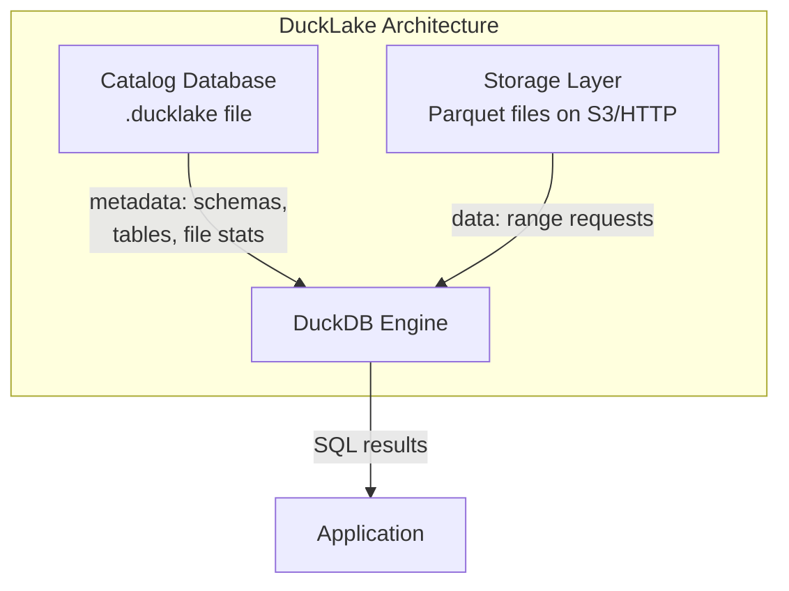
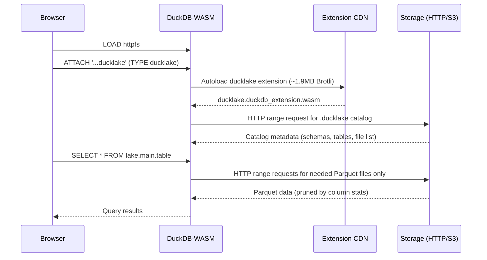
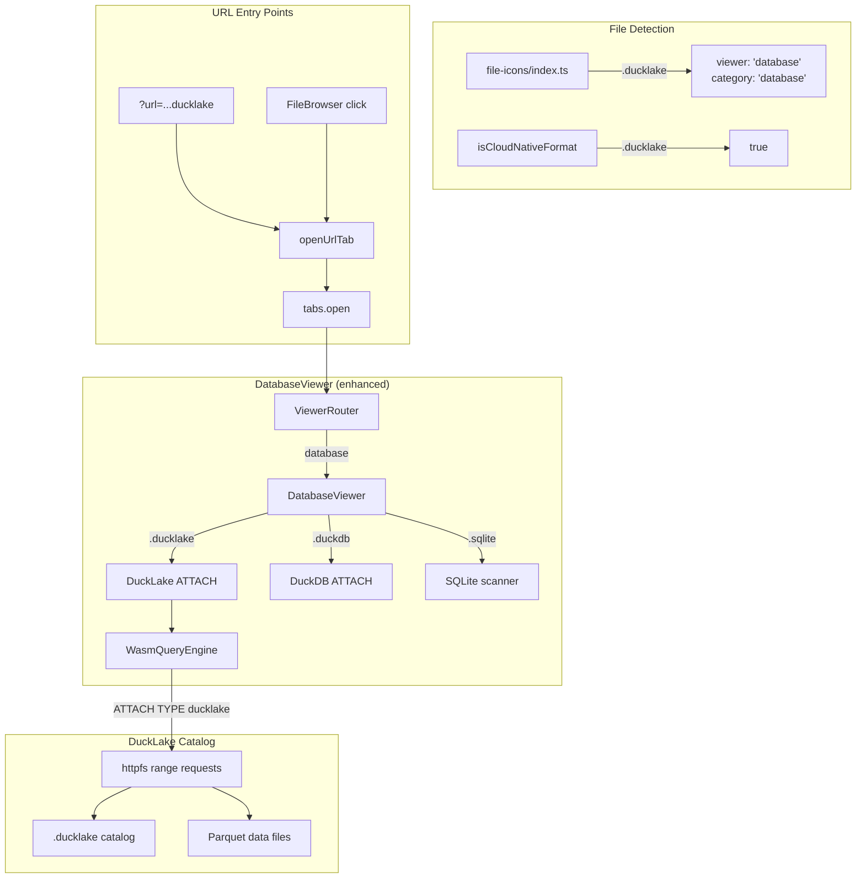

# DuckLake WASM Support

Research and implementation plan for integrating DuckLake with DuckDB-WASM in objex.

**Date**: 2026-04-05
**Status update (2026-04-20)**: SHIPPED. `@duckdb/duckdb-wasm@1.33.1-dev53.0` attaches DuckLake 1.0 catalogs (storage v68) end-to-end. `DatabaseViewer.svelte` auto-detects `.ducklake` and `.duckdb` DuckLake catalogs, lists snapshots via `ducklake_snapshots('<alias>')`, and exposes a snapshot picker in the header that re-attaches with `SNAPSHOT_VERSION N` for time travel. The storage-version and `stoi`-crash blockers called out further down are resolved, see the status banner in `docs/duckdb-wasm-upgrade-analysis.md` for how. Sections below the "Research" heading predate the fix and are preserved for historical context, treat any claim about `dev20.0` being the pin as stale.

## What is DuckLake?

DuckLake is an open lakehouse format by DuckDB Labs (MIT license, first released May 2025). It stores all metadata in a SQL database (DuckDB, PostgreSQL, SQLite, MySQL) while keeping data as Parquet files on any storage backend (local, S3, GCS, Azure, HTTP).

Unlike Iceberg/Delta Lake which store metadata as JSON/Avro manifest files on blob storage (requiring multiple HTTP round-trips to reconstruct state), DuckLake uses a single SQL query to the catalog database for schema, partition, and statistics-based file pruning.

### Core Architecture



### Key Features (v0.4, March 2026)

| Feature | Description |
|---------|-------------|
| Data inlining | Small inserts (< threshold rows) stored in catalog, not Parquet files |
| Deletion inlining | Small deletes stored in catalog metadata |
| Sorted compaction | Auto-sorts data during compaction/flush |
| Stats-only COUNT(*) | Answered from metadata without scanning data files |
| TopN file pruning | `ORDER BY col LIMIT N` prunes files using min/max stats |
| Time travel | `AT (VERSION => N)` or `AT (TIMESTAMP => ...)` |
| Snapshot attach | `SNAPSHOT_VERSION` / `SNAPSHOT_TIME` at attach time |
| VARIANT type | Semi-structured data columns |
| Macro support | User-defined SQL macros in catalog |

## Browser / WASM Compatibility

### Proven: DuckLake Works in DuckDB-WASM

The DuckDB Table Visualizer (`duckdb.org/visualizer/`) demonstrates a working DuckLake-in-browser implementation using DuckDB-WASM `1.33.1-dev41.0`.

**Source**: [github.com/duckdb/duckdb-web/tree/main/visualizer](https://github.com/duckdb/duckdb-web/tree/main/visualizer)

### How It Works



The pattern is called **"Frozen DuckLake"**:

1. Build DuckLake locally with `DATA_PATH` pointing to eventual HTTPS URL
2. Populate with data (writes Parquet files + catalog metadata)
3. Upload `.ducklake` file + data directory to any CORS-enabled HTTP endpoint
4. Browser clients attach via HTTPS URL (read-only)

### WASM Extension Availability

The `ducklake` WASM extension binary exists on the DuckDB extension CDN:

| DuckDB Version | ducklake WASM binary | Status |
|---|---|---|
| 1.2.x | Not available (404) | Before DuckLake existed |
| 1.3.0-1.3.1 | Available (200) | DuckLake spec 0.1-0.2 |
| 1.4.0-1.4.1 | Available (200) | DuckLake spec 0.3 |
| 1.5.0-1.5.1 | Available (200) | DuckLake spec 0.4 |

**Important**: The extension is NOT listed on the official DuckDB-WASM extensions docs page (only 11 extensions listed), but it works via autoloading.

### Catalog Backend Compatibility in WASM

| Backend | WASM Support | Notes |
|---------|-------------|-------|
| DuckDB file (`.ducklake`) via HTTP | **Yes** | Primary browser pattern. Read-only via httpfs range requests |
| DuckDB file via OPFS | Possible | Untested. Would allow local read-write |
| PostgreSQL | **No** | No TCP sockets in browser |
| MySQL | **No** | No TCP sockets in browser |
| SQLite | **No** | sqlite extension exists in WASM but cannot access remote SQLite |

### ATTACH Syntax for Browser

```sql
-- Read-only HTTP-served DuckLake (the browser pattern)
ATTACH 'https://example.com/data/my.ducklake' AS lake (TYPE ducklake);

-- With explicit read-only mode
ATTACH 'https://example.com/data/my.ducklake' AS lake (TYPE ducklake, READ_ONLY);

-- Time travel at attach time
ATTACH 'https://example.com/data/my.ducklake' AS lake (
    TYPE ducklake,
    SNAPSHOT_VERSION 5
);

-- S3 with credentials (requires CREATE SECRET)
CREATE SECRET my_s3 (TYPE s3, KEY_ID '...', SECRET '...', REGION 'us-east-1');
ATTACH 's3://bucket/data.ducklake' AS lake (TYPE ducklake);
```

### Available SQL Operations in Browser

```sql
-- Browse catalog
DESCRIBE WHERE database = 'lake';

-- Query tables
SELECT * FROM lake.main.customers LIMIT 100;

-- Time travel
SELECT * FROM lake.main.orders AT (VERSION => 3);
SELECT * FROM lake.main.orders AT (TIMESTAMP => '2026-01-15'::TIMESTAMP);

-- Catalog inspection
SELECT * FROM ducklake_snapshots('lake');
SELECT * FROM ducklake_table_info('lake');
SELECT * FROM ducklake_table_changes('lake', 'main', 'orders', 0, 5);
SELECT * FROM ducklake_table_insertions('lake', 'main', 'orders', 0, 5);
SELECT * FROM ducklake_table_deletions('lake', 'main', 'orders', 0, 5);

-- Standard aggregations (stats-only COUNT)
SELECT COUNT(*) FROM lake.main.orders;
```

## Comparison: DuckLake vs Iceberg vs Delta Lake in WASM

| Aspect | DuckLake | Iceberg | Delta Lake |
|--------|----------|---------|------------|
| WASM binary available | Yes (autoloaded) | Yes (iceberg extension) | No |
| Browser access pattern | HTTP range requests to .ducklake file | REST Catalog over HTTP | N/A |
| Catalog requirement | Single .ducklake file on HTTP | REST Catalog server | N/A |
| Time travel in browser | Yes (VERSION / TIMESTAMP) | Yes (snapshot ID) | N/A |
| Multi-table transactions | Yes (single catalog DB) | No (per-table) | N/A |
| Data inlining | Yes (small data in catalog) | No | N/A |
| Write from browser | No (httpfs is read-only) | No | N/A |
| Setup complexity | Low (static file hosting) | Medium (REST Catalog server needed) | N/A |

## objex Integration

### Current State

- DuckDB-WASM: `1.33.1-dev20.0` (pinned due to `stoi` crash in dev34+)
- Extensions loaded: `httpfs`, `spatial`
- DuckLake requires: `httpfs` (already loaded) + `ducklake` (autoloaded on ATTACH)
- The DuckDB visualizer uses `dev41.0`, which is newer than our pin

### Version Compatibility Risk

The `stoi` bug (duckdb/duckdb-wasm#2199) crashes on GeoParquet files with CRS metadata. This is unrelated to DuckLake. DuckLake autoloading should work on `dev20.0` since:
- The extension CDN serves binaries matched by DuckDB version hash
- Autoloading fetches the correct binary for the running WASM version
- httpfs (required for HTTP access) is already loaded

**Risk**: If the `ducklake` extension binary for `dev20.0`'s specific version hash is not on the CDN, autoloading will fail. This needs runtime testing.

### Integration Architecture



### Implementation Plan

**Phase 1: Basic DuckLake Support (this PR)**

1. **File icon registry**: Add `.ducklake` extension to `file-icons/index.ts`
   - viewer: `'database'`, category: `'database'`, queryable: `true`
   - Add to `CLOUD_NATIVE_EXTS` set (supports HTTP range requests)

2. **DatabaseViewer enhancement**: Detect `.ducklake` extension and use `ATTACH ... (TYPE ducklake)` instead of plain DuckDB attach
   - Browse schemas and tables from the DuckLake catalog
   - Show snapshot info in the header (version, timestamp)
   - Query tables through existing TableGrid

3. **URL handler**: Auto-detect `.ducklake` URLs in `openUrlTab()`
   - Works with `?url=https://...ducklake` query parameter
   - Works with file browser clicks on `.ducklake` files

4. **i18n**: Add translation keys for DuckLake-specific UI strings

**Phase 2: DuckLake-Aware UI (future)**

- Time travel slider using `ducklake_snapshots()`
- Visual diff between versions using `ducklake_table_changes()`
- Snapshot metadata panel
- DuckLake-specific connection dialog for S3-hosted catalogs

### CORS Requirement

The `.ducklake` catalog file AND all Parquet data files must be served with CORS headers. Since objex already has per-provider CORS help in the connection dialog, DuckLake files hosted on any of the 13 supported providers will work once CORS is enabled.

For HTTP-served DuckLake (no credentials), the storage server must return:
```
Access-Control-Allow-Origin: *
Access-Control-Allow-Methods: GET, HEAD
Access-Control-Allow-Headers: Range
Access-Control-Expose-Headers: Content-Range, Content-Length
```

## Current Blocker: DuckDB Storage Version Mismatch

**Status as of 2026-04-05**: DuckLake integration is implemented but blocked by a DuckDB storage format version mismatch.

### The Problem

DuckLake catalogs created with DuckDB 1.5.x use **storage format v68**. Our DuckDB-WASM `1.33.1-dev20.0` only supports **storage formats v64-v67** (DuckDB 1.3.x era).

```
Error: IO Error: Trying to read a database file with version number 68,
but we can only read versions between 64 and 67.
```

The DuckDB visualizer (`duckdb.org/visualizer/`) uses `1.33.1-dev41.0` which supports v68. We are pinned to `dev20.0` because of the `stoi` crash on GeoParquet CRS metadata ([duckdb/duckdb-wasm#2199](https://github.com/duckdb/duckdb-wasm/issues/2199)). See `docs/duckdb-wasm-upgrade-analysis.md` for the full crash analysis.

### Storage Version Map

| DuckDB Version | Storage Format | DuckDB-WASM Build | Status |
|---|---|---|---|
| 1.3.x | v64-v67 | `1.33.1-dev20.0` (current) | Our version. Cannot read v68 catalogs |
| 1.5.x | v68 | `1.33.1-dev41.0` (visualizer) | Reads v68 catalogs. Has `stoi` crash on GeoParquet |

### Temporary Workaround

Users who need DuckLake now can re-export their catalog with DuckDB 1.3.x:

```bash
# Export from 1.5.x catalog
duckdb catalog.duckdb "EXPORT DATABASE '/tmp/catalog_export';"

# Import into 1.3.x catalog
duckdb-v1.3 new_catalog.duckdb "IMPORT DATABASE '/tmp/catalog_export';"

# Upload new_catalog.duckdb to S3
```

### What Unblocks This

When the `stoi` crash is fixed in DuckDB core (requires patch to `arrow_duck_schema.cpp` lines 191/230 in `duckdb/duckdb` repo), we can upgrade to a WASM build that supports storage v68. Track [duckdb/duckdb-wasm#2199](https://github.com/duckdb/duckdb-wasm/issues/2199).

## DuckDB-WASM 1.5.x Upgrade Checklist for DuckLake

When upgrading DuckDB-WASM past `dev20.0` (to a 1.5.x-based build), these improvements become available. Update the codebase accordingly.

### SQL Syntax Fixes

| Current (dev20.0 / 1.3.x) | After Upgrade (1.5.x) | Where Used |
|---|---|---|
| `DETACH db_name;` (no IF EXISTS) | `DETACH IF EXISTS db_name;` | DatabaseViewer.svelte |
| `geometry_always_xy` not recognized | `SET GLOBAL geometry_always_xy = true` works | wasm.ts DB init |

### DuckLake Features Available After Upgrade

| Feature | DuckLake Spec | Notes |
|---|---|---|
| Storage format v68 | Required for 1.5.x catalogs | Core blocker resolved |
| Data inlining (enabled by default) | 0.4+ | Small inserts in catalog, fewer HTTP requests |
| Deletion inlining | 0.4+ | Small deletes in catalog metadata |
| Stats-only COUNT(*) | 0.4+ | No data file scan needed |
| TopN file pruning | 0.4+ | `ORDER BY col LIMIT N` prunes via stats |
| Sorted compaction | 0.4+ | Better read performance |
| VARIANT type | 0.4+ | Semi-structured data columns |
| DuckLake 1.0 spec | 1.0 (planned 2026-04-13) | Production-ready milestone |

### ATTACH Improvements (1.5.x)

DuckDB 1.5.x may fix the issue where `ATTACH 's3://...'` ignores `s3_endpoint`. If fixed, we can simplify DatabaseViewer to use direct `s3://` ATTACH instead of the download-and-register-in-VFS workaround. Test this during upgrade.

Current workaround flow:
```
1. adapter.read(path) → download catalog via aws4fetch (respects endpoint)
2. db.registerFileBuffer(vfsPath, buffer) → register in DuckDB VFS
3. ATTACH 'vfsPath' AS db (TYPE ducklake) → attach from local VFS
4. S3 credentials still configured for Parquet data file access via read_parquet
```

If `ATTACH 's3://...'` respects `s3_endpoint` in 1.5.x, simplify to:
```
1. ATTACH 's3://bucket/path' AS db (TYPE ducklake, READ_ONLY)
   → DuckDB httpfs handles auth + endpoint for both catalog and data files
```

### Other Upgrade Items

- Remove `try/catch` around `SET GLOBAL geometry_always_xy = true` (becomes stable)
- Replace `DETACH db_name` with `DETACH IF EXISTS db_name` in DatabaseViewer
- Test DuckLake extension autoloading (should work, but verify CDN has binary for new WASM hash)
- Test with DuckLake catalogs created by DuckDB 1.5.x (storage v68)
- Verify `ducklake_snapshots()`, `ducklake_table_info()`, `ducklake_table_changes()` all work
- Test time travel: `SELECT * FROM table AT (VERSION => N)`

## Known Issues and Limitations

| Issue | Impact | Workaround |
|-------|--------|------------|
| **Storage v68 incompatibility** | Cannot read 1.5.x catalogs on dev20.0 | Re-export with DuckDB 1.3.x, or wait for WASM upgrade |
| **ATTACH ignores s3_endpoint** | `ATTACH 's3://...'` defaults to AWS S3 | Download via adapter, register in VFS, ATTACH from local path |
| Browser DuckLake is read-only | Cannot write/insert from browser | Expected for objex (explorer, not editor) |
| No PostgreSQL catalog in WASM | Multi-user live catalogs unavailable | Use "frozen DuckLake" pattern |
| `DETACH IF EXISTS` not supported | Syntax error on dev20.0 | Use plain `DETACH` in try/catch |
| httpfs WASM issue (duckdb/duckdb-wasm#2196) | httpfs may fail in some WASM contexts | Already loaded in objex, should be fine |
| Extension size (~1.9MB) | First DuckLake ATTACH adds latency | One-time cost, cached by browser |
| `stoi` crash on GeoParquet (duckdb/duckdb-wasm#2199) | Blocks WASM upgrade to 1.5.x | Existing workaround in TableViewer |

## Open Upstream Discussions

- [duckdb/ducklake#73](https://github.com/duckdb/ducklake/discussions/73) - "WASM support?" (open, no official response)
- [duckdb/duckdb-wasm#2196](https://github.com/duckdb/duckdb-wasm/issues/2196) - httpfs loading issue in HTML-WASM
- [duckdb/duckdb-wasm#2199](https://github.com/duckdb/duckdb-wasm/issues/2199) - `stoi` crash (blocks WASM upgrade to 1.5.x builds)

## DuckLake Release Timeline

| Date | Extension Version | Spec Version | DuckDB Version |
|------|-------------------|-------------|----------------|
| 2025-05-27 | 0.1 | 0.1 | 1.3.x |
| 2025-07-04 | 0.2 | 0.2 | 1.3.x |
| 2025-09-17 | 0.3 | 0.3 | 1.4.x |
| 2026-03-09 | 0.4 | 0.4 | 1.5.0-1.5.1 |
| 2026-04-13 (planned) | 1.0 | 1.0 | 1.5.2 |

## References

- [DuckLake Official Site](https://ducklake.select/)
- [DuckLake FAQ](https://ducklake.select/faq)
- [DuckLake DuckDB Extension Docs](https://duckdb.org/docs/current/core_extensions/ducklake)
- [DuckLake GitHub](https://github.com/duckdb/ducklake)
- [Data Inlining in DuckLake](https://ducklake.select/2026/04/02/data-inlining-in-ducklake/)
- [DuckDB Table Visualizer Source](https://github.com/duckdb/duckdb-web/tree/main/visualizer)
- [DuckDB-WASM Extensions Docs](https://duckdb.org/docs/current/clients/wasm/extensions)
- [Choosing a DuckLake Catalog Database](https://ducklake.select/docs/stable/duckdb/usage/choosing_a_catalog_database)
