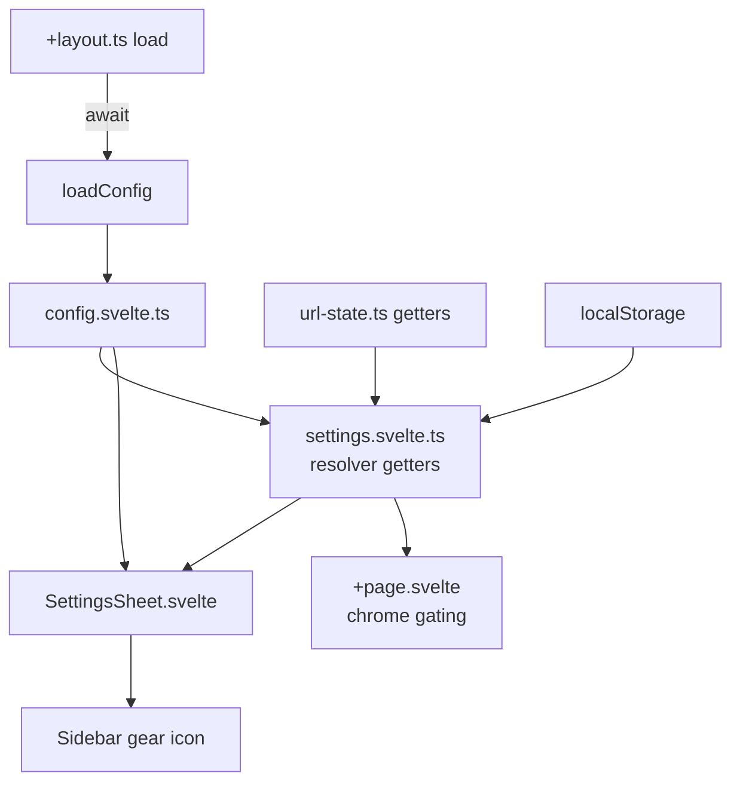

# Global Runtime Config and Settings Panel

Date: 2026-05-28
Status: Approved design, Phase 1 ready for planning

## Goal

Make objex easy to self-host and customize without a rebuild. A runtime
`config.json` becomes the deploy-time source of truth for app defaults and
available options. A new in-app settings panel (gear icon in the sidebar) lets
end users adjust their own preferences, which persist locally and override the
config. Query parameters allow per-link overrides for embed and focused-viewer
scenarios.

Today every customizable value is hardcoded or baked into the build. Theme,
locale, and query limits live in a single localStorage-backed rune store
(`settings.svelte.ts`). Basemap URLs are hardcoded CartoDB styles in
`MapContainer.svelte`. The demo connection is hardcoded in
`Sidebar.svelte::loadDemoConnection()`. There is no runtime config loader.

## Decisions

These were settled during brainstorming and are fixed for this design.

1. Config model. `config.json` provides deploy-time defaults a host edits by
   hand. The in-app panel writes user changes to localStorage, which override
   config at runtime. A "Copy config JSON" button exports current state so
   hosts can paste it into their file.
2. Edit scope. The panel lets users pick among config-provided options and
   toggle preferences. Adding brand-new connections stays in the existing
   `ConnectionDialog`. Adding new basemap URLs is host-only via `config.json`.
3. Query params. Individual boolean params (`?sidebar=hide`, `?tree=hide`,
   `?panel=settings`), each independent, plus `?config=<url>`.
4. Phasing. Phase 1 ships config loader, settings store refactor, settings
   panel, theme/language/query-limit, chrome visibility and query params.
   Phase 2 ships configurable basemaps and config-driven default connections.
5. Remote config trust. `?config=<url>` is fetched and merged like the bundled
   config. It can set theme, locale, basemaps, limits, and chrome toggles, and
   it can preload public connections. It never carries secrets, and any private
   connection it defines still triggers the normal credential prompt. A small
   "custom config loaded" indicator shows so users know. Same trust level as
   the existing `?url=` param.

## Precedence

Effective value of any setting resolves in this order, first match wins.

1. Query parameter (per-link override)
2. localStorage (explicit user edit in the panel)
3. `config.json` (deploy-time default, bundled or remote)
4. Hardcoded fallback (current behaviour)

localStorage stays sparse. It stores only keys the user explicitly changed, so
a later edit to `config.json` still reaches users who never touched that
particular setting.

## Architecture



New files.

- `src/lib/stores/config.svelte.ts`. Holds the loaded config and a status flag
  (`bundled`, `custom`, `error`), exposes `loadConfig()` and reactive getters.
- `src/lib/components/layout/SettingsSheet.svelte`. The panel, sibling to
  `AboutSheet.svelte`.
- `static/config.json`. Bundled default config that reproduces current
  behaviour exactly.

Modified files.

- `src/routes/+layout.ts`. Add an async `load` that awaits `loadConfig()` so
  config is ready before any component mounts.
- `src/lib/stores/settings.svelte.ts`. Refactor from "capture defaults at
  construction" to "resolve through the precedence chain". Add `showConnectionRail`
  and `showFileTree` getters. Move theme and locale application to run after
  config load so config-provided defaults apply on first paint.
- `src/lib/components/layout/Sidebar.svelte`. Add the gear icon above
  `LocaleToggle`, gated by `config.ui.showSettings`. Mount `SettingsSheet`.
- `src/lib/utils/url-state.ts`. Add read-only getters for `?config`, `?sidebar`,
  `?tree`, `?panel`.
- `src/routes/+page.svelte`. Gate the connection rail and file tree render
  against the resolved visibility values.
- `src/lib/constants.ts`. Add a `CONFIG_PATH` constant and any new defaults.
- `src/lib/i18n/en.ts` and `ar.ts`. New keys for the panel strings.

## Config schema

Path `static/config.json`. Every field is optional. Missing fields fall back to
hardcoded behaviour, so a host can ship a minimal or a full config. The bundled
file reproduces today's behaviour (CartoDB light and dark, Source Cooperative
demo).

```jsonc
{
  "defaults": {
    "theme": "system",        // light | dark | system
    "locale": "en",           // en | ar
    "featureLimit": 1000,     // DuckDB table page size (row limit)
    "mosaicItemLimit": 2000
  },
  "ui": {
    "showConnectionRail": true,
    "showFileTree": true,
    "showSettings": true
  },
  "basemaps": [                 // Phase 2
    { "id": "positron", "label": "Positron", "type": "vector", "url": "https://basemaps.cartocdn.com/gl/positron-gl-style/style.json", "variant": "light" },
    { "id": "dark-matter", "label": "Dark Matter", "type": "vector", "url": "https://basemaps.cartocdn.com/gl/dark-matter-gl-style/style.json", "variant": "dark" },
    { "id": "osm", "label": "OSM Raster", "type": "raster", "url": "https://tile.openstreetmap.org/{z}/{x}/{y}.png" }
  ],
  "defaultBasemap": { "light": "positron", "dark": "dark-matter" },
  "connections": [              // Phase 2 (public auto-load, private prompts for keys)
    { "name": "Source Cooperative", "provider": "s3", "bucket": "us-west-2.opendata.source.coop", "region": "us-west-2", "anonymous": true }
  ]
}
```

A TypeScript `AppConfig` type mirrors this shape. The full shape is defined now
even though `basemaps` and `connections` are consumed in Phase 2, so the file
format is stable from day one.

## Loading

`loadConfig()` runs inside `+layout.ts` `load`, which SvelteKit awaits before
rendering. Because the app is `ssr=false` with `prerender=true`, this runs
client-side at boot.

1. Read `?config=<url>`. If present, fetch that remote file and set status
   `custom`.
2. Otherwise fetch the bundled `static/config.json` and set status `bundled`.
3. On fetch or parse failure, log a warning, fall back to hardcoded defaults,
   and set status `error`. The app still boots.
4. Validate and merge defaults-only. Unknown fields are ignored. No secrets are
   read from config. Any private connection definition still goes through the
   normal credential prompt in Phase 2.

## Settings store refactor

`settings.svelte.ts` keeps a sparse persisted object (only user-changed keys)
and exposes getters that fall back to `config.svelte.ts` and then hardcoded
defaults, with query-param override on top where applicable. New getters added
for `showConnectionRail` and `showFileTree`. Theme and locale application to
`document` moves to run after config load so config-provided defaults apply on
first paint instead of the construction-time defaults used today.

`setX` methods write to the sparse localStorage object so a later config edit
still reaches users who never changed that key. A "Reset to defaults" action
clears the sparse object, reverting every value to config or hardcoded.

## Settings panel

`SettingsSheet.svelte` opened by a gear icon (`lucide settings`) added to the
bottom stack of `Sidebar.svelte`, directly above `LocaleToggle`, gated by
`config.ui.showSettings`. Opened automatically when `?panel=settings` is
present. Sections.

- Appearance. Theme (light, dark, system).
- Language. Locale (en, ar).
- Data. Default row limit (`featureLimit`), mosaic item limit
  (`mosaicItemLimit`). Offset is pagination-driven and not a configurable
  default, so the row limit is the knob.
- Interface. Connection rail and file tree toggles. When a query param is
  overriding a toggle, the control shows a note that a link parameter is in
  control.
- Footer. "Copy config JSON" exports the current effective state as a
  `config.json` a host can paste into their file. "Reset to defaults" clears
  user overrides. A "custom config loaded" indicator appears when config status
  is `custom`.

Phase 2 adds a Map section with a basemap picker sourced from `config.basemaps`.

All panel strings go through `t()` with new en and ar keys.

## Query params

Added to `url-state.ts` as read-only getters. The app does not write these.

- `?config=<url>`. Remote config file. Read at boot by `loadConfig()`.
- `?sidebar=hide|show`. Connection rail visibility.
- `?tree=hide|show`. File tree visibility.
- `?panel=settings`. Open the settings sheet on load.

A query param wins over the user's saved preference and over config, which makes
a shared focused-viewer link reliable. These are read at boot in `+page.svelte`,
and the rail and tree are conditionally rendered against the resolved values.
The exact render site in `+page.svelte` is confirmed during planning.

## Security

- No secrets ever appear in config. Access and secret keys stay in the
  in-memory `credentialStore`, never persisted, never read from config.
- Private connections always prompt for credentials through the existing flow.
- Remote config is treated as untrusted defaults, same trust level as `?url=`.
  It can change UI and preload public buckets, both of which are already
  reachable via existing link params. A visible "custom config loaded"
  indicator surfaces that a non-bundled config is active.
- No `eval` or dynamic code. Basemap and tile URLs are plain strings passed to
  existing fetchers.

## Phasing

Phase 1 (this spec, fully detailed).

- `config.svelte.ts` and `loadConfig()` including remote `?config=`.
- Full `AppConfig` schema and bundled `static/config.json`.
- Settings store refactor with precedence resolver and new fields.
- `SettingsSheet.svelte` and the sidebar gear icon.
- Chrome visibility (rail and tree) via config and individual query params.
- Theme, language, and query-limit wired through the panel.
- Copy-config export and custom-config indicator.

Phase 2 (its own spec and plan later).

- Configurable basemaps wired through `MapContainer.svelte`, basemap picker in
  the panel.
- Config-driven default connections replacing the hardcoded
  `loadDemoConnection()`. Public connections auto-load, private connections
  prompt for credentials.

## Testing

- Unit tests for the precedence resolver, covering query param over localStorage
  over config over hardcoded.
- Unit tests for the config merge, covering bundled, remote, and malformed
  inputs, with the malformed case falling back without crashing.
- Manual verification that a focused-embed link
  (`?url=...&sidebar=hide&tree=hide`) renders viewer-only.
- Manual verification that "Copy config JSON" produces a file that, when placed
  at `static/config.json`, reproduces the current state.
- `pnpm -w run format && pnpm -w run lint:fix && pnpm -w run check` all pass.

## Open items for planning

- Confirm the exact conditional-render site for the connection rail and file
  tree in `+page.svelte`.
- Decide whether `config.svelte.ts` belongs under the npm publish boundary or
  stays app-only. It depends on `$app` indirectly via the loader, so it likely
  stays app-side under `src/lib/stores/`, consistent with other stores.
