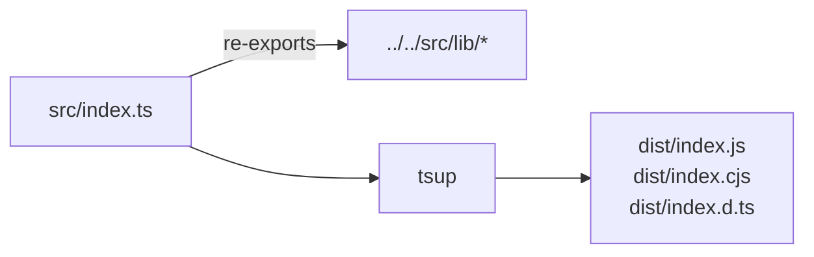

# objex-utils

Pure TypeScript sub-package. Zero Svelte dependency. Built with tsup (ESM + CJS + DTS).



- `src/index.ts` re-exports from `../../../src/lib/` via relative paths
- tsup bundles everything into self-contained output (no runtime path dep)
- External: `apache-arrow`, `hyparquet`, `hyparquet-compressors`
- `tsconfig.json` has `rootDir: "../.."` to allow DTS generation across monorepo

```bash
pnpm --filter @walkthru-earth/objex-utils run build
```
