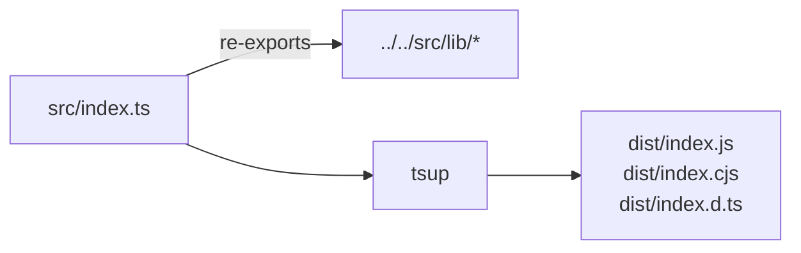

# objex-utils

Pure TypeScript sub-package. Zero Svelte dependency. Built with tsup (ESM + CJS + DTS).



Re-exports from `src/lib/`: types, storage/adapter, storage/url-adapter, query/engine, utils/wkb, utils/geoarrow, utils/storage-url, utils/parquet-metadata, utils/format, utils/hex, utils/column-types, file-icons/index.

- External: `apache-arrow`, `hyparquet`, `hyparquet-compressors` (not bundled)
- `tsconfig.json` has `rootDir: "../.."` to allow DTS generation across monorepo

```bash
pnpm --filter @walkthru-earth/objex-utils run build
```
