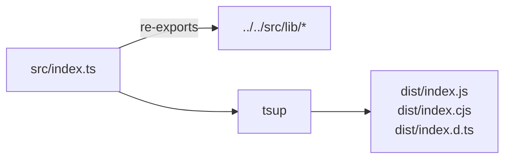

# objex-utils

Pure TypeScript sub-package. Zero Svelte dependency. Built with tsup (ESM + CJS + DTS).


```mermaid
graph LR
    IDX[src/index.ts] -->|re-exports| SRC["../../src/lib/*"]
    IDX --> TSUP[tsup] --> DIST["dist/index.js<br/>dist/index.cjs<br/>dist/index.d.ts"]
```

Re-exports from `src/lib/`:
- **types**: `Connection`, `ConnectionConfig`, `FileEntry`, `Tab`, `Theme`, `WriteResult`
- **constants**: `COPY_FEEDBACK_MS`, `DEFAULT_TARGET_CRS`, `DUCKDB_INIT_TIMEOUT_MS`, `LAYER_HUE_MULTIPLIER`, `MAX_QUERY_HISTORY_ENTRIES`, `SQL_PREVIEW_LENGTH`, `STORAGE_KEYS`, `VIEWER_DIR_EXTENSIONS`, `WGS84_CODES`
- **storage/adapter**: `StorageAdapter` (interface), `ListPage` (type)
- **storage/url-adapter**: `UrlAdapter` (class)
- **storage/providers**: `PROVIDERS`, `PROVIDER_IDS`, `ProviderId` (type), `ProviderDef` (type), `ProviderRegion` (type), `getProvider()`, `buildEndpointFromTemplate()`, `buildProviderBaseUrl()`, `isGcsProvider()`
- **query/engine**: `QueryEngine` (type), `QueryHandle` (type), `QueryResult` (type), `SchemaField` (type), `MapQueryHandle` (type), `MapQueryResult` (type), `QueryCancelledError` (class)
- **file-icons**: `DuckDbReadFn` (type), `FileCategory` (type), `FileTypeInfo` (type), `ViewerKind` (type), `buildDuckDbSource()`, `getDuckDbReadFn()`, `getFileTypeInfo()`, `getMimeType()`, `getViewerKind()`, `isCloudNativeFormat()`, `isQueryable()`
- **utils/wkb**: `GeoType` (type), `ParsedGeometry` (type), `parseWKB()`, `toBinary()`, `findGeoColumn()`, `findGeoColumnFromRows()`
- **utils/geoarrow**: `GeoArrowGeomType` (type), `GeoArrowResult` (type), `buildGeoArrowTables()`, `normalizeGeomType()`
- **utils/storage-url**: `StorageProvider` (type), `ParsedStorageUrl` (type), `Defaults` (type), `parseStorageUrl()`, `looksLikeUrl()`, `describeParseResult()`
- **utils/parquet-metadata**: `GeoColumnMeta` (type), `GeoParquetMeta` (type), `ParquetFileMetadata` (type), `readParquetMetadata()`, `extractBounds()`, `extractEpsgFromGeoMeta()`, `extractGeometryTypes()`
- **utils/format**: `formatFileSize()`, `formatDate()`, `formatValue()`, `getFileExtension()`, `jsonReplacerBigInt()`
- **utils/hex**: `HexRow` (type), `generateHexDump()`
- **utils/column-types**: `TypeCategory` (type), `classifyType()`, `typeBadgeClass()`, `typeColor()`, `typeLabel()`
- **utils/cloud-url**: `resolveCloudUrl()`, `getNativeScheme()`, `safeDecodeURIComponent()`
- **utils/file-sort**: `SortConfig` (type), `SortDirection` (type), `SortField` (type), `sortFileEntries()`, `toggleSortField()`
- **utils/export**: `serializeToCsv()`, `serializeToJson()`, `escapeCsvField()`
- **utils/local-storage**: `loadFromStorage()`, `persistToStorage()`
- **utils/markdown-sql**: `ParsedMarkdownDocument` (type), `SqlBlock` (type), `parseMarkdownDocument()`, `interpolateTemplates()`, `markSqlBlocks()`
- **utils/cog**: `CogInfo` (type), `GeoBounds` (type), `SF_LABELS`, `safeClamp()`, `clampBounds()`, `buildDataTypeLabel()`
- **utils/error**: `handleLoadError()`

**Important**: All re-exported source files must use **relative imports** (not `$lib/`). The `$lib` alias is SvelteKit-only and breaks the tsup build.

- External (not bundled): `apache-arrow`, `hyparquet`, `hyparquet-compressors`, `yaml`, `@developmentseed/geotiff`, `maplibre-gl`, `proj4`
- `tsconfig.json` has `rootDir: "../.."` to allow DTS generation across monorepo

```bash
pnpm --filter @walkthru-earth/objex-utils run build
```
