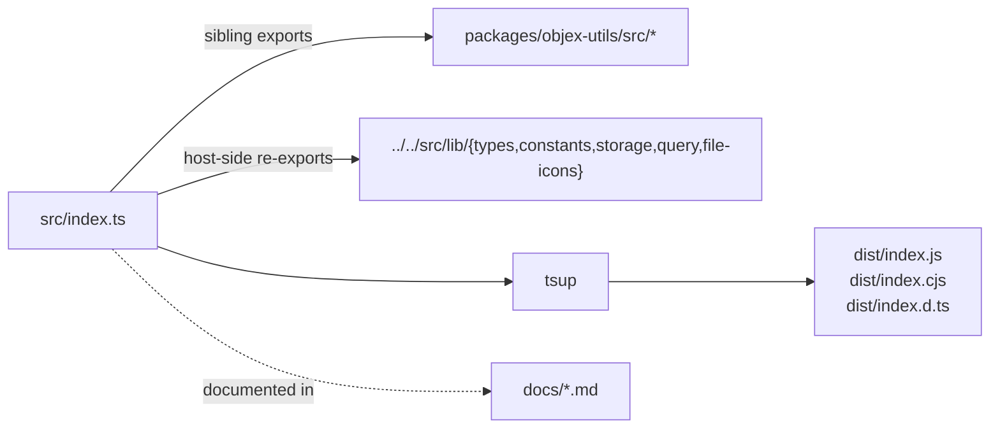

# objex-utils

Pure TypeScript sub-package. Zero Svelte dependency. Built with tsup (ESM + CJS + DTS).

All framework-agnostic utilities now live physically inside `packages/objex-utils/src/`. The package still re-exports a handful of host-side types from `src/lib/` (Connection, StorageAdapter, QueryEngine, file-icons, constants). Files that pull on heavy graphics or framework deps (deck.gl, maplibre, zarrita, pdf.js, shiki, marked, babylon, pmtiles, zip.js, $app/navigation, Svelte stores) stay in `src/lib/utils/` and are consumed only by the Svelte components package.

Developer-facing reference docs live in [`docs/`](./docs/README.md) , one page per module with full signatures, inputs/outputs, and peer-dep notes. Keep them in sync whenever a public export changes.


```mermaid
graph LR
    IDX[src/index.ts] -->|sibling exports| LOCAL["packages/objex-utils/src/*"]
    IDX -->|host-side re-exports| SRC["../../src/lib/{types,constants,storage,query,file-icons}"]
    IDX --> TSUP[tsup] --> DIST["dist/index.js<br/>dist/index.cjs<br/>dist/index.d.ts"]
    IDX -. documented in .-> DOCS[docs/*.md]
```

Host-side re-exports from `src/lib/` (only the type-level / configuration surface that the Svelte components also rely on, kept in one place so both packages share the same shapes):
- **types**: `Connection`, `ConnectionConfig`, `FileEntry`, `Tab`, `Theme`, `WriteResult`
- **constants**: `COPY_FEEDBACK_MS`, `DEFAULT_AWS_REGION`, `DEFAULT_TARGET_CRS`, `DUCKDB_INIT_TIMEOUT_MS`, `FIRST_FEATURE_FLY_ZOOM`, `LAYER_HUE_MULTIPLIER`, `MAX_QUERY_HISTORY_ENTRIES`, `SQL_PREVIEW_LENGTH`, `STORAGE_KEYS`, `TILE_DEBOUNCE_MS`, `VIEWER_DIR_EXTENSIONS`, `WGS84_CODES`
- **storage/adapter**: `StorageAdapter` (interface), `ListPage` (type)
- **storage/url-adapter**: `UrlAdapter` (class)
- **storage/providers**: `PROVIDERS`, `PROVIDER_IDS`, `ProviderId` (type), `ProviderDef` (type), `ProviderRegion` (type), `AccessMode` (type), `AccessModeInput` (type), `getProvider()`, `buildEndpointFromTemplate()`, `resolveProviderEndpoint()`, `buildProviderBaseUrl()`, `isGcsProvider()`, `getAccessMode()`, `isPubliclyStreamable()`
- **query/engine**: `QueryEngine` (type), `QueryHandle` (type), `QueryResult` (type), `QuerySource` (type), `SchemaField` (type), `MapQueryHandle` (type), `MapQueryResult` (type), `QueryCancelledError` (class)
- **file-icons**: `DuckDbReadFn` (type), `FileCategory` (type), `FileTypeInfo` (type), `ViewerKind` (type), `buildDuckDbSource()`, `getDuckDbReadFn()`, `getFileTypeInfo()`, `getMimeType()`, `getViewerKind()`, `isCloudNativeFormat()`, `isQueryable()`

Sibling modules physically located in `packages/objex-utils/src/` (each re-exported via `export *` from `index.ts`):
- **wkb**: `GeoType` (type), `ParsedGeometry` (type), `parseWKB()`, `toBinary()`, `findGeoColumn()`, `findGeoColumnFromRows()`
- **stac-geoparquet**: `StacBboxStruct` (type), `StacGeoparquetRow` (type), `StacGeoparquetSchemaColumn` (type), `StacRowToItemOptions` (type), `STAC_GEOPARQUET_REQUIRED_COLUMNS`, `isStacGeoparquetSchema()`, `flattenStacBbox()`, `resolveStacAssetHref()`, `pickStacPrimaryAsset()`, `stacRowToItem()`. Framework-agnostic, accepts schema descriptors from hyparquet, DuckDB-WASM, Arrow, or any other source. `stacRowToItem` takes a caller-supplied `wkbParser` (re-export `parseWKB` from the same package, or plug in another WKB library).
- **geoarrow**: `GeoArrowGeomType` (type), `GeoArrowResult` (type), `buildGeoArrowTables()`, `normalizeGeomType()`
- **storage-url**: `StorageProvider` (type), `ParsedStorageUrl` (type), `Defaults` (type), `parseStorageUrl()`, `looksLikeUrl()`, `describeParseResult()`, `classifyUrl()`, `isKnownBucketHost()`, `STAC_API_PATH_RE`
- **parquet-metadata**: `GeoColumnMeta` (type), `GeoParquetMeta` (type), `ParquetFileMetadata` (type), `readParquetMetadata()`, `extractBounds()`, `extractEpsgFromGeoMeta()`, `extractGeometryTypes()`
- **format**: `formatFileSize()`, `formatDate()`, `formatValue()`, `getFileExtension()`, `jsonReplacerBigInt()`
- **hex**: `HexRow` (type), `generateHexDump()`
- **column-types**: `TypeCategory` (type), `classifyType()`, `typeBadgeClass()`, `typeColor()`, `typeLabel()`
- **channel-composite**: `PresetDef` (type), `PRESETS`, `applyPreset()`, `availablePresets()`, `compositeFromUrl()`, `compositeToUrl()`, `presetMatchesComposite()`
- **cog-asset**: `CogAsset` / `ChannelRef` / `ChannelComposite` (types), `extractCogAssets()`, `syntheticSelfAsset()`, `pickNaturalColorComposite()`, `isSingleAssetComposite()`, `allChannelsBand0()`. Reads `raster:bands.length` and `eo:bands` without network.
- **cloud-url**: `resolveCloudUrl()`, `getNativeScheme()`, `safeDecodeURIComponent()`
- **clipboard**: `copyToClipboard()`, `wireCodeCopyButtons()`. Uses `navigator.clipboard` and `COPY_FEEDBACK_MS`.
- **crs**: `isWgs84(crs)`. Returns `true` when the given numeric EPSG code or string (`"EPSG:4326"`, `"OGC:CRS84"`, `"epsg:4979"`, etc.) is WGS84 lon/lat and requires no `ST_Transform`. Reads `WGS84_CODES` and `DEFAULT_TARGET_CRS` from host constants so the set is never re-typed in a viewer. Distinct from `isWgs84Crs` (geometry-type.ts), which treats absent CRS as WGS84; `isWgs84` returns `false` for null/unknown.
- **app-config**: `AppConfig`, `AppConfigDefaults`, `AppConfigUi`, `BasemapConfig`, `ConnectionSeed` (types), `DEFAULT_APP_CONFIG`, `mergeAppConfig()`, `resolveSetting()`, `resolveBasemap()`, `parseVisibilityParam()`, `coerceTheme()`, `coerceString()`, `coercePositiveInt()`, `coerceBool()`. Pure config schema, field-by-field merge of untrusted JSON (unknown fields ignored, malformed values fall back to base, basemaps/connections filtered to well-formed entries), the first-match-wins precedence resolver, and `resolveBasemap(config, variant, userId)` which picks the basemap to render (user pick > defaultBasemap[variant] > first matching variant > first basemap, undefined when none configured). Imports only the `Theme` type from `src/lib/types`.
- **connection-identity**: `connectionIdentityKey()`, `isSameConnectionIdentity()`, `normalizeEndpoint()`, `normalizeProvider()`, `ConnectionIdentityInput`
- **error**: `handleLoadError()`, `isAbortError()`
- **file-sort**: `SortConfig` (type), `SortDirection` (type), `SortField` (type), `sortFileEntries()`, `toggleSortField()`
- **export**: `serializeToCsv()`, `serializeToJson()`, `escapeCsvField()`, `exportToCsv()`, `exportToJson()`
- **host-detection**: `DetectedHost` (type), `detectHostBucket()`, `applyStacItemStorageHints()`
- **local-storage**: `loadFromStorage()`, `persistToStorage()`. SSR-safe.
- **lru**: `LruCache<K,V>`. Move-to-end on `get`, evicts oldest past `max`, optional `onEvict`.
- **map-pixel-inspect**: `attachPixelInspector(map, opts)` → `detach()`. Framework-agnostic click-to-inspect helper. No maplibre / deck.gl / Svelte imports.
- **markdown-sql**: `ParsedMarkdownDocument` (type), `SqlBlock` (type), `parseMarkdownDocument()`, `interpolateTemplates()`, `markSqlBlocks()`. `yaml` is loaded lazily.
- **markdown-sql-context**: `MarkdownSqlContext` (class). Executes the SQL blocks parsed by `markdown-sql` against an injected `QueryEngine`, caches results by block name, and rewrites relative `read_parquet`/`read_csv`/`read_json` paths to `s3://prefix/...`. The engine is passed in by the host so the module stays free of DuckDB.
- **notebook**: `renderNotebook()`. Pure DOM (`document.createElement`), no markdown/shiki imports, those are injected by the caller.
- **cog-info**: `CogInfo` (type), `GeoBounds` (type), `SF_LABELS`, `safeClamp()`, `clampBounds()`, `buildDataTypeLabel()`. Dependency-free subset of the app-side `cog.ts`. The render-pipeline helpers (`selectCogPipeline`, `createEpsgResolver`, `normalizeCogGeotiff`, `renderNonTiledBitmap`, `fitCogBounds`, etc.) stay in `src/lib/utils/cog.ts` and are **not** re-exported here. Use the full `@walkthru-earth/objex` package if you need them.
- **stac**: `StacItem`, `StacFeatureCollection`, `StacCollection`, `StacCatalog`, `StacAsset`, `StacLink`, `StacRoutableKind`, `MosaicSourceMeta`, `BandSlot`, `BandMap`, `RasterBandAsset` (types), `classifyStac()`, `isStacItem()` / `isStacFeatureCollection()` / `isStacCollection()` / `isStacCatalog()`, `detectMosaicCapable()`, `detectMultiCogCapable()`, `pickCogAssetHref()`, `stacItemBbox()`, `buildMosaicSourceMeta()`, `spatialCellKey()`, `extractSentinelBandAssets()`, `hasRgbBands()`, `extractRasterBandAssets()`, `extractMosaicAssets()`, `resolveBandSlotAssetKey()`, `resolvePresetComposite()`, `hasCompositableBands()`, `STAC_COG_ASSET_KEYS`
- **stac-facets**: `StacItemView` (type), `Facet` / `NumericFacet` / `EnumFacet` / `DatetimeFacet`, `FacetSet` / `FacetState` / `FacetSort` / `NumericFacetField` / `EnumFacetField` (types), `DatetimeGranularity`, `extractItemView()`, `buildFacets()`, `applyFacets()`, `sortViews()`, `hasActiveFilters()`, `emptyFacetState()`, `DATETIME_HISTOGRAM_BINS_MAX = 64`, `DATETIME_HISTOGRAM_BINS = 32` (legacy alias). Auto-detects which facet controls have variance for the loaded view set so consumers can render only the controls that will narrow this dataset.
- **stac-hydrate**: `hydrateStacItems()`, `hasStacItemsEndpoint()`, `absolutizeHref()`, `HydrateOptions`, `StacItemsQuery`, `HydrateResult`. Pure async link-walker. Takes a caller-supplied `StorageAdapter`.
- **stac-pushdown**: `StacApiCapabilities` / `StacNativeQuery` / `ToNativeQueryOptions` (types), `sniffApiCapabilities()`, `toNativeQuery()`, `toCql2Filter()`, `residualState()`
- **stac-source**: `StacSource`, `StacSourceCapabilities` (`hivePartitioned?: boolean`), `StacSourceRequest`, `StacSourceBatch`, `StacSourceKind` (`'api' | 'parquet' | 'static'`), `emptyPushdown()`. Pure-TS contract for the unified STAC ingestion path.
- **stac-source-api**: `createApiSource(kind, deps)` → `StacSource`. Wraps `hydrateStacItems` with `itemsQuery` push-down, sniffs `conformsTo`, builds CQL2-JSON via `toCql2Filter`, reports `pushedDown` / `residual` per batch.
- **stac-source-static**: `createStaticSource(kind, deps)` → `StacSource`. Wraps `hydrateStacItems` with no `itemsQuery`, the entire advertised tree is fetched and the caller filters client-side.
- **stac-storage-extension**: `StorageExtensionVersion`, `StorageHints`, `emptyStorageHints()`, `detectStorageExtensionVersion()`, `extractStorageHints()`, `applyStorageHintsToConnection()`
- **storage-smoketest**: `smokeTestHref(href, signal?)` → `{ok: true} | {ok: false, status, reason}`. Open-time HEAD-style probe.

**Important**: All source files inside this package must use **relative imports** (`./X.js` for siblings, `../../../src/lib/...js` for host-side re-exports). Never use `$lib/` (SvelteKit-only, breaks tsup) and never self-reference `'@walkthru-earth/objex-utils'` (creates a circular import in the tsup graph and re-introduces issue #11).

- External (not bundled, declared in `tsup.config.ts`): `apache-arrow`, `hyparquet`, `hyparquet-compressors`, `yaml`. These appear as optional peer-deps so consumers can BYO versions.
- `yaml` is loaded lazily via dynamic `import()` inside `parseMarkdownDocument` so the bundle loads without it installed. Keep it this way.
- `@developmentseed/geotiff`, `@developmentseed/epsg`, `@developmentseed/proj`, `maplibre-gl`, `proj4`, `@deck.gl/*`, `@geoarrow/deck.gl-geoarrow`, `zarrita`, `pdfjs-dist`, `shiki`, `marked`, `@babylonjs/*`, `pmtiles`, `flatgeobuf`, `@zip.js/*`, `@cogeotiff/*` MUST NOT appear in the import graph (static OR dynamic). If a utility needs them, even via `await import()`, keep it in `src/lib/utils/` instead, tsup with `splitting: false` bundles dynamic imports into the main chunk and explodes the bundle (we saw 146 KB → 4.34 MB). svelte-package emits per-file output for the Svelte components package so dynamic imports stay lazy there. If a new re-export needs a heavy dep, split the dependency-free surface into a sibling module that has zero heavy imports (the pattern `cog-info.ts` uses as the pure subset of the app-side `cog.ts`). Never add heavy deps to the `external` list, that only hides the problem, tsup emits bare side-effect imports for externalized static modules and breaks consumer Vite pre-bundles (walkthru-earth/objex#11).
- `tsconfig.json` has `rootDir: "../.."` to allow DTS generation across monorepo.
- `package.json` `files` must include `dist` and `docs` so the published tarball carries the reference docs.
- Bundle is guarded by `scripts/verify-objex-utils-bundle.mjs`, which scans `dist/*.{js,cjs}` for top-level `from`/`require()` against a forbidden list. Dynamic `import()` calls are skipped. The verifier runs after every `tsup` build.

```bash
pnpm --filter @walkthru-earth/objex-utils run build
```
