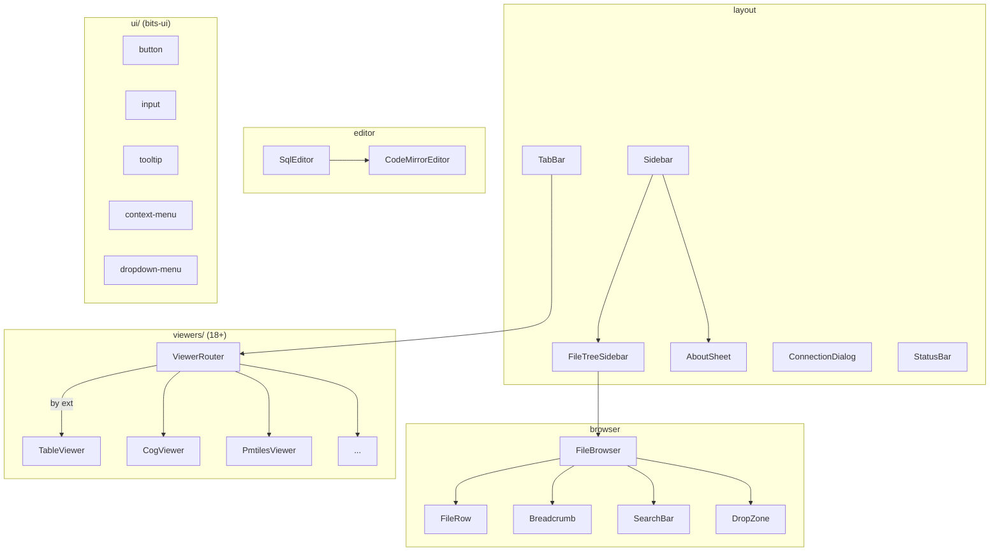

# components/

All Svelte 5 components. Organized by function.

| Directory | Files | Role | Used by |
|-----------|-------|------|---------|
| `viewers/` | 34 | Per-format viewers | ViewerRouter → +page.svelte |
| `browser/` | 10 | File tree, search, upload, dialogs | FileTreeSidebar → Sidebar → +page.svelte |
| `layout/` | 8 | Sidebar, tabs, status bar, toggles, about sheet | +page.svelte, +layout.svelte |
| `editor/` | 4 | SQL editor, markdown editor, SQL results | TableViewer, MarkdownViewer |
| `map/` | 2 | MapContainer, AttributeTable | GeoParquetMapViewer, PmtilesMapView, MapViewer |
| `ui/` | 61 | bits-ui primitives (https://bits-ui.com/llms.txt) | Used across all components |

See `viewers/CLAUDE.md` for viewer-specific details.
