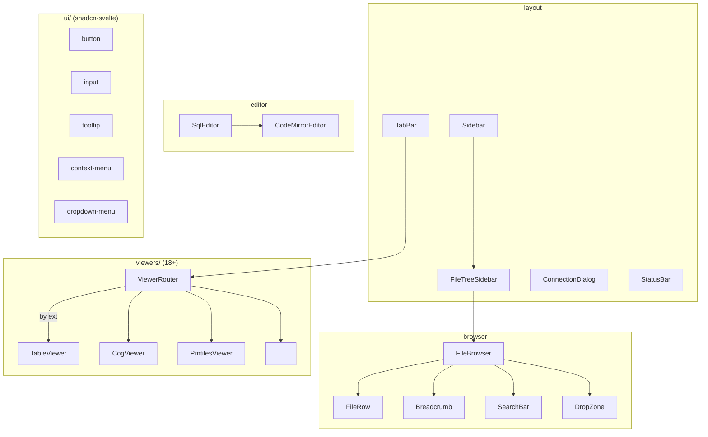

# components/

All Svelte 5 components. Organized by function.

| Directory | Files | Role |
|-----------|-------|------|
| `viewers/` | 34 | Per-format viewers (Table, Map, Code, PDF, 3D, Archive...) |
| `browser/` | 10 | File tree, breadcrumbs, search, upload, dialogs |
| `layout/` | 7 | Sidebar, tabs, status bar, connection dialog, toggles |
| `editor/` | 4 | CodeMirror SQL editor, Milkdown markdown, SQL result blocks |
| `map/` | 2 | Shared MapContainer, AttributeTable |
| `ui/` | 61 | shadcn-svelte primitives (bits-ui based) |

See `viewers/CLAUDE.md` for viewer-specific details.
