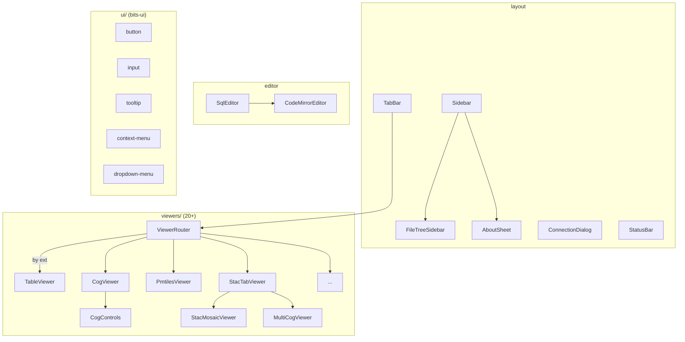

# components/

All Svelte 5 components. Organized by function.

```mermaid
graph TD
    subgraph layout
        SB[Sidebar] --> FTS[FileTreeSidebar]
        SB --> AS[AboutSheet]
        TB[TabBar]
        CD[ConnectionDialog]
        STB[StatusBar]
    end
    subgraph viewers["viewers/ (20+)"]
        VR[ViewerRouter] -->|by ext| TV[TableViewer]
        VR --> CV[CogViewer] --> CC[CogControls]
        VR --> PV[PmtilesViewer]
        VR --> STV[StacTabViewer] --> SMV[StacMosaicViewer]
        STV --> MCV[MultiCogViewer]
        VR --> MORE[...]
    end
    subgraph editor
        SQL[SqlEditor] --> CM[CodeMirrorEditor]
    end
    subgraph ui["ui/ (bits-ui)"]
        BTN[button] & INP[input] & TT[tooltip] & CTX[context-menu] & DD[dropdown-menu]
    end
    TB --> VR
```

| Directory | Files | Role | Used by |
|-----------|-------|------|---------|
| `viewers/` | 33 | Per-format viewers (19 routed incl. STAC tab + Mosaic + MultiCOG, plus sub-components) | ViewerRouter → +page.svelte |
| `browser/` | 1 | FileTreeSidebar (read-only object tree) | Sidebar → +page.svelte |
| `layout/` | 8 | Sidebar, tabs, status bar, toggles, about sheet | +page.svelte, +layout.svelte |
| `editor/` | 4 | SQL editor, markdown editor, SQL results | TableViewer, MarkdownViewer |
| `viewers/map/` | 2 | MapContainer, AttributeTable | GeoParquetMapViewer, PmtilesMapView, MapViewer |
| `ui/` | 73 | bits-ui primitives (https://bits-ui.com/llms.txt) | Used across all components |

See `viewers/CLAUDE.md` for viewer-specific details.
