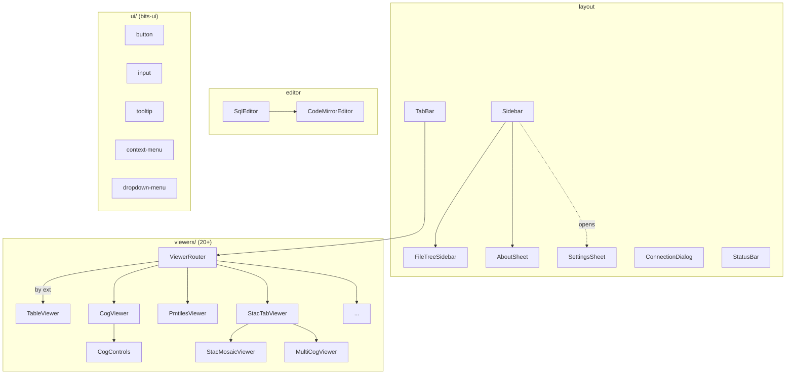

# components/

All Svelte 5 components. Organized by function.

```mermaid
graph TD
    subgraph layout
        SB[Sidebar] --> FTS[FileTreeSidebar]
        SB --> AS[AboutSheet]
        SB -.->|opens| SS[SettingsSheet]
        TB[TabBar]
        CD[ConnectionDialog]
        STB[StatusBar]
    end
    subgraph viewers["viewers/ (20+)"]
        VR[ViewerRouter] -->|by ext| TV[TableViewer]
        VR --> CV[CogViewer] --> CC[CogControls]
        VR --> PV[PmtilesViewer]
        VR --> STV[StacTabViewer] --> SMV[StacMosaicViewer]
        STV --> MCV[MultiCogViewer]
        VR --> MORE[...]
    end
    subgraph editor
        SQL[SqlEditor] --> CM[CodeMirrorEditor]
    end
    subgraph ui["ui/ (bits-ui)"]
        BTN[button] & INP[input] & TT[tooltip] & CTX[context-menu] & DD[dropdown-menu]
    end
    TB --> VR
```

| Directory | Files | Role | Used by |
|-----------|-------|------|---------|
| `viewers/` | 33 | Per-format viewers (19 routed incl. STAC tab + Mosaic + MultiCOG, plus sub-components) | ViewerRouter → +page.svelte |
| `browser/` | 1 | FileTreeSidebar (read-only object tree) | Sidebar → +page.svelte |
| `layout/` | 9 | Sidebar, tabs, status bar, toggles, about sheet, settings sheet (SettingsSheet is mounted by +page.svelte so it survives the connection rail being hidden; Sidebar's gear and a +page fallback gear request it via `onOpenSettings`) | +page.svelte, +layout.svelte |
| `editor/` | 4 | SQL editor, markdown editor, SQL results | TableViewer, MarkdownViewer |
| `viewers/map/` | 2 | MapContainer (resolves its basemap via `resolveBasemap(appConfig.value, theme, settings.basemapId)` and falls back to the hardcoded CartoDB positron/dark-matter styles when no basemaps are configured; style swaps are keyed on a stable `basemap id + variant` string so a fresh raster StyleSpecification object never loops the swap effect), AttributeTable | GeoParquetMapViewer, PmtilesMapView, MapViewer |
| `viewers/stac/` | 4 | StacItemStrip (bottom-anchored cards with thumbnails + hover-sync), StacItemInspector (right-side slide-over with metadata + assets + raw JSON), StacDatetimeBar (compact datetime histogram + range scrubber, writes back to `filterState.datetime`, now renders an adaptive granularity hint label below the slider via `stac.granularityLabel` + `stac.granularity.{day,week,month,year}` driven by `DatetimeFacet.granularity` from `utils/stac-facets`), StacFilterPanel (auto-faceted filter sheet with footer slot for fetch-options snippet). All numeric/datetime range UI now consumes `ui/slider/RangeSlider` directly | StacMosaicViewer (Phase 2/3 UI) |
| `ui/` | 73 | bits-ui primitives (https://bits-ui.com/llms.txt). `ui/slider/` exports `Slider` (single/multiple-thumb shadcn-style wrapper over `bits-ui` Slider) and `RangeSlider` (dual-thumb wrapper with optional histogram overlay + min/max label row) | Used across all components |

See `viewers/CLAUDE.md` for viewer-specific details.
