# viewers/

Per-format viewer components. Routed by `ViewerRouter` based on file extension.

```mermaid
graph TD
    VR[ViewerRouter] -->|parquet,csv,jsonl| TV[TableViewer]
    VR -->|geoparquet map| GPM[GeoParquetMapViewer]
    VR -->|cog,tif| COG[CogViewer]
    VR -->|pmtiles| PMT[PmtilesViewer]
    VR -->|fgb| FGB[FlatGeobufViewer]
    VR -->|zarr| ZV[ZarrViewer]
    VR -->|ipynb| NB[NotebookViewer]
    VR -->|code,json,py| CODE[CodeViewer]
    VR -->|md| MD[MarkdownViewer]
    VR -->|pdf| PDF[PdfViewer]
    VR -->|img| IMG[ImageViewer]
    VR -->|video,audio| MEDIA[MediaViewer]
    VR -->|glb,obj,stl| MODEL[ModelViewer]
    VR -->|zip,tar| ARC[ArchiveViewer]
    VR -->|copc,laz| COPC[CopcViewer]
    VR -->|duckdb,sqlite| DB[DatabaseViewer]
    VR -->|stac| STAC[StacMapViewer]
    VR -->|fallback| RAW[RawViewer]

    TV --> TG[TableGrid]
    TV --> TTB[TableToolbar]
    TV --> TSB[TableStatusBar]
    TV --> QHP[QueryHistoryPanel]
    GPM --> MC[map/MapContainer]
    GPM --> AT[map/AttributeTable]
    PMT --> PMV[pmtiles/PmtilesMapView]
    PMT --> PMA[pmtiles/PmtilesArchiveView]
    PMT --> PMI[pmtiles/PmtilesTileInspector]
```

| Viewer | Powered by | Heavy deps |
|--------|-----------|------------|
| TableViewer | DuckDB-WASM, Arrow | duckdb-wasm, apache-arrow |
| GeoParquetMapViewer | deck.gl, @geoarrow/deck.gl-layers | deck.gl, maplibre-gl |
| CogViewer | @developmentseed/deck.gl-geotiff, geotiff v3 | geotiff, proj4 |
| PmtilesViewer | pmtiles, MapLibre | pmtiles, maplibre-gl |
| FlatGeobufViewer | flatgeobuf, deck.gl | flatgeobuf, deck.gl |
| ZarrViewer | zarrita, @carbonplan/zarr-layer | zarrita, maplibre-gl |
| CodeViewer | Shiki | shiki |
| NotebookViewer | notebookjs, Marked, Shiki | notebookjs |
| PdfViewer | pdf.js | pdfjs-dist |
| ModelViewer | Babylon.js | @babylonjs/core |
| ArchiveViewer | zip.js | @zip.js/zip.js |
| DatabaseViewer | DuckDB-WASM | duckdb-wasm |

Every viewer must follow the pattern in root `CLAUDE.md` (cleanup, tabResources, AbortController, $state.raw).
