# viewers/

Per-format viewer components. Routed by `ViewerRouter` based on file extension.

```mermaid
graph TD
    VR[ViewerRouter] -->|parquet,csv,jsonl| TV[TableViewer]
    VR -->|geoparquet map| GPM[GeoParquetMapViewer]
    VR -->|cog,tif| COG[CogViewer]
    VR -->|pmtiles| PMT[PmtilesViewer]
    VR -->|fgb| FGB[FlatGeobufViewer]
    VR -->|zarr| ZV[ZarrViewer]
    VR -->|ipynb| NB[NotebookViewer]
    VR -->|code,json,py| CODE[CodeViewer]
    VR -->|md| MD[MarkdownViewer]
    VR -->|pdf| PDF[PdfViewer]
    VR -->|img| IMG[ImageViewer]
    VR -->|video,audio| MEDIA[MediaViewer]
    VR -->|glb,obj,stl| MODEL[ModelViewer]
    VR -->|zip,tar| ARC[ArchiveViewer]
    VR -->|copc,laz| COPC[CopcViewer]
    VR -->|duckdb,sqlite| DB[DatabaseViewer]
    VR -->|stac| STAC[StacMapViewer]
    VR -->|fallback| RAW[RawViewer]

    TV --> TG[TableGrid]
    TV --> TTB[TableToolbar]
    TV --> TSB[TableStatusBar]
    TV --> QHP[QueryHistoryPanel]
    GPM --> MC[map/MapContainer]
    GPM --> AT[map/AttributeTable]
    PMT --> PMV[pmtiles/PmtilesMapView]
    PMT --> PMA[pmtiles/PmtilesArchiveView]
    PMT --> PMI[pmtiles/PmtilesTileInspector]
```

| Viewer | Powered by | Key deps used |
|--------|-----------|---------------|
| TableViewer | DuckDB-WASM, Arrow | query/index, utils/wkb, utils/geoarrow, utils/parquet-metadata, utils/url, utils/url-state, file-icons |
| GeoParquetMapViewer | deck.gl, @geoarrow/deck.gl-layers | query/engine, utils/wkb, utils/geoarrow, utils/deck, map/MapContainer |
| CogViewer | @developmentseed/deck.gl-geotiff, geotiff v3 | utils/url |
| PmtilesViewer | pmtiles, MapLibre | utils/pmtiles, utils/url-state, pmtiles/* sub-components |
| FlatGeobufViewer | flatgeobuf, deck.gl | utils/deck, utils/url |
| ZarrViewer | zarrita, @carbonplan/zarr-layer | utils/zarr, utils/url-state |
| CodeViewer | Shiki | utils/shiki, utils/url-state |
| NotebookViewer | notebookjs, Marked, Shiki | utils/shiki |
| PdfViewer | pdf.js | utils/pdf |
| ModelViewer | Babylon.js | utils/model3d |
| ArchiveViewer | zip.js | utils/archive, utils/url, utils/format |
| DatabaseViewer | DuckDB-WASM | query/index |
| MarkdownViewer | Marked, Milkdown | utils/markdown, utils/markdown-sql, editor/MilkdownEditor |
| RawViewer | custom hex dump | utils/hex, utils/format |
| ImageViewer | native `` | utils/url |
| MediaViewer | native `<video>`/`<audio>` | utils/url |
| StacMapViewer | stac-map iframe | utils/url |
| CopcViewer | viewer.copc.io iframe | utils/url |

All viewers use: `stores/tab-resources` (LRU cleanup), `i18n/t()`, `stores/settings` (theme).

Every viewer must follow the pattern in root `CLAUDE.md` (cleanup, tabResources, AbortController, $state.raw).
