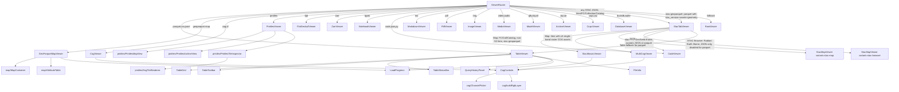

# viewers/

Per-format viewer components. Routed by `ViewerRouter` based on file extension.

**STAC routing rule**: `ViewerRouter::detectStac` only returns `{ kind: 'stac', ... }` when `classifyStac(parsed)` recognises the JSON as a STAC Item / ItemCollection / Collection / Catalog. Plain JSON that happens to parse (including GeoJSON FeatureCollections that fail the STAC shape check) returns `{ kind: 'none' }` so the router falls through to `CodeViewer`; otherwise StacTabViewer's `stac-map` / `STAC Browser` buttons would appear on files that have nothing to do with STAC. Parquet files route through `detectStacGeoparquet`, which keys on the schema's top-level columns.

**Pending-state gate**: `detectStac` (256 KB JSON peek + parse) and `detectStacGeoparquet` (parquet schema sniff) are async, so `stacRoute` transits through `{ kind: 'pending' }` between mount and resolution. While pending, `ViewerRouter` mounts an empty pane for `viewerKind === 'table' | 'code' | 'raw'` instead of falling through to plain `TableViewer` / `CodeViewer`. Without this gate, the transient viewer reads the URL hash, picks a default `viewMode`, and may stamp `updateUrlView(...)` over the hash that the eventual `StacTabViewer` mount would have honoured (e.g. `#map` on a STAC Collection JSON gets clobbered to `#stac-browser` by `CodeViewer`'s `isStacJson` auto-switch). The pending window is short (small file = single peek; large file falls back to a full read inside `detectStac`). Other viewer kinds skip the gate because their detection is synchronous.

**URL view-mode rule**: every viewer with a `viewMode` state derives its initial value through `pickViewMode<T>(validModes, defaultMode)` from `utils/url-state.ts`. The helper (a) validates the URL hash against the viewer's known token vocabulary and (b) falls back to `defaultMode` WITHOUT rewriting the URL. Critical invariant: a viewer MUST NOT call `updateUrlView(...)` for a hash it doesn't recognise — that hash is owned by another viewer farther up the routing stack and will become valid once the routing decision settles. The pending-state gate above defends the same invariant at the router level; `pickViewMode` defends it at the viewer level.

```mermaid
graph TD
    VR[ViewerRouter] -->|parquet,csv,jsonl| TV[TableViewer]
    VR -->|geoparquet map| GPM[GeoParquetMapViewer]
    VR -->|cog,tif| COG[CogViewer]
    VR -->|pmtiles| PMT[PmtilesViewer]
    VR -->|fgb| FGB[FlatGeobufViewer]
    VR -->|zarr| ZV[ZarrViewer]
    VR -->|ipynb| NB[NotebookViewer]
    VR -->|code,json,py| CODE[CodeViewer]
    VR -->|md| MD[MarkdownViewer]
    VR -->|pdf| PDF[PdfViewer]
    VR -->|img| IMG[ImageViewer]
    VR -->|video,audio| MEDIA[MediaViewer]
    VR -->|glb,obj,stl| MODEL[ModelViewer]
    VR -->|zip,tar| ARC[ArchiveViewer]
    VR -->|copc,laz| COPC[CopcViewer]
    VR -->|duckdb,sqlite| DB[DatabaseViewer]
    VR -->|any STAC JSON: Item/FC/Collection/Catalog| STV[StacTabViewer]
    VR -->|stac-geoparquet: parquet with stac_version+assets+geometry| STV
    STV -->|Map: FC/Coll/Catalog, non-S2 Item, stac-geoparquet| SMV[StacMosaicViewer]
    STV -->|Map: Item with ≥3 single-band raster COG assets| MCV[MultiCogViewer]
    STV -->|stac-map: DevSeed iframe, accepts JSON or parquet via href=| STACMAP[StacMapViewer variant=stac-map]
    STV -->|STAC Browser: Radiant Earth iframe, JSON only, disabled for parquet| STACBR[StacMapViewer variant=stac-browser]
    STV -->|JSON| CODE
    STV -->|Table fallback for parquet| TV
    VR -->|fallback| RAW[RawViewer]

    TV --> TG[TableGrid]
    TV --> TTB[TableToolbar]
    TV --> TSB[TableStatusBar]
    TV --> QHP[QueryHistoryPanel]
    GPM --> MC[map/MapContainer]
    GPM --> AT[map/AttributeTable]
    PMT --> PMV[pmtiles/PmtilesMapView]
    PMT --> PMA[pmtiles/PmtilesArchiveView]
    PMT --> PMI[pmtiles/PmtilesTileInspector]
    PMI --> SVG[pmtiles/SvgTileRenderer]

    COG --> CC[CogControls]
    SMV --> CC
    MCV --> CC
    CC --> CHP[cog/ChannelPicker]
    CC --> BRL[cog/buildRgbLayer]

    TV --> FI[FileInfo]
    TV --> LP[LoadProgress]
    GPM --> LP
```

| Viewer | Powered by | Key deps used |
|--------|-----------|---------------|
| TableViewer | DuckDB-WASM, Arrow | query/index, utils/wkb, utils/geoarrow, utils/parquet-metadata, utils/url, utils/url-state, file-icons. Accepts a `nested?: boolean` prop; when `true` (set by `StacTabViewer` when mounting a stac-geoparquet tab) the inner `TableToolbar` suppresses its own `STAC Map` button so it doesn't duplicate the outer wrapper's `stac-map` button (both mount the same `StacMapViewer` DevSeed iframe). Initial `viewMode` is picked via `pickViewMode<TableViewMode>(['table','map','stac','info'], 'table')`. |
| GeoParquetMapViewer | deck.gl, @geoarrow/deck.gl-layers | query/engine, utils/wkb, utils/geoarrow, utils/deck, map/MapContainer |
| CogViewer | @developmentseed/deck.gl-geotiff v0.6.0-alpha.1, @developmentseed/geotiff | utils/cog, utils/colormap-sprite, utils/storage-smoketest, utils/url, CogControls (mode='single'). Single-band mode plumbs an `onHistogram` callback through `selectCogPipeline` and stores a 64-bin `Uint32Array` in `$state.raw` for the CogControls histogram overlay. Cleared on tab reset. **Open-time smoke test**: at viewer mount `smokeTestHref(presignedUrl, signal)` is awaited before the geotiff is opened; on failure an amber HUD pill (`stac.smokeWarning` + `stac.smokeWarningHint`) is rendered so presign / CORS / 403 issues surface immediately instead of as a generic tile-layer fetch error. **Overview-aware pixel inspection**: the click handler reads the current `map.getZoom()` + `lat`, computes `mapResolutionMetersPerPixel(zoom, lat)`, picks an overview via `selectOverviewForResolution(geotiff, gsd)`, and threads it into `readPixelAtLngLat(geotiff, lng, lat, {overview})` so the readout matches the overview deck.gl is painting instead of always reading full-res. |
| StacTabViewer | Thin wrapper around STAC-shaped JSON and stac-geoparquet tabs | Renders a top bar with `Map` / `stac-map` / `STAC Browser` / `JSON`/`Table` buttons. Mounts `StacMosaicViewer` / `MultiCogViewer` / `StacMapViewer` (DevSeed `developmentseed.org/stac-map` iframe when `variant='stac-map'`, Radiant Earth `radiantearth.github.io/stac-browser` iframe when `variant='stac-browser'`) / nested `CodeViewer nested` (JSON tabs) or `TableViewer nested` (stac-geoparquet tabs) based on `viewMode`. **URL token mapping**: persists the active mode as `#map` / `#stac-map` / `#stac-browser` / `#code` (JSON tabs) / `#table` (parquet tabs). The "raw content" navbar button writes a filetype-aware token via `rawContentMode = isParquet ? 'table' : 'code'` so a shared parquet URL reads as `#table`, not `#code`; both tokens are accepted on read so old shareable URLs still resolve. **Initial-view selection**: `initialView()` honours an explicit `#map` only when `mapKind` is non-null, then defers to `pickViewMode(['stac-map','stac-browser','code','table'], 'stac-map')` for the unconditional modes; an empty hash with `mapKind` non-null defaults to `'map'`, an empty hash without `mapKind` defaults to `'stac-map'`. The `'map'` token is special-cased because it's only valid when the file actually has rasterisable assets — otherwise an explicit `#map` would silently downgrade to the same default an unknown hash gets. For parquet tabs the STAC Browser button is disabled (Radiant Earth iframe is JSON-only, stac-map's iframe handles parquet via its own DuckDB). The nested `TableViewer` is mounted with `nested = true` so its `TableToolbar` hides its own `STAC Map` toggle (the outer wrapper already exposes the same `StacMapViewer` mount as `stac-map` — without this gate the user sees two identical buttons stacked). Wraps its root in `<Tooltip.Provider>` because the in-template `Tooltip.Root` instances (parquet-disabled STAC Browser tooltip, private-bucket iframe tooltips) throw `Context "Tooltip.Provider" not found` without an ancestor provider. |
| StacMosaicViewer | @developmentseed/deck.gl-geotiff MosaicLayer, @developmentseed/geotiff, @deck.gl/layers GeoJsonLayer (footprints), DuckDB-WASM (parquet path only) | utils/cog, utils/stac (classifyStac, buildMosaicSourceMeta, extractMosaicAssets, pickCogAssetHref, RasterBandAsset), utils/stac-facets (extractItemView, StacItemView, applyFacets, hasActiveFilters), utils/stac-source (StacSource type), query/stac-source-factory (`createStacSourceForTab`), utils/url, storage/getAdapter, stores/settings (mosaicItemLimit), CogControls (mode='single' + asset picker), map/MapContainer, stac/StacItemStrip, stac/StacItemInspector. **Mosaic asset picker**: every item is rendered through ONE COG (`MosaicLayer` is single-asset-per-source by design); the user picks which STAC asset feeds the mosaic via the new `Asset <select>` exposed by `CogControls` when ≥2 raster assets exist on the seeded item. State lives on the viewer as `availableAssets: RasterBandAsset[]` (seeded from `extractMosaicAssets` of the first item that has rasters) + `mosaicAssetKey: string | null` (initially the asset whose href matches `pickCogAssetHref`'s default order — `visual` / `image` / `data` / `rendered_preview` — falling back to the first asset). `setMosaicAssetKey(nextKey)` swaps in place: it remaps `committedViews[].raw` through `buildMosaicSourceMeta(item, nextKey)` to rebuild `committedSources` + `itemsRef`, drops the geotiff/presign caches (different hrefs), clears `bandConfig` + `probedBandCount` so the next `getSource` resolution reseeds the band config from the new asset's `geotiff.count` / `sampleFormat` (`visual` 3-band uint8 → `nir` 1-band uint16 → single-band colormap branch), and bumps `pipelineGen` so the inner TileLayer drops every cached tile. No viewport re-query, no pagination loss. Single `StacSource`-driven ingestion path with three implementations behind it (`api`, `parquet`, `static`), dispatched by `createStacSourceForTab`. The viewer reads `source.capabilities.kind` for HUD copy and atomic-swap behavior. The orchestration loop is one `for await (const batch of source.query(req))`, with `applyFacetsToItems(batch.items, batch.residual)` applying whatever the source could not push down. **Discovery model**: `kind` is one of `api` (Collection/Catalog with `rel="items"`, OR `item-collection` whose source URL matches `STAC_API_PATH_RE`, picked by the factory), `parquet` (stac-geoparquet, single-yield re-run on moveend with `ST_Intersects`), or `static` (self-contained JSON, streaming yield). The `static` branch teardown is the only branch that does NOT register a moveend listener; both `api` and `parquet` register a debounced `moveend` listener that aborts in-flight hydration and re-queries with the current viewport bbox (so the dispatch is `if (kind === 'static') teardown else setup`, not a three-way condition on `streaming` flag). **Filter-triggered reload**: `applyFilterChange` invokes `reloadViewport()` on ANY filter change in `api`/`parquet` mode (not just `datetime`). Slice 1 push-down is narrow (bbox + datetime only), but the source's freshness window is still capped at `itemLimit`, so a residual-only change like a cloud-cover slider still benefits from re-querying so the freshest matches in the new filter set get streamed. A shallow `facetStateEqual` short-circuits no-op fires (panel re-emits on remount). **Datetime histogram bbox scoping**: in `api` / `parquet` modes the histogram bars + slider bounds in `StacDatetimeBar` are bbox-scoped because the source pushed `bbox` (`?bbox=` / `ST_Intersects`), so panning rebuilds the histogram from the new viewport's items via `reloadViewport()`. In `static` mode the histogram covers the entire catalog by design: we deliberately do NOT client-side bbox-clip `committedViews` before facet build in static mode, because the rendered footprint set is also un-clipped and divergence would be confusing. Revisit if static usage grows. The hard 2000/4000 caps were retired; `itemLimit` is seeded from `settings.mosaicItemLimit` (persisted) and overridable per-tab through the filter panel. **Stage HUD**: `stage` is one of `idle | classify | fetch | index | render | done | error`, surfaced as a top-center pill with a determinate progress bar when `stageHinted` is known (item cap during fetch) and an indeterminate stripe otherwise. Distinguishes empty-viewport (`map.mosaicEmptyViewport`) from no-COG-assets (`map.mosaicNoAssets`) from catalog-walk-empty (`map.mosaicEmpty`). Band count and sampleFormat are probed dynamically on the first COG that `getSource` resolves (via `geotiff.count` / `cachedTags.sampleFormat`), which reseeds `bandConfig` via `defaultBandConfig(count, sf)` and updates `<CogControls bandCount=...>` so 4-band NAIP-style imagery exposes all four bands in the picker (not the old hardcoded 3). Combined with `needsCustomPipelineForConfig` forcing the CPU path for `count===4`, this fixes the "band 4 becomes alpha" opacity artifact in the library-default RGBA pipeline. Single-band mode plumbs `onHistogram` into a `$state.raw<Uint32Array>` for the CogControls histogram overlay; the multi-asset MultiCOG / RGB path bakes the same histogram via `buildHistogramFromGeotiff(geotiff)` against the first resolved source's smallest overview, so the rescale slider gets a meaningful backdrop on RGB mosaics too (not just single-band ramps). Exposes the same `Info` button + pixel-inspection pattern as `CogViewer`: a `geotiffCache: LruCache<string, Promise<GeoTIFF>>` (cap 64) is populated inside `getSource` and reused both for MosaicLayer rebuilds and for the map-click handler, which finds the topmost source whose bbox contains the click (reverse-iterates `committedSources` to match mosaic z-order) and calls `readPixelAtLngLat(...)` against that source's GeoTIFF. Info panel shows source count, detected band count + data type (captured as `buildDataTypeLabel(sampleFormat, bitsPerSample)` on the first resolved COG), and union bounds. **Rich-metadata mirror**: `itemViewsRef: $state.raw<StacItemView[]>` is held in lockstep with `itemsRef` and promoted alongside `committedSources` via `commitSources()` into `committedViews: $state.raw<StacItemView[]>`. The renderer's `$derived facets` / `filteredViews` / `footprintLayer` all read `committedViews`, so Phase 2/3 UI (item strip, footprint hover, inspector, auto-faceted filter panel) reads datetime / cloud cover / platform / instruments / asset roles / thumbnail href without re-walking the catalog. The slim `MosaicSourceMeta[]` and the rich `StacItemView[]` move together at every transition point. **Layer model (declarative, single-derive)**: there is NO imperative `currentMosaicLayer` / `pushLayers` path. The full deck.gl layer set is a pure function of `(committedSources, committedViews, bandConfig, rescale, pipelineGen, showFootprints, hoveredId, selectedId, filterState)` derived through `$derived mosaicLayer`, `$derived footprintLayer`, and `$derived layers`. A single `$effect` calls `overlayRef.setProps({layers})` when any input changes. **Critical dep-tracking gotcha**: the push effect MUST read `const ls = layers;` BEFORE its `if (!overlayRef) return;` early exit. The first run happens before `onMapReady` attaches the overlay; if `layers` is read only after the return guard, Svelte sees an empty dep set on that run and the reactive graph silently disconnects — the effect never fires again even when `commitSources` populates layers. Read first, guard second. Layer identity is content-hashed: `mosaicId = mosaic-${hashSources(filteredItems)}-p${pipelineGen}`. Same content → same id → deck.gl reconciles in place via `_transferLayerState`. Different content (sources change, pipeline change) → different id → deck.gl does a clean unmount/init pair. **This is what removes the `assert9(!this.internalState)` deck.gl assertion that fired in the previous imperative model**: nothing in the rewritten viewer ever re-presents a finalized COGLayer instance to the layer tree, because deck.gl is the only entity that holds layer instances. `commitSources()` is the single transition point that promotes the streaming buffer (`itemsRef`/`itemViewsRef`) to the rendered set; `bumpPipeline()` is the single transition point for invalidating the inner TileLayer's tile cache on band/rescale change. The footprint layer is a `@deck.gl/layers GeoJsonLayer` over bbox polygons with `updateTriggers` on `getLineColor`/`getLineWidth`/`getFillColor`, so hover/select/filter changes re-run the per-feature accessors without rebuilding the layer or re-tessellating geometry. `filled: true` with a near-transparent default fill (`[0, 0, 0, 1]`) is required because deck.gl's GeoJsonLayer hit test only covers the stroke edge when `filled: false` — clicks inside the polygon would never fire `onClick` and the yellow selection highlight would never appear. `lineWidthMinPixels: 1` keeps the orange grid from anti-aliasing to invisible at low zoom. `hoveredId` and `selectedId` are plain `$state<string | null>` synced bidirectionally between the strip card hover, footprint pick events, and the inspector. **Strip / inspector**: `StacItemStrip` renders bottom-anchored cards with thumbnail + datetime + cloud-cover badge, lazy-loads thumbnails via the parent's `presignHref` (sharing the LRU presign cache so private buckets work without a duplicate cache), drops thumb URLs for items no longer in the views list, and scrolls the selected card into view when selection comes from a footprint click. `StacItemInspector` is a right-side slide-over showing datetime / cloud / gsd / platform / constellation / instruments / EPSG / bbox + asset table with per-asset Open links (presigned on click) + a collapsible raw JSON section with copy-to-clipboard. **Memory model**: `geotiffCache`, `presignCache` (keyed by href), and `sourceHistograms` are all bounded LRU / Map structures that get swept by `MosaicLayer.onTileUnload` so deck.gl's own tile-eviction signal drives Svelte-side cache eviction symmetrically (cap = `SOURCE_CACHE_MAX = 64`, also passed as `MosaicLayer.maxCacheSize`). A reverse `sourceHrefById: Map` maps a deck.gl-evicted source.id back to its href so the matching `presignCache` entry can be dropped at the same time. **Commit model**: streaming batches mutate `itemsRef`/`itemViewsRef` (the buffer) freely; the renderer reads `committedSources`/`committedViews` only. `commitSources()` is called at strategic boundaries: api-backed sources commit on the first batch (atomic swap so the user sees a frame fast) and once after the stream completes (final flush) — intermediate pages stay in the buffer so the inner TileLayer cache is not churned mid-pan. Trade-off: a long-running stream (e.g. 10s for 2000 items) shows only the freshest page until the stream completes; this is acceptable because the freshest page is what the user actually sees at the current zoom, older pages are dimmer revisits that mostly overlap the first, and the final flush is a single declarative re-derive. Static and parquet sources commit per batch. There is no rebuild timer; the derived chain re-runs synchronously when `committedSources` changes, and deck.gl's id-based reconciliation does the right thing. **`commitSources()` also enforces dedup-by-id**: the same `item.id` can appear across pagination batches (revisits with different `spatialCellKey`, static catalogs that re-walk overlapping links, API pages that overlap the previous response). The accept-site `seenIds` defends within one `loadMosaic` call but is not load-bearing — the commit boundary is the single chokepoint before the renderer, and the keyed `{#each views as view (view.id)}` in `StacItemStrip` would throw `each_key_duplicate` if duplicates leaked through. Both arrays are filtered by the same predicate so they stay lockstep. **Abort model**: `abortController` is viewer-lifetime (only torn down on tab close / reset), `hydrationController` is per-pan (aborts only the JSON link-walk so in-flight COG range fetches keep painting visible tiles); both are filtered through `isAbortError` in `onTileError` and `MapboxOverlay.onError` to stop console floods. See root `CLAUDE.md` "Map / deck.gl Viewer Memory Checklist". **Open-time smoke test + Explain panel + overview-aware pixel inspection**: at viewer mount the first picked asset's presigned href is run through `smokeTestHref(href, signal)` and on failure an amber HUD pill (`stac.smokeWarning` / `stac.smokeWarningHint`) is rendered so presign / CORS / 403 errors are visible without waiting for the first tile fetch. The Info panel gained an `Explain` section (`stac.explainHeading` + `stac.explainItems` / `stac.explainAssets` / `stac.explainOverlap` / `stac.explainBytes` / `stac.explainTimeSpan`) reporting items visible / total, distinct asset keys across the picked mosaic, center-overlap count, estimated tile bytes, and the time span of the visible set, so a user can see why a viewport is dense or sparse. Click-to-inspect now mirrors `CogViewer`'s overview-aware pattern, the topmost source whose bbox contains the click is found in z-order and `readPixelAtLngLat(geotiff, lng, lat, {overview: selectOverviewForResolution(geotiff, mapResolutionMetersPerPixel(zoom, lat))})` reads the same overview deck.gl is painting instead of always falling back to full-res. |
| MultiCogViewer | @developmentseed/deck.gl-geotiff MultiCOGLayer | utils/cog (buildBandRenderPipeline, createEpsgResolver, buildHistogramFromGeotiff, percentileFromHistogram, defaultRescaleForGeotiff, mapResolutionMetersPerPixel, selectOverviewForResolution, readPixelAtLngLat with `{overview}`), utils/storage-smoketest, utils/stac (`extractRasterBandAssets`, `resolvePresetComposite`, `hasCompositableBands`, `isStacItem`), utils/url, utils/url-state (`getUrlViewParams` / `updateUrlViewParams`), storage/getAdapter, CogControls (mode='multi'), map/MapContainer. **Open-time smoke test**: the R-channel presigned href is probed via `smokeTestHref` at mount and an amber HUD pill (`stac.smokeWarning` + `stac.smokeWarningHint`) renders on failure so the user does not wait for a deck.gl tile error. **Overview-aware pixel inspection per channel**: each channel-resolved geotiff is held in a per-channel cache and the click handler runs `selectOverviewForResolution(geotiff, mapResolutionMetersPerPixel(zoom, lat))` per channel before threading the result into `readPixelAtLngLat(..., {overview})`, so the R/G/B/A readout is sampled from whichever overview deck.gl is currently painting on each channel rather than forcing four full-res reads per click. **Histogram backdrop + p2/p98 auto-contrast**: on every R-channel resolution `buildHistogramFromGeotiff(preflightGeotiff)` bakes a 64-bin shader-space histogram from the R channel's smallest overview. The histogram is stored in `$state.raw<Uint32Array>` and passed to `CogControls` as the rescale slider backdrop. While the user has not dragged the slider, `percentileFromHistogram(bins, 0.02)` / `0.98` seed an auto-contrast `{min, max}` pair so the first frame is correctly stretched (vs. the pre-baked-in `defaultRescaleForGeotiff` constant fallback for uint8/uint16/float). `userChangedRescale` flips on first slider drag and pins subsequent rescales to the user's pick across preset / composite swaps. **r32float fallback**: see the `MultiCOGSourceConfig` patch note in the project root `CLAUDE.md` and `patches/@developmentseed__deck.gl-geotiff@0.6.0-alpha.1.patch`. Apple/Firefox/macOS WebGL2 paths that lack `EXT_texture_norm16` route uint16 band data through a `Float32Array` divided by 65535 and upload as `r32float`, preserving r16unorm's `[0, 1]` normalized sampling semantics so the same shader pipeline works. **Vendor-neutral band picker**: composite is `{ r, g, b, a? }` STAC asset keys (not the closed `BandSlot` enum), so any catalog with ≥3 single-band raster COG assets composes — Sentinel-2 (semantic keys + `eo:bands.common_name`), Landsat C2 L2 (`coastal`/`blue`/...`/`lwir11` semantic keys), MS Planetary Computer S2 (`B01`..`B12` raw band numbers + `common_name`), Maxar / static catalogs without `eo:bands` (key + media-type fallback). `extractRasterBandAssets(item)` filters to `image/tiff*` AND not `roles ∋ thumbnail|overview|metadata` AND `bandCount ≤ 1`, dropping JP2 mirrors and pre-baked `visual` 3-band COGs (those route to CogViewer). The five presets (True Color / False-Color IR / SWIR / Vegetation / Agriculture) are now data: each is a `BandSlot` triple resolved per-Item via `resolvePresetComposite(assets, composite)` (common-name first, then `BAND_KEY_FALLBACKS` vendor key list). Presets that don't resolve are hidden, the user picks manually via `CogControls` (mode='multi') R/G/B/A `<select>`s. **URL round-trip**: composite + active preset are encoded into the `#map?r=B04&g=B03&b=B02&a=B08&preset=true-color` hash on every change via `syncCompositeToUrl`; on load `loadItem` reads `getUrlViewParams()` and re-applies if every R/G/B asset key still exists on the current Item, else falls back to the active preset, else to the first three assets. `getUrlView()` strips the `?`-suffix so existing single-token consumers (StacTabViewer #map / #stac-map / #code) keep working. `MultiChannel` + `AssetComposite` types are exported from `CogControls.svelte` for cross-viewer reuse. The viewer itself no longer owns picker UI — the same `Style` button/panel pattern as `CogViewer`, with `CogControls` rendering the picker under its discriminated `mode='multi'` branch |
| PmtilesViewer | pmtiles, MapLibre | utils/pmtiles, utils/url-state, pmtiles/* sub-components |
| FlatGeobufViewer | flatgeobuf, deck.gl | utils/deck, utils/url |
| ZarrViewer | zarrita 0.7, @carbonplan/zarr-layer 0.4.3, @developmentseed/deck.gl-zarr 0.6.0-alpha.1 | utils/zarr (ZarrNode, ZarrHierarchy, fetchHierarchy, ensureCodecsRegistered, formatCodecs, formatChunkKeys, computeChunkCount/Size/Uncompressed, inferDims, DIM_LIKE_NAMES, detectGeoZarr), utils/url-state. Tree view with detail panel for hierarchical Zarr stores. Map mode is **dual-path**: GeoZarr-valid stores (`multiscales` + `spatial:*` + CRS) render via `@developmentseed/deck.gl-zarr` ZarrLayer on MapboxOverlay; everything else falls back to `@carbonplan/zarr-layer` with the 10 k tile guard. Supports v2/v3, consolidated/non-consolidated, string dtype, sharding_indexed. See `docs/zarr-viewer-architecture.md` |
| CodeViewer | Shiki | utils/shiki, utils/url-state. **Initial view** picked via `pickViewMode<CodeViewMode>(['code','render','stac-browser','kepler','maputnik','marimo'], 'code')`, with HTML files defaulting to `'render'` when no hash is set. **STAC auto-switch**: when not nested in `StacTabViewer` and the loaded JSON is recognised as STAC by the local `detectJsonKind`, the viewer flips `viewMode` to `'stac-browser'` and writes `#stac-browser` — but ONLY when `urlView` is empty. Any explicit hash (`#map`, `#stac-map`, `#stac-browser`, `#code`, `#kepler`, `#maputnik`, `#marimo`) is honoured exactly. Without that guard, the auto-switch races `ViewerRouter`'s async STAC detection and clobbers a hash the eventual `StacTabViewer` mount would own (e.g. `#map` on a STAC Collection JSON). The pending-state gate in `ViewerRouter` is the primary defence, this guard is the secondary defence for the post-resolution case where `stacRoute` returned `'none'` but `detectJsonKind` saw STAC. |
| NotebookViewer | Marked, Shiki, ansi_up | utils/notebook, utils/shiki |
| PdfViewer | pdf.js | utils/pdf |
| ModelViewer | Babylon.js | utils/model3d |
| ArchiveViewer | zip.js | utils/archive, utils/url, utils/format |
| DatabaseViewer | DuckDB-WASM | query/index. Handles .duckdb (native attach), .sqlite (sqlite scanner), .ducklake (ATTACH TYPE ducklake, autoloaded extension, read-only, catalog browsing with schema/table discovery, snapshot picker for time travel via `SNAPSHOT_VERSION N` re-attach, `ducklake_snapshots()` query for full snapshot list with timestamps). See `docs/ducklake-wasm-support.md` |
| MarkdownViewer | Marked, Milkdown | utils/markdown, utils/markdown-sql, editor/MilkdownEditor |
| RawViewer | custom hex dump | utils/hex, utils/format |
| ImageViewer | native `` | utils/url |
| MediaViewer | native `<video>`/`<audio>` | utils/url |
| StacMapViewer | DevSeed `stac-map` iframe (default, `variant='stac-map'`) or Radiant Earth `stac-browser` iframe (`variant='stac-browser'`) | utils/url |
| CopcViewer | viewer.copc.io iframe | utils/url |

All viewers use: `stores/tab-resources` (LRU cleanup), `i18n/t()`, `stores/settings` (theme).

Every viewer must follow the pattern in root `CLAUDE.md` (cleanup, tabResources, AbortController, $state.raw).

## CogControls

Shared style/picker panel mounted by `CogViewer`, `MultiCogViewer`, and `StacMosaicViewer`. Single prop shape (`assets: CogAsset[]`, `composite: ChannelComposite`, `presets: PresetDef[]`, plus mode toggle for the legacy single-band ramp branch). Renders a top-of-panel preset `<select>` (Natural color / False-color IR / SWIR / Vegetation / Agriculture, NDVI intentionally excluded), then three `ChannelPicker` rows (R/G/B, optional A) when mode='rgb', then the existing single-band ramp picker (107-entry sprite, search, pinned grid) when mode='single'. The band column inside each ChannelPicker auto-collapses to plain `Band 1` text when the chosen asset's `bandCount === 1`, so Sentinel-2 / Landsat per-band assets read as one clean row while NAIP `image` / S2 `visual` exposes the full band picker. Histogram overlay + rescale slider unchanged.

## viewers/cog/

| Sub-directory | Files | Role | Used by |
|---------------|-------|------|---------|
| `viewers/cog/` | 3 | ChannelPicker (one row, two dropdowns) + buildRgbLayer (COGLayer ↔ MultiCOGLayer dispatch) + PixelInspectorPanel (bottom-left lat/lng + per-row label/sublabel/value readout, optional `footnote` for `px (col, row)` and `extraLine` for source id; renders the `cog.reading` pill while `inspecting` is true). | CogControls (ChannelPicker, buildRgbLayer), CogViewer (PixelInspectorPanel), MultiCogViewer (ChannelPicker, buildRgbLayer, PixelInspectorPanel with channel/assetKey rows), StacMosaicViewer (PixelInspectorPanel) |
