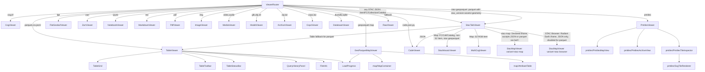

# viewers/

Per-format viewer components. Routed by `ViewerRouter` based on file extension.

```mermaid
graph TD
    VR[ViewerRouter] -->|parquet,csv,jsonl| TV[TableViewer]
    VR -->|geoparquet map| GPM[GeoParquetMapViewer]
    VR -->|cog,tif| COG[CogViewer]
    VR -->|pmtiles| PMT[PmtilesViewer]
    VR -->|fgb| FGB[FlatGeobufViewer]
    VR -->|zarr| ZV[ZarrViewer]
    VR -->|ipynb| NB[NotebookViewer]
    VR -->|code,json,py| CODE[CodeViewer]
    VR -->|md| MD[MarkdownViewer]
    VR -->|pdf| PDF[PdfViewer]
    VR -->|img| IMG[ImageViewer]
    VR -->|video,audio| MEDIA[MediaViewer]
    VR -->|glb,obj,stl| MODEL[ModelViewer]
    VR -->|zip,tar| ARC[ArchiveViewer]
    VR -->|copc,laz| COPC[CopcViewer]
    VR -->|duckdb,sqlite| DB[DatabaseViewer]
    VR -->|any STAC JSON: Item/FC/Collection/Catalog| STV[StacTabViewer]
    VR -->|stac-geoparquet: parquet with stac_version+assets+geometry| STV
    STV -->|Map: FC/Coll/Catalog, non-S2 Item, stac-geoparquet| SMV[StacMosaicViewer]
    STV -->|Map: S2 RGB Item| MCV[MultiCogViewer]
    STV -->|stac-map: DevSeed iframe, accepts JSON or parquet via href=| STACMAP[StacMapViewer variant=stac-map]
    STV -->|STAC Browser: Radiant Earth iframe, JSON only, disabled for parquet| STACBR[StacMapViewer variant=stac-browser]
    STV -->|JSON| CODE
    STV -->|Table fallback for parquet| TV
    VR -->|fallback| RAW[RawViewer]

    TV --> TG[TableGrid]
    TV --> TTB[TableToolbar]
    TV --> TSB[TableStatusBar]
    TV --> QHP[QueryHistoryPanel]
    GPM --> MC[map/MapContainer]
    GPM --> AT[map/AttributeTable]
    PMT --> PMV[pmtiles/PmtilesMapView]
    PMT --> PMA[pmtiles/PmtilesArchiveView]
    PMT --> PMI[pmtiles/PmtilesTileInspector]
    PMI --> SVG[pmtiles/SvgTileRenderer]

    TV --> FI[FileInfo]
    TV --> LP[LoadProgress]
    GPM --> LP
```

| Viewer | Powered by | Key deps used |
|--------|-----------|---------------|
| TableViewer | DuckDB-WASM, Arrow | query/index, utils/wkb, utils/geoarrow, utils/parquet-metadata, utils/url, utils/url-state, file-icons |
| GeoParquetMapViewer | deck.gl, @geoarrow/deck.gl-layers | query/engine, utils/wkb, utils/geoarrow, utils/deck, map/MapContainer |
| CogViewer | @developmentseed/deck.gl-geotiff v0.6.0-alpha.1, @developmentseed/geotiff | utils/cog, utils/url, CogControls |
| StacTabViewer | Thin wrapper around STAC-shaped JSON and stac-geoparquet tabs | Renders a top bar with `Map` / `stac-map` / `STAC Browser` / `JSON`/`Table` buttons. Mounts `StacMosaicViewer` / `MultiCogViewer` / `StacMapViewer` (DevSeed `developmentseed.org/stac-map` iframe when `variant='stac-map'`, Radiant Earth `radiantearth.github.io/stac-browser` iframe when `variant='stac-browser'`) / nested `CodeViewer` (JSON tabs) or `TableViewer` (stac-geoparquet tabs) based on `viewMode`. Persists choice in URL hash (`#map` / `#stac-map` / `#stac-browser` / `#code`). Auto-selects Map when `mapKind` is non-null, otherwise defaults to `stac-map`. For parquet tabs the STAC Browser button is disabled (Radiant Earth iframe is JSON-only, stac-map's iframe handles parquet via its own DuckDB). Wraps its root in `<Tooltip.Provider>` because the in-template `Tooltip.Root` instances (parquet-disabled STAC Browser tooltip, private-bucket iframe tooltips) throw `Context "Tooltip.Provider" not found` without an ancestor provider. |
| StacMosaicViewer | @developmentseed/deck.gl-geotiff MosaicLayer, @developmentseed/geotiff, DuckDB-WASM (parquet path only) | utils/cog, utils/stac (classifyStac, buildMosaicSourceMeta), utils/stac-hydrate (JSON path), query/stac-geoparquet (stac-geoparquet path → `queryStacGeoparquetFeatureCollection`), utils/url, storage/getAdapter, CogControls, map/MapContainer. Two ingestion paths: (1) progressive JSON link-walking via `hydrateStacItems` (batches of 12), (2) single-shot DuckDB query for `.parquet`/`.geoparquet` extensions that materializes an FC via `stacRowToItem` (from `objex-utils/stac-geoparquet`). Both funnel through `buildMosaicSourceMeta` + `ingestParquetFeatures`/`onBatch` to the same MosaicLayer wiring. Hard cap 2000 items. |
| MultiCogViewer | @developmentseed/deck.gl-geotiff MultiCOGLayer | utils/cog (buildBandRenderPipeline, createEpsgResolver), utils/stac (extractSentinelBandAssets, hasRgbBands, isStacItem), utils/url, storage/getAdapter, CogControls (mode='multi'), map/MapContainer. Reads a STAC Item, extracts Sentinel-2 band asset URLs by `eo:bands.common_name` + asset-key heuristics, composes into True Color / False-Color IR / SWIR / Vegetation / Agriculture presets with a `LinearRescale` + `FilterNoDataVal` pipeline |
| PmtilesViewer | pmtiles, MapLibre | utils/pmtiles, utils/url-state, pmtiles/* sub-components |
| FlatGeobufViewer | flatgeobuf, deck.gl | utils/deck, utils/url |
| ZarrViewer | zarrita 0.7, @carbonplan/zarr-layer 0.4.3, @developmentseed/deck.gl-zarr 0.6.0-alpha.1 | utils/zarr (ZarrNode, ZarrHierarchy, fetchHierarchy, ensureCodecsRegistered, formatCodecs, formatChunkKeys, computeChunkCount/Size/Uncompressed, inferDims, DIM_LIKE_NAMES, detectGeoZarr, zarrTileToImageData), utils/url-state. Tree view with detail panel for hierarchical Zarr stores. Map mode is **dual-path**: GeoZarr-valid stores (`multiscales` + `spatial:*` + CRS) render via `@developmentseed/deck.gl-zarr` ZarrLayer on MapboxOverlay; everything else falls back to `@carbonplan/zarr-layer` with the 10 k tile guard. Supports v2/v3, consolidated/non-consolidated, string dtype, sharding_indexed. See `docs/zarr-viewer-architecture.md` |
| CodeViewer | Shiki | utils/shiki, utils/url-state |
| NotebookViewer | Marked, Shiki, ansi_up | utils/notebook, utils/shiki |
| PdfViewer | pdf.js | utils/pdf |
| ModelViewer | Babylon.js | utils/model3d |
| ArchiveViewer | zip.js | utils/archive, utils/url, utils/format |
| DatabaseViewer | DuckDB-WASM | query/index. Handles .duckdb (native attach), .sqlite (sqlite scanner), .ducklake (ATTACH TYPE ducklake, autoloaded extension, read-only, catalog browsing with schema/table discovery, snapshot picker for time travel via `SNAPSHOT_VERSION N` re-attach, `ducklake_snapshots()` query for full snapshot list with timestamps). See `docs/ducklake-wasm-support.md` |
| MarkdownViewer | Marked, Milkdown | utils/markdown, utils/markdown-sql, editor/MilkdownEditor |
| RawViewer | custom hex dump | utils/hex, utils/format |
| ImageViewer | native `` | utils/url |
| MediaViewer | native `<video>`/`<audio>` | utils/url |
| StacMapViewer | DevSeed `stac-map` iframe (default, `variant='stac-map'`) or Radiant Earth `stac-browser` iframe (`variant='stac-browser'`) | utils/url |
| CopcViewer | viewer.copc.io iframe | utils/url |

All viewers use: `stores/tab-resources` (LRU cleanup), `i18n/t()`, `stores/settings` (theme).

Every viewer must follow the pattern in root `CLAUDE.md` (cleanup, tabResources, AbortController, $state.raw).
