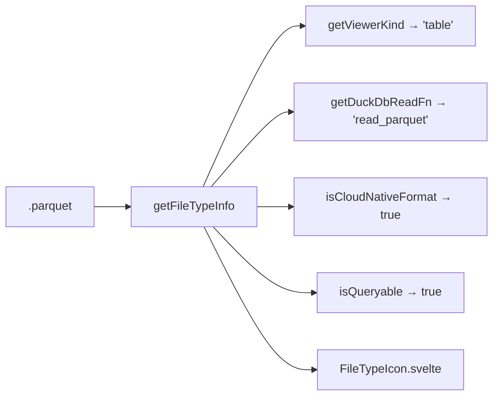

# file-icons/

Extension → file type registry. Maps 200+ extensions to viewer, icon, category, DuckDB read function.

| File | Exports |
|------|---------|
| `index.ts` | `getFileTypeInfo()`, `getDuckDbReadFn()`, `buildDuckDbSource()`, `isCloudNativeFormat()`, `getViewerKind()`, `isQueryable()`, `getMimeType()` |
| `FileTypeIcon.svelte` | Icon component (Lucide icons by category) |

Types: `FileCategory`, `ViewerKind`, `DuckDbReadFn`, `FileTypeInfo` (interface).
Published to npm. No Svelte dependency in `index.ts`.
