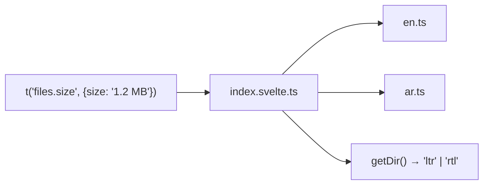

# i18n/

Simple key-based translation with `{param}` interpolation. Supports RTL.

| File | Exports |
|------|---------|
| `index.svelte.ts` | `t()`, `getLocale()`, `setLocale()`, `getDir()`, `Locale` type |
| `en.ts` | English translations dict |
| `ar.ts` | Arabic translations dict |

Use `t('key')` for all user-facing strings. Add new keys to both `en.ts` and `ar.ts`.
