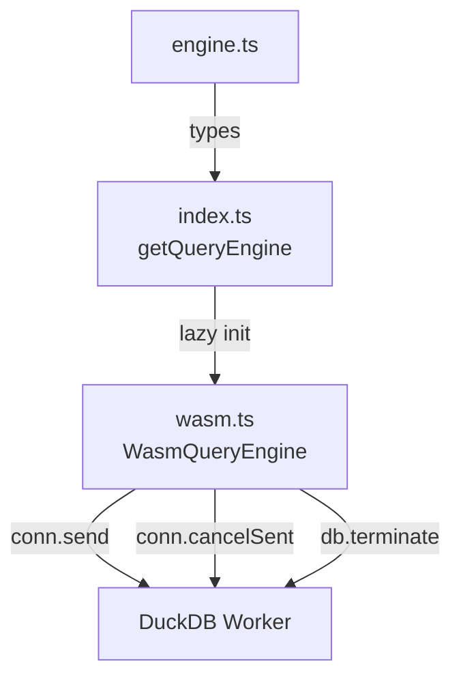

# query/

DuckDB-WASM query engine. Single worker, cancellable queries.

| File | Exports |
|------|---------|
| `engine.ts` | `QueryEngine` (interface), `QueryResult`, `MapQueryResult`, `SchemaField`, `QueryHandle`, `MapQueryHandle`, `QueryCancelledError` |
| `wasm.ts` | `WasmQueryEngine` — implements QueryEngine, manages DuckDB-WASM lifecycle |
| `index.ts` | `getQueryEngine()` — singleton factory, re-exports all types |

- `conn.send()` for data queries (non-blocking, cancellable)
- `conn.query()` only for fast metadata queries
- `enable_geoparquet_conversion = false` set at DB init
