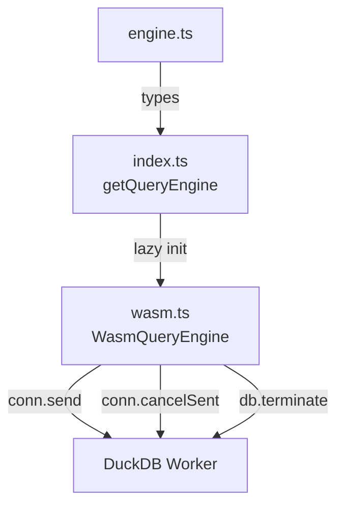

# query/

DuckDB-WASM query engine. Single worker, cancellable queries.

| File | Exports | Used by |
|------|---------|---------|
| `engine.ts` | `QueryEngine`, `QueryResult`, `MapQueryResult`, `SchemaField`, `QueryHandle`, `MapQueryHandle`, `QueryCancelledError` | TableViewer, GeoParquetMapViewer, FileInfo, evidence-context, lib/index.ts |
| `wasm.ts` | `WasmQueryEngine` | index.ts (lazy import) |
| `index.ts` | `getQueryEngine()`, re-exports all types | TableViewer, DatabaseViewer, SqlEditor, evidence-context |

- `conn.send()` for data queries (non-blocking, cancellable)
- `conn.query()` only for fast metadata queries
- `enable_geoparquet_conversion = false` set at DB init
