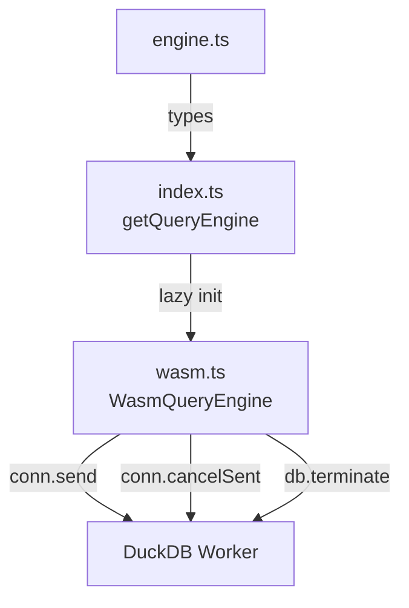

# query/

DuckDB-WASM query engine. Single worker, cancellable queries.

```mermaid
graph TD
    A[index.ts<br/>getQueryEngine] -->|lazy init| B[wasm.ts<br/>WasmQueryEngine]
    B -->|conn.send| C[DuckDB Worker]
    B -->|conn.cancelSent| C
    B -->|db.terminate| C
    D[engine.ts] -->|types| A
```

| File | Exports | Used by |
|------|---------|---------|
| `engine.ts` | `QueryEngine`, `QueryResult`, `MapQueryResult`, `SchemaField`, `QueryHandle`, `MapQueryHandle`, `QueryCancelledError` | TableViewer, GeoParquetMapViewer, FileInfo, evidence-context, lib/index.ts |
| `wasm.ts` | `WasmQueryEngine` | index.ts (lazy import) |
| `source.ts` | `resolveTableSource()`, `resolveTableSourceAsync()`, `isHttpsSourceRef()`, `ResolvedTableSource`, `QuerySource` bridge | TableViewer, DatabaseViewer, wasm.ts |
| `stac-source-parquet.ts` | `createParquetSource(tab, connectionId)` → `StacSource` (kind `'parquet'`, reports `bbox` + `datetime` push-down, single-yield, `count(filter, bbox)` runs `SELECT COUNT(*) ... ST_Intersects(...) AND <datetime predicate>`). `connectionId` is threaded explicitly from the dispatch site (not read from `tab.connectionId`) so the parquet impl is symmetric with the api/static impls receiving an explicit `deps.adapter`. Datetime push-down is load-bearing because `LIMIT + ORDER BY datetime DESC` would otherwise drop older rows before the client-side residual filter could see them, returning zero items for any window outside the freshest N. `buildDatetimeWhere` widens to handle BOTH the simple `datetime` column AND the `start_datetime`/`end_datetime` interval form (Landsat composites, climate reanalysis, etc.) when the parquet schema exposes the interval columns; combined with OR when both are present so interval-only items are not silently excluded. The underlying `runQuery()` projects required STAC columns plus optional `proj:*`/`raster:*`/`bands` (sniffed from schema), runs through `queryCancellable`, maps each row via `stacRowToItem` from `utils/stac-geoparquet.ts` with `parseWKB`. Asset hrefs resolve per-row against `{parquet_dir}/{item.id}/` (stactools item-subfolder layout). bbox values inlined after `Number.isFinite` validation; limit floored after `Number()` coercion. Slice 3 will turn this into a streaming `conn.send()` cursor and widen push-down to `eo:cloud_cover`/`gsd`/`platform`/etc. via property push. | StacMosaicViewer (via `stac-source-factory`) |
| `stac-source-factory.ts` | `createStacSourceForTab(tab, classified, deps)` → `StacSource`. `deps` shape is `{ adapter, baseHref, connectionId, urlToKey? }` — `connectionId` is required and threaded into every source impl so a future caller passing a `tab` whose `connectionId` is missing cannot get a silently-broken parquet source. Synchronous dispatch on extension + `classified.kind` + `tabLooksLikeStacApi(path)` (regex match against `STAC_API_PATH_RE`). Picks `createParquetSource(tab, deps.connectionId)` for `.parquet`/`.geoparquet`, `createApiSource` for Collection/Catalog with `rel="items"` or `item-collection` from STAC API URLs, `createStaticSource` otherwise. **Only module allowed to import both `utils/stac-source-*` and `query/stac-source-parquet` together** so DuckDB stays off the objex-utils import graph. Also re-exports `tabLooksLikeStacApi` for the few callers that need it. | StacMosaicViewer |
| `index.ts` | `getQueryEngine()`, re-exports all types | TableViewer, DatabaseViewer, SqlEditor, evidence-context |

- `conn.send()` for data queries (non-blocking, cancellable)
- `conn.query()` only for fast metadata queries
- `geometry_always_xy = true` set at DB init (DuckDB v1.5+ lon/lat axis order)
- `force_download_threshold = 2000000` set at DB init (httpfs downloads files <2MB in one shot instead of range-requesting)
- `DEFAULT_TARGET_CRS = 'OGC:CRS84'` (GeoParquet 1.1 canonical, equivalent to EPSG:4326 under always_xy)
- GeoParquet auto-conversion enabled (default) — columns read as `GEOMETRY('EPSG:...')`
- Legacy GeoParquet fallback: `enable_geoparquet_conversion = false` set per-connection when detected. The known CRS (from hyparquet metadata) is re-attached via `ST_SetCRS(ST_GeomFromWKB(...))` so downstream `ST_Transform` uses the 2-arg form
- **Init SQL ordering is load-bearing**: `SELECT * FROM duckdb_coordinate_systems()` must run BEFORE explicit `LOAD spatial` to warm the PROJ default CRS registry. Workaround for [duckdb-wasm#2199](https://github.com/duckdb/duckdb-wasm/issues/2199), do not reorder
- Use helpers from `utils/geometry-type.ts` (`parseGeometryTypeCrs`, `buildTransformExpr`, `wrapWkbWithCrs`, `isWgs84Crs`) instead of ad-hoc regex on type strings
- For `signed-s3` connections, use `resolveTableSourceAsync(tab)` so the resolved `fileUrl` / `ref` carries a presigned HTTPS URL (SigV4 query string). DuckDB's httpfs then fetches with `Range` only, skipping the `Authorization` preflight that breaks on GCS. Every `configureStorage` call site threads either `source.ref` (`getSchema`, `getRowCount`, `getSchemaAndCrs`, `detectCrs`) or the raw `sql` (`query`, `queryForMap`, `queryCancellable`, `queryForMapCancellable`) so `isHttpsSourceRef()` short-circuits the S3 SETs on every query path, not just the initial schema probe. The `isHttpsSourceRef` regex matches both bare refs and `https://` URLs embedded in `read_parquet('https://...')` SQL
- **Arrow DECIMAL handling**: DuckDB-WASM emits DECIMAL columns as Arrow `Decimal128` buffers whose values are either `BigInt` or `Uint32Array` little-endian words. `isNumericArrowType()` excludes DECIMAL so values go through the decimal path; `decimalScale()` parses **both** the DuckDB DESCRIBE form (`DECIMAL(10,2)`) **and** the Arrow `toString()` form (`Decimal[10e+2]`, precision `e` signed-scale) since `query()` / `queryCancellable()` derive `types` from `String(field.type)` on Arrow schema — never the DESCRIBE string. `formatDecimal()` then rewrites each cell to a scaled decimal string. Reviewed in v1.2+ after the initial regex only matched the DESCRIBE form
