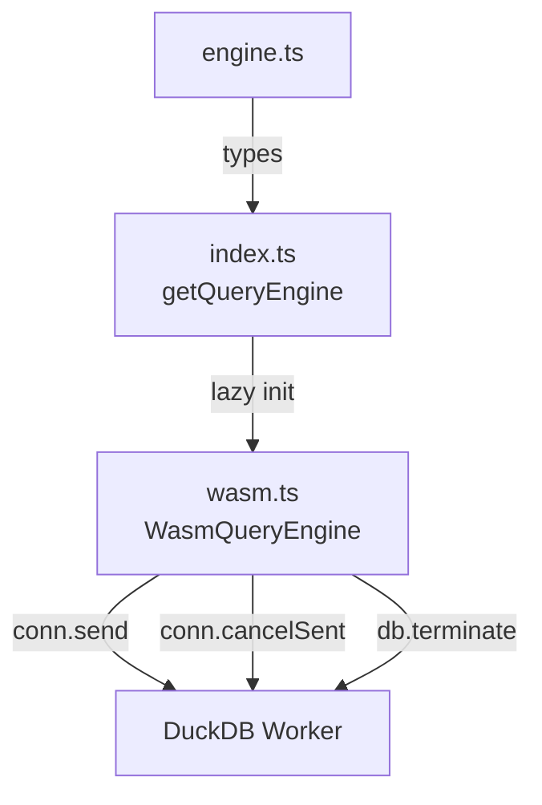

# query/

DuckDB-WASM query engine. Single worker, cancellable queries.

```mermaid
graph TD
    A[index.ts<br/>getQueryEngine] -->|lazy init| B[wasm.ts<br/>WasmQueryEngine]
    B -->|conn.send| C[DuckDB Worker]
    B -->|conn.cancelSent| C
    B -->|db.terminate| C
    D[engine.ts] -->|types| A
```

| File | Exports | Used by |
|------|---------|---------|
| `engine.ts` | `QueryEngine`, `QueryResult`, `MapQueryResult`, `SchemaField`, `QueryHandle`, `MapQueryHandle`, `QueryCancelledError` | TableViewer, GeoParquetMapViewer, FileInfo, evidence-context, lib/index.ts |
| `wasm.ts` | `WasmQueryEngine` | index.ts (lazy import) |
| `source.ts` | `resolveTableSource()`, `ResolvedTableSource`, `QuerySource` bridge | TableViewer, DatabaseViewer |
| `index.ts` | `getQueryEngine()`, re-exports all types | TableViewer, DatabaseViewer, SqlEditor, evidence-context |

- `conn.send()` for data queries (non-blocking, cancellable)
- `conn.query()` only for fast metadata queries
- `geometry_always_xy = true` set at DB init (DuckDB v1.5+ lon/lat axis order)
- `force_download_threshold = 2000000` set at DB init (httpfs downloads files <2MB in one shot instead of range-requesting)
- `DEFAULT_TARGET_CRS = 'OGC:CRS84'` (GeoParquet 1.1 canonical, equivalent to EPSG:4326 under always_xy)
- GeoParquet auto-conversion enabled (default) — columns read as `GEOMETRY('EPSG:...')`
- Legacy GeoParquet fallback: `enable_geoparquet_conversion = false` set per-connection when detected. The known CRS (from hyparquet metadata) is re-attached via `ST_SetCRS(ST_GeomFromWKB(...))` so downstream `ST_Transform` uses the 2-arg form
- **Init SQL ordering is load-bearing**: `SELECT * FROM duckdb_coordinate_systems()` must run BEFORE explicit `LOAD spatial` to warm the PROJ default CRS registry. Workaround for [duckdb-wasm#2199](https://github.com/duckdb/duckdb-wasm/issues/2199), do not reorder
- Use helpers from `utils/geometry-type.ts` (`parseGeometryTypeCrs`, `buildTransformExpr`, `wrapWkbWithCrs`, `isWgs84Crs`) instead of ad-hoc regex on type strings
