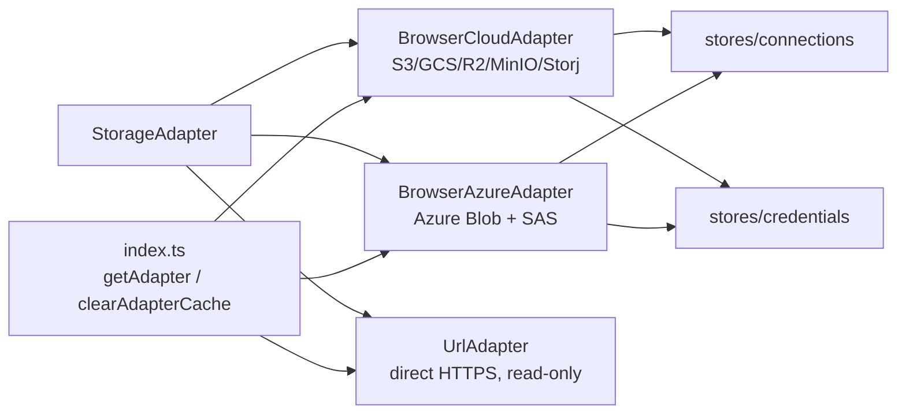

# storage/

Cloud storage adapters. All implement `StorageAdapter` interface.

| File | Exports |
|------|---------|
| `adapter.ts` | `StorageAdapter` (interface), `ListPage` |
| `browser-cloud.ts` | `BrowserCloudAdapter` — S3-compatible (aws4fetch SigV4) |
| `browser-azure.ts` | `BrowserAzureAdapter` — Azure Blob (SAS token auth) |
| `url-adapter.ts` | `UrlAdapter` — direct HTTPS fetch, no auth |
| `index.ts` | `getAdapter()`, `clearAdapterCache()` — factory + LRU cache |

`adapter.ts` and `url-adapter.ts` use relative imports (not `$lib`) — they're published to npm.
