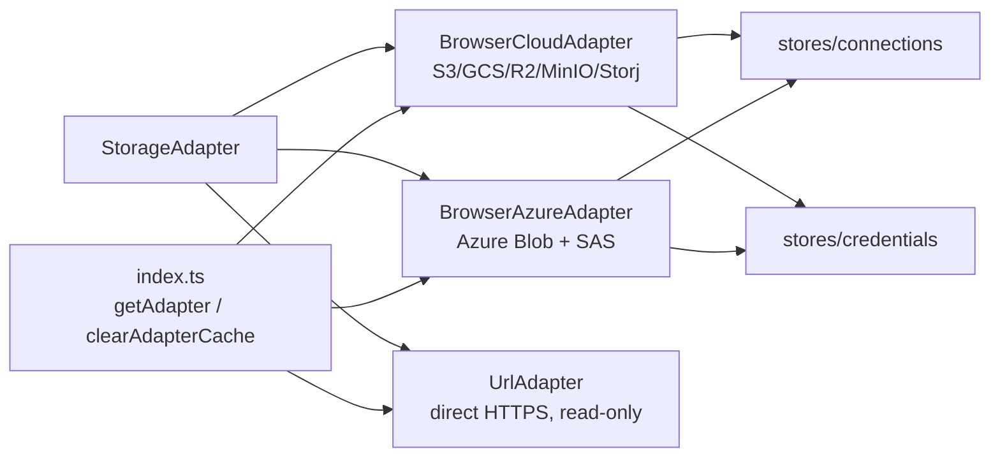

# storage/

Cloud storage adapters. All implement `StorageAdapter` interface.

| File | Exports | Used by |
|------|---------|---------|
| `adapter.ts` | `StorageAdapter` (interface), `ListPage` | lib/index.ts (npm export) |
| `browser-cloud.ts` | `BrowserCloudAdapter` | index.ts (factory) |
| `browser-azure.ts` | `BrowserAzureAdapter` | index.ts (factory) |
| `url-adapter.ts` | `UrlAdapter` | lib/index.ts (npm export) |
| `index.ts` | `getAdapter()`, `clearAdapterCache()` | stores/browser, FileTreeSidebar, ArchiveViewer, ModelViewer, DatabaseViewer, MediaViewer, PdfViewer, RawViewer, MarkdownViewer, NotebookViewer, MapViewer, CodeViewer, ImageViewer |

`adapter.ts` and `url-adapter.ts` use relative imports (not `$lib`) — they're published to npm.
