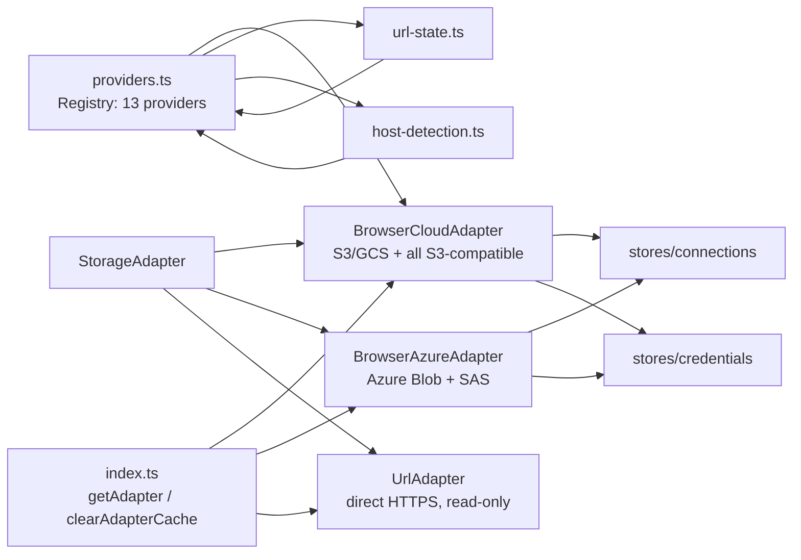

# storage/

Cloud storage adapters. All implement `StorageAdapter` interface.

```mermaid
graph LR
    P[providers.ts<br/>Registry: 13 providers] --> B & US & HD
    A[StorageAdapter] --> B[BrowserCloudAdapter<br/>S3/GCS + all S3-compatible]
    A --> C[BrowserAzureAdapter<br/>Azure Blob + SAS]
    A --> D[UrlAdapter<br/>direct HTTPS, read-only]
    E[index.ts<br/>getAdapter / clearAdapterCache] --> B & C & D
    B & C --> F[stores/connections]
    B & C --> G[stores/credentials]
    US[url-state.ts] --> P
    HD[host-detection.ts] --> P
```

| File | Exports | Used by |
|------|---------|---------|
| `providers.ts` | `PROVIDERS`, `PROVIDER_IDS`, `ProviderId`, `ProviderDef`, `ProviderRegion`, `getProvider()`, `buildEndpointFromTemplate()`, `buildProviderBaseUrl()`, `isGcsProvider()`, `AccessMode`, `AccessModeInput`, `getAccessMode()`, `isPubliclyStreamable()` | ConnectionDialog, browser-cloud, url-state, host-detection, url.ts, storage-url.ts, query/wasm.ts |
| `adapter.ts` | `StorageAdapter` (interface), `ListPage` | lib/index.ts (npm export) |
| `browser-cloud.ts` | `BrowserCloudAdapter` | index.ts (factory) |
| `browser-azure.ts` | `BrowserAzureAdapter` | index.ts (factory) |
| `url-adapter.ts` | `UrlAdapter` | lib/index.ts (npm export) |
| `index.ts` | `getAdapter()`, `clearAdapterCache()` | stores/browser, FileTreeSidebar, ArchiveViewer, ModelViewer, DatabaseViewer, MediaViewer, PdfViewer, RawViewer, MarkdownViewer, NotebookViewer, CodeViewer, ImageViewer |

`adapter.ts`, `url-adapter.ts`, and `utils/storage-url.ts` use relative imports (not `$lib`) — they're published to npm via `objex-utils`. `providers.ts` is also imported by `storage-url.ts` via relative path.

## Provider Registry (`providers.ts`)

Single source of truth for all 13 providers: S3, GCS, R2, Azure, B2, DigitalOcean, Wasabi, Storj, Hetzner, Contabo, Linode, OVHcloud, MinIO.

Each `ProviderDef` has: label, description, authMethod, needsRegion, needsEndpoint, defaultRegion, endpointTemplate (`{region}` placeholder), regions array, endpointPlaceholder, schemes.

To add a new provider: add entry to `PROVIDERS`, add ID to `ProviderId` union and `PROVIDER_IDS` array. If it has a distinctive URL pattern, also update `storage-url.ts` and `host-detection.ts`.

## Access Mode

`getAccessMode(conn)` returns one of three values — the single source of truth for how any HTTP client (DuckDB httpfs, COG/Zarr/PMTiles, fetch/img/video) should read a connection's files:

| Mode | URL form | When |
|------|----------|------|
| `public-https` | Plain HTTPS | Anonymous buckets (AWS/GCS/R2/Storj/Wasabi/etc.) |
| `sas-https` | HTTPS with SAS token | Azure Blob (any auth) |
| `signed-s3` | `s3://bucket/key` | Authenticated S3-compatible — needs SigV4 signing |

Consumers:
- `utils/url.ts` — `buildDuckDbUrl()` returns `s3://` only for `signed-s3`; `canStreamDirectly()` wraps `isPubliclyStreamable()`
- `query/wasm.ts` — `configureStorage()` skips all S3 SETs (credentials, region, endpoint, url_style) for non-`signed-s3` modes, saving a worker round-trip per query

**Do not** add another ad-hoc `provider === 'azure'` or `anonymous && endpoint` branch for URL routing. Use `getAccessMode()` / `isPubliclyStreamable()` instead. Adapter selection in `index.ts` is still provider-based (Azure uses a different API class), which is a separate concern from access mode.
