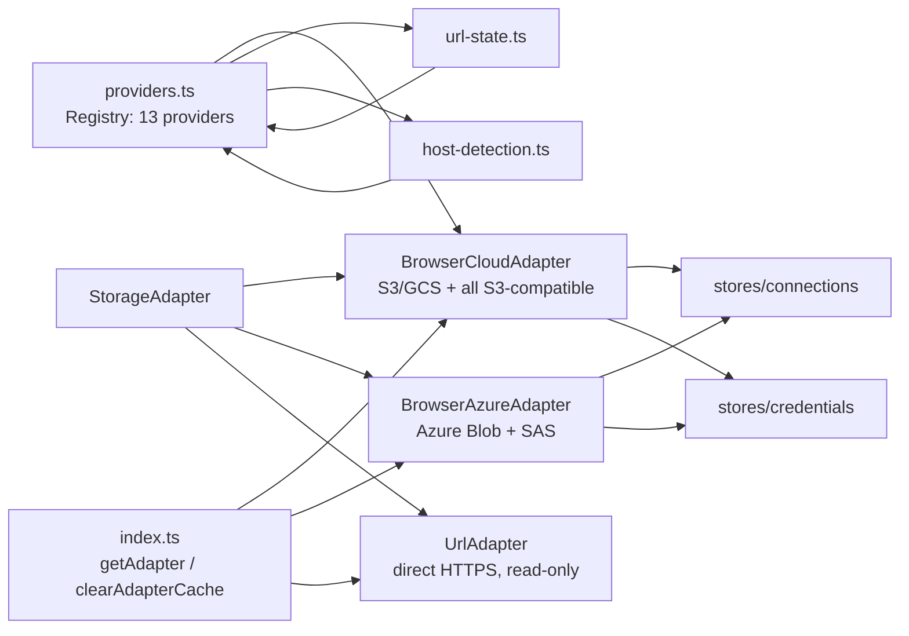

# storage/

Cloud storage adapters. All implement `StorageAdapter` interface.

```mermaid
graph LR
    P[providers.ts<br/>Registry: 13 providers] --> B & US & HD
    A[StorageAdapter] --> B[BrowserCloudAdapter<br/>S3/GCS + all S3-compatible]
    A --> C[BrowserAzureAdapter<br/>Azure Blob + SAS]
    A --> D[UrlAdapter<br/>direct HTTPS, read-only]
    E[index.ts<br/>getAdapter / clearAdapterCache] --> B & C & D
    B & C --> F[stores/connections]
    B & C --> G[stores/credentials]
    US[url-state.ts] --> P
    HD[host-detection.ts] --> P
```

| File | Exports | Used by |
|------|---------|---------|
| `providers.ts` | `PROVIDERS`, `PROVIDER_IDS`, `ProviderId`, `ProviderDef`, `ProviderRegion`, `getProvider()`, `buildEndpointFromTemplate()`, `resolveProviderEndpoint()`, `buildProviderBaseUrl()`, `isGcsProvider()`, `AccessMode`, `AccessModeInput`, `getAccessMode()`, `isPubliclyStreamable()` | ConnectionDialog, browser-cloud, url-state, host-detection, url.ts, storage-url.ts, query/wasm.ts, presign.ts |
| `adapter.ts` | `StorageAdapter` (interface), `ListPage` | lib/index.ts (npm export) |
| `browser-cloud.ts` | `BrowserCloudAdapter` | index.ts (factory) |
| `browser-azure.ts` | `BrowserAzureAdapter` | index.ts (factory) |
| `url-adapter.ts` | `UrlAdapter` | lib/index.ts (npm export) |
| `presign.ts` | `presignHttpsUrl()` (SigV4 query-string, 7d default expiry) | utils/url.ts (buildHttpsUrlAsync, buildDuckDbUrlAsync) |
| `index.ts` | `getAdapter()`, `clearAdapterCache()` | stores/browser, FileTreeSidebar, ArchiveViewer, ModelViewer, DatabaseViewer, MediaViewer, PdfViewer, RawViewer, MarkdownViewer, NotebookViewer, CodeViewer, ImageViewer |

`adapter.ts`, `url-adapter.ts`, and `utils/storage-url.ts` use relative imports (not `$lib`) — they're published to npm via `objex-utils`. `providers.ts` is also imported by `storage-url.ts` via relative path.

## Provider Registry (`providers.ts`)

Single source of truth for all 13 providers: S3, GCS, R2, Azure, B2, DigitalOcean, Wasabi, Storj, Hetzner, Contabo, Linode, OVHcloud, MinIO.

Each `ProviderDef` has: label, description, authMethod, needsRegion, needsEndpoint, defaultRegion, endpointTemplate (`{region}` placeholder), regions array, endpointPlaceholder, schemes.

To add a new provider: add entry to `PROVIDERS`, add ID to `ProviderId` union and `PROVIDER_IDS` array. If it has a distinctive URL pattern, also update `storage-url.ts` and `host-detection.ts`.

## Access Mode

`getAccessMode(conn)` returns one of three values — the single source of truth for how any HTTP client (DuckDB httpfs, COG/Zarr/PMTiles, fetch/img/video) should read a connection's files:

| Mode | URL form | When |
|------|----------|------|
| `public-https` | Plain HTTPS | Anonymous buckets (AWS/GCS/R2/Storj/Wasabi/etc.) |
| `sas-https` | HTTPS with SAS token | Azure Blob (any auth) |
| `signed-s3` | `s3://bucket/key` | Authenticated S3-compatible — needs SigV4 signing |

Consumers:
- `utils/url.ts` — `buildDuckDbUrl()` / `buildHttpsUrl()` are sync. The async pair `buildDuckDbUrlAsync()` / `buildHttpsUrlAsync()` share a `tryPresignTab()` helper that calls `presignHttpsUrl()` (SigV4 query-string auth via `aws4fetch.signQuery`) for `signed-s3` and falls back to the sync builder for anonymous / Azure-SAS. `canStreamDirectly()` wraps `isPubliclyStreamable()`.
- `query/wasm.ts` — `configureStorage(conn, connId, sourceRef?)` skips all S3 SETs when `isHttpsSourceRef(sourceRef)` is true (presigned, self-authenticating) or when access mode is not `signed-s3`. Every caller threads the ref through: schema / row-count / CRS probes pass `source.ref`, data-query paths (`query`, `queryCancellable`, `queryForMap`, `queryForMapCancellable`) pass the raw `sql` (the regex matches `read_parquet('https://...')` embedded in SQL too). Net effect: one worker round-trip saved per query on every presigned tab, not just at tab open. When the connection's `endpoint` is empty and the provider is non-`s3`, it resolves a default via `resolveProviderEndpoint()` so DuckDB doesn't silently route to AWS.

The presigned path is preferred for `signed-s3` because it removes the `Authorization` header from DuckDB's httpfs fetches, dodging CORS preflight fragility on GCS's S3-compatible endpoint (where the bucket `responseHeader` list and the browser's preflight cache regularly desync).

`DEFAULT_EXPIRES_IN_SECONDS = 7 * 24 * 3600` in `presign.ts`. 7d is the SigV4 protocol maximum and is a hard cap on every S3-compatible provider we support (AWS, GCS, R2, B2, DO Spaces, Wasabi, Storj, Hetzner, Contabo, Linode, OVHcloud, MinIO). SDK defaults are lower (GCS ships 3600s), but that's a default, not a limit. `presignHttpsUrl` clamps `expiresIn` to `MAX_EXPIRES_IN_SECONDS` so callers can't silently mint URLs every provider rejects.

Tabs open longer than 7d will hit 403 on new range requests — no automatic resign-on-4xx yet. Adding it is non-trivial because the fetcher is usually out of our hands (DuckDB httpfs, `@developmentseed/geotiff`, flatgeobuf's `HttpReader`, iframes), so interception would need to happen in a library-specific wrapper rather than in `presignHttpsUrl`. For now, the UX remedy is to close/reopen the tab.

**Do not** add another ad-hoc `provider === 'azure'` or `anonymous && endpoint` branch for URL routing. Use `getAccessMode()` / `isPubliclyStreamable()` instead. Adapter selection in `index.ts` is still provider-based (Azure uses a different API class), which is a separate concern from access mode.
