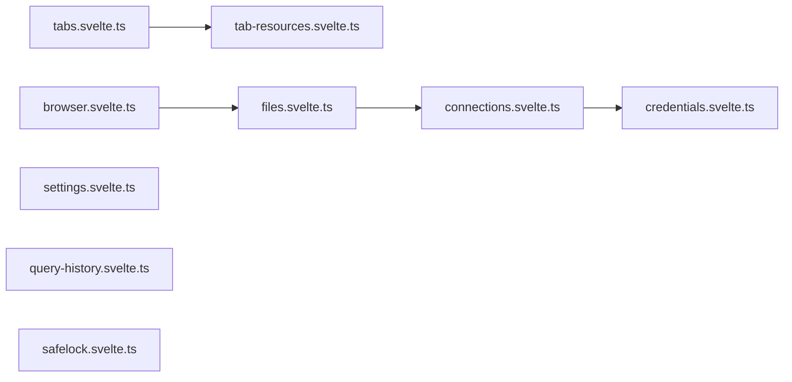

# stores/

Svelte 5 rune-based stores. All use `$state` / `$state.raw` / `$derived`.

| File | Export | Used by |
|------|--------|--------|
| `connections.svelte.ts` | `connectionStore` | url.ts, browser-azure, browser-cloud, storage/index, ConnectionDialog, Sidebar, TableToolbar, +page.svelte |
| `credentials.svelte.ts` | `credentialStore` | url.ts, browser-azure, browser-cloud, Sidebar, query/wasm |
| `tabs.svelte.ts` | `tabStore` | StatusBar, TabBar, Sidebar, FileRow, FileTreeSidebar, +page.svelte |
| `tab-resources.svelte.ts` | `tabResources` | CogViewer, TableViewer, FlatGeobufViewer, ArchiveViewer, ModelViewer, GeoParquetMapViewer, DatabaseViewer, MediaViewer, PdfViewer, RawViewer, MarkdownViewer, ZarrMapViewer, NotebookViewer, MapViewer, CodeViewer, ImageViewer, PmtilesViewer |
| `files.svelte.ts` | `fileStore` | StatusBar |
| `browser.svelte.ts` | `browser` | StatusBar, Sidebar, FileBrowser, DropZone, UploadButton, FileRow, DeleteConfirmDialog, FileTreeSidebar, RenameDialog, CreateFolderDialog, +page.svelte |
| `settings.svelte.ts` | `settings` | LocaleToggle, ThemeToggle, scroll-area, TableViewer, FlatGeobufViewer, GeoParquetMapViewer, MapContainer, CodeMirrorEditor, +layout.svelte |
| `query-history.svelte.ts` | `queryHistory` | TableViewer, QueryHistoryPanel, SqlEditor |
| `safelock.svelte.ts` | `safeLock` | SafeLockToggle, FileBrowser, DropZone, FileRow |

All stores are module-level singletons (SPA, no SSR).
Use `$state.raw` for arrays >100 items. Credentials never touch localStorage.
