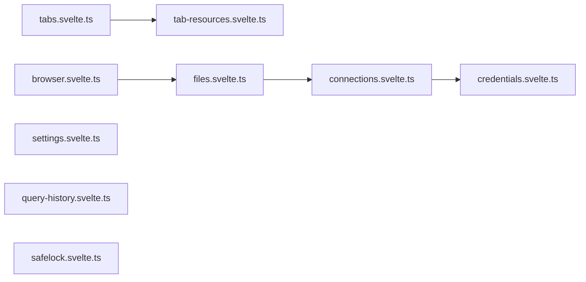

# stores/

Svelte 5 rune-based stores. All use `$state` / `$state.raw` / `$derived`.

| File | Export | What |
|------|--------|------|
| `connections.svelte.ts` | `connectionStore` | CRUD for storage connections, localStorage persistence |
| `credentials.svelte.ts` | `credentialStore` | In-memory only (never persisted), SigV4 + Azure SAS |
| `tabs.svelte.ts` | `tabStore` | Open file tabs, active tab tracking |
| `tab-resources.svelte.ts` | `tabResources` | LRU eviction of viewer heavy data, `register(tabId, cleanup)` |
| `files.svelte.ts` | `fileStore` | Directory listing, sort config |
| `browser.svelte.ts` | `browser` | Current path, navigation state |
| `settings.svelte.ts` | `settings` | Theme, locale, preferences |
| `query-history.svelte.ts` | `queryHistory` | SQL query history log |
| `safelock.svelte.ts` | `safeLock` | Write protection toggle |

All stores are module-level singletons (SPA, no SSR).
Use `$state.raw` for arrays >100 items. Credentials never touch localStorage.
