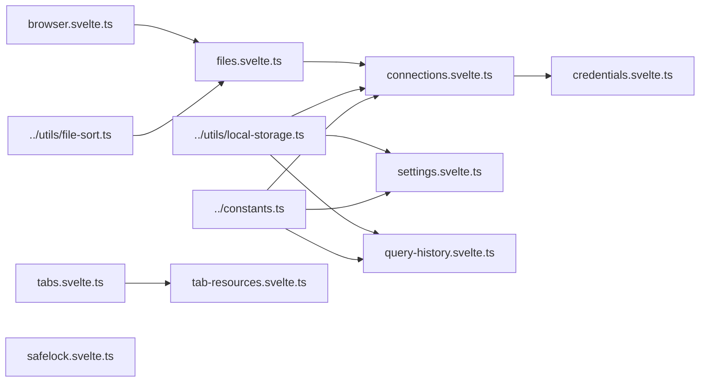

# stores/

Svelte 5 rune-based stores. All use `$state` / `$state.raw` / `$derived`.

```mermaid
graph LR
    CONST[../constants.ts] --> CONN & SET & QH
    LS[../utils/local-storage.ts] --> CONN & SET & QH
    FSORT[../utils/file-sort.ts] --> FILES
    CONN[connections.svelte.ts] --> CRED[credentials.svelte.ts]
    TABS[tabs.svelte.ts] --> TR[tab-resources.svelte.ts]
    FILES[files.svelte.ts] --> CONN
    BR[browser.svelte.ts] --> FILES
    SET[settings.svelte.ts]
    QH[query-history.svelte.ts]
    SL[safelock.svelte.ts]
```

Stores use shared utilities from `../utils/`:
- `local-storage.ts` — generic `loadFromStorage()`/`persistToStorage()` (used by connections, settings, query-history)
- `file-sort.ts` — `sortFileEntries()`, `toggleSortField()` (used by files)

| File | Export | Used by |
|------|--------|--------|
| `connections.svelte.ts` | `connectionStore`, `DuplicateConnectionError`, `ConnectionWriteResult` | url.ts, browser-azure, browser-cloud, storage/index, ConnectionDialog, Sidebar, TableToolbar, +page.svelte |
| `credentials.svelte.ts` | `credentialStore` | url.ts, browser-azure, browser-cloud, Sidebar, query/wasm |
| `tabs.svelte.ts` | `tabs` (incl. `tabs.migrating` getter + `tabs.beginMigration()` / `tabs.endMigration()` — set by `Sidebar::handleAutoDetection` across the eager-close → remote-open window so the tab-sync `$effect` in `+page.svelte` knows not to wipe `?url=`/`#hash` while `tabs.items` is briefly empty; user-initiated closes leave the flag false so URL clears cleanly), `eagerUrlTabId(url)` | StatusBar, TabBar, Sidebar, FileTreeSidebar, +page.svelte |
| `tab-resources.svelte.ts` | `tabResources` | CogViewer, TableViewer, FlatGeobufViewer, ArchiveViewer, ModelViewer, GeoParquetMapViewer, DatabaseViewer, MediaViewer, PdfViewer, RawViewer, MarkdownViewer, ZarrMapViewer, NotebookViewer, MapViewer, CodeViewer, ImageViewer, PmtilesViewer |
| `files.svelte.ts` | `files` | StatusBar |
| `browser.svelte.ts` | `browser` | StatusBar, Sidebar, FileTreeSidebar, +page.svelte |
| `settings.svelte.ts` | `settings` (theme, locale, featureLimit, mosaicItemLimit) | LocaleToggle, ThemeToggle, scroll-area, TableViewer, FlatGeobufViewer, GeoParquetMapViewer, MapContainer, CodeMirrorEditor, StacMosaicViewer (mosaicItemLimit), +layout.svelte |
| `query-history.svelte.ts` | `queryHistory` | TableViewer, QueryHistoryPanel, SqlEditor |
| `safelock.svelte.ts` | `safeLock` | SafeLockToggle |

All stores are module-level singletons (SPA, no SSR).
Use `$state.raw` for arrays >100 items. Credentials never touch localStorage.

## Connection dedup

`save()`, `update()`, and `saveHostConnection()` all dedup via
`connectionIdentityKey()` (`../utils/connection-identity.ts`). Identity is:

| Provider | Key |
|----------|-----|
| `azure` | `azure \| <normalizedEndpoint> \| <bucket>` |
| `gcs` | `gcs \| <bucket>` (global namespace) |
| `s3` (empty endpoint) | `s3 \| <bucket> \| <region>` (AWS native) |
| everything else | `<provider> \| <normalizedEndpoint> \| <bucket>` |

`normalizeEndpoint()` lowercases host, drops default ports (`:443`/`:80`) and
trailing slashes, and preserves explicit non-default ports and pathnames, so
`http` vs `https`, `:443` vs empty, and trailing-slash drift all collapse.

- `save()` returns `{ id, existed }`. On `existed: true` the row is reused and
  credentials from the new config overwrite the old ones.
- `update()` throws `DuplicateConnectionError` when the new identity would
  collide with a different saved row, so the dialog can tell the user which
  connection already owns that bucket.
- `saveHostConnection()` is the auto-detect entry and always returns the final
  id, either reused or newly inserted.

Do not add new write paths that bypass these helpers. Adding a `findBy*`
variant that keys on a subset of fields reintroduces the duplicate bug.
