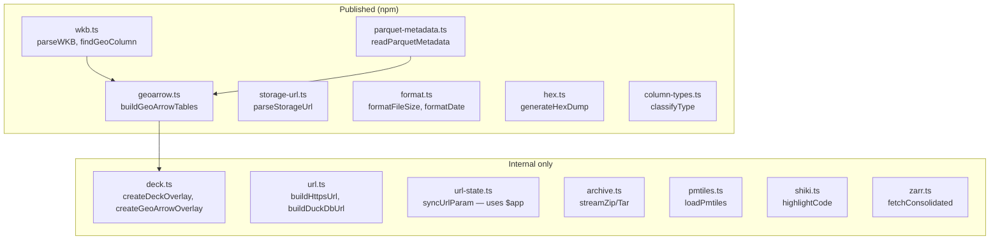

# utils/

Pure utility modules. No Svelte dependency except `url-state.ts` and `analytics.ts`.

| File | Key Exports | Notes |
|------|-------------|-------|
| `wkb.ts` | `parseWKB()`, `toBinary()`, `findGeoColumn()`, `findGeoColumnFromRows()` | 5-byte WKB peek, zero-copy |
| `geoarrow.ts` | `buildGeoArrowTables()`, `normalizeGeomType()` | WKB → Arrow, splits by geom type |
| `storage-url.ts` | `parseStorageUrl()`, `looksLikeUrl()`, `Defaults` | 20+ URL patterns |
| `parquet-metadata.ts` | `readParquetMetadata()`, `extractEpsgFromGeoMeta()`, `extractBounds()` | hyparquet, single range request |
| `format.ts` | `formatFileSize()`, `formatDate()`, `getFileExtension()` | NaN-safe |
| `hex.ts` | `generateHexDump()` | For RawViewer |
| `column-types.ts` | `classifyType()`, `typeColor()`, `typeLabel()` | DuckDB type → category |
| `deck.ts` | `createDeckOverlay()`, `createGeoArrowOverlay()`, `createGeoArrowLayers()` | deck.gl + MapLibre bridge |
| `url.ts` | `buildHttpsUrl()`, `buildDuckDbUrl()`, `canStreamDirectly()` | Provider-aware URL builder |
| `archive.ts` | `streamZipEntriesFromUrl()`, `streamTarEntriesFromUrl()`, `listContents()` | zip.js streaming |
| `pmtiles.ts` | `loadPmtiles()`, `buildPmtilesLayers()` | PMTiles → MapLibre layers |
| `shiki.ts` | `highlightCode()`, `extensionToShikiLang()` | Syntax highlighting |
| `zarr.ts` | `fetchConsolidated()`, `probeWithZarrita()` | Zarr v2/v3 metadata |
| `url-state.ts` | `syncUrlParam()`, `updateUrlView()` | URL hash state (uses `$app`) |
| `analytics.ts` | `initAnalytics()`, `capturePageview()` | PostHog (uses `$app`) |
| `export.ts` | `exportToCsv()`, `exportToJson()` | Table data export |
| `pdf.ts` | `loadPdfDocument()` | pdf.js wrapper |
| `model3d.ts` | `createModelScene()`, `loadModel()` | Babylon.js wrapper |
| `markdown.ts` | `renderMarkdown()`, `detectRTL()` | Marked + direction detection |
| `map-selection.ts` | `setupSelectionLayer()`, `updateSelection()` | deck.gl selection |
| `host-detection.ts` | `detectHostBucket()` | Auto-detect bucket from hostname |
| `markdown-sql.ts` | `parseMarkdownDocument()`, `interpolateTemplates()` | Evidence-style SQL blocks |
