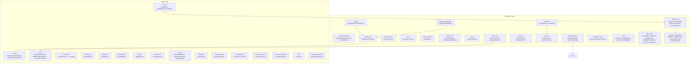

# utils/

Pure utility modules. No Svelte dependency except `url-state.ts` and `url.ts` (store-dependent).
Shared constants live in `src/lib/constants.ts` (imported by stores, query, and utils).

```mermaid
graph TD
    subgraph "Published (npm)"
        WKB[wkb.ts<br/>parseWKB, findGeoColumn]
        SGP[stac-geoparquet.ts<br/>isStacGeoparquetSchema, stacRowToItem]
        GA[geoarrow.ts<br/>buildGeoArrowTables]
        SU[storage-url.ts<br/>parseStorageUrl]
        PM[parquet-metadata.ts<br/>readParquetMetadata]
        FMT[format.ts<br/>formatFileSize, formatDate]
        HEX[hex.ts<br/>generateHexDump]
        CT[column-types.ts<br/>classifyType]
        CB[clipboard.ts<br/>copyToClipboard, wireCodeCopyButtons]
        ERR[error.ts<br/>handleLoadError]
        CU[cloud-url.ts<br/>resolveCloudUrl, getNativeScheme]
        FS[file-sort.ts<br/>sortFileEntries, toggleSortField]
        EXP[export.ts<br/>serializeToCsv, serializeToJson]
        LS[local-storage.ts<br/>loadFromStorage, persistToStorage]
        MSQL[markdown-sql.ts<br/>parseMarkdownDocument]
        COG[cog.ts<br/>safeClamp, clampBounds, renderNonTiledBitmap]
        COGP[cog-pure.ts<br/>SF_LABELS, safeClamp, clampBounds, buildDataTypeLabel, CogInfo, GeoBounds]
        CA[cog-asset.ts<br/>CogAsset, ChannelRef, ChannelComposite, extractCogAssets]
        CCM[channel-composite.ts<br/>PRESETS, applyPreset, compositeFromUrl, compositeToUrl]
    end
    subgraph "Internal only"
        DECK[deck.ts<br/>createGeoArrowOverlay, createGeoArrowLayers]
        URL[url.ts<br/>buildHttpsUrl/Async, buildDuckDbUrl/Async — re-exports cloud-url]
        US[url-state.ts<br/>syncUrlParam — uses $app]
        ARC[archive.ts<br/>streamZip/Tar]
        PMT[pmtiles.ts<br/>loadPmtiles]
        PMTT[pmtiles-tile.ts<br/>decodeMvtTile]
        SHIKI[shiki.ts<br/>highlightCode]
        NB[notebook.ts<br/>renderNotebook]
        ZARR[zarr.ts<br/>detectZarrMarkers, extractZarrStoreUrl, detectGeoZarr]
        ZTAB[zarr-tab.ts<br/>openZarrTab]
        STAC[stac.ts<br/>classifyStac, buildMosaicSourceMeta]
        STACH[stac-hydrate.ts<br/>hydrateStacItems]
        STACSRC[stac-source.ts<br/>StacSource contract]
        STACAPI[stac-source-api.ts<br/>createApiSource]
        STACSTAT[stac-source-static.ts<br/>createStaticSource]
        LRU[lru.ts<br/>LruCache]
        MPI[map-pixel-inspect.ts<br/>attachPixelInspector]
    end
    WKB --> GA
    PM --> GA
    GA --> DECK
    CU --> URL
    FMT --> EXP
    LS --> stores
    CA --> CCM
    STAC --> CA
```

| File | Key Exports | Used by |
|------|-------------|---------|
| `wkb.ts` | `parseWKB()`, `toBinary()`, `findGeoColumn()`, `findGeoColumnFromRows()` | TableViewer, GeoParquetMapViewer, lib/index.ts |
| `stac-geoparquet.ts` | `STAC_GEOPARQUET_REQUIRED_COLUMNS`, `isStacGeoparquetSchema()`, `flattenStacBbox()`, `resolveStacAssetHref()`, `pickStacPrimaryAsset()`, `stacRowToItem()` + types | ViewerRouter (schema sniff), query/stac-source-parquet (per-row → Item), objex-utils (re-export) |
| `geoarrow.ts` | `buildGeoArrowTables()`, `normalizeGeomType()` | TableViewer, GeoParquetMapViewer, lib/index.ts |
| `storage-url.ts` | `parseStorageUrl()`, `looksLikeUrl()`, `describeParseResult()`, `classifyUrl()`, `isKnownBucketHost()`, `STAC_API_PATH_RE`, `Defaults`, `ParsedStorageUrl`, `StorageProvider`, `UrlClassification` | ConnectionDialog, Sidebar, host-detection (isKnownBucketHost), +page.svelte (classifyUrl for STAC API path routing), lib/index.ts |
| `parquet-metadata.ts` | `readParquetMetadata()` (returns `{ schema, topLevelColumns, geo, ... }` — `schema` is leaves only, `topLevelColumns` includes struct parents like `assets`/`bbox` for stac-geoparquet sniffing), `extractEpsgFromGeoMeta()`, `extractBounds()` | TableViewer, ViewerRouter (stac-geoparquet detect), lib/index.ts |
| `format.ts` | `formatFileSize()`, `formatDate()`, `getFileExtension()`, `formatValue()`, `jsonReplacerBigInt()` | StatusBar, FileTreeSidebar, ArchiveViewer, RawViewer, PmtilesTileInspector, PmtilesArchiveView, AttributeTable, TableGrid, export.ts, lib/index.ts |
| `hex.ts` | `generateHexDump()` | RawViewer, lib/index.ts |
| `column-types.ts` | `classifyType()`, `typeColor()`, `typeLabel()` | TableGrid, lib/index.ts |
| `cloud-url.ts` | `resolveCloudUrl()`, `getNativeScheme()`, `safeDecodeURIComponent()` | url.ts, FileTreeSidebar, +page.svelte, lib/index.ts |
| `file-sort.ts` | `sortFileEntries()`, `toggleSortField()`, `SortConfig`, `SortField`, `SortDirection` | files.svelte.ts, lib/index.ts |
| `export.ts` | `serializeToCsv()`, `serializeToJson()`, `escapeCsvField()`, `exportToCsv()`, `exportToJson()` | TableStatusBar, lib/index.ts |
| `local-storage.ts` | `loadFromStorage()`, `persistToStorage()` | connections.svelte.ts, settings.svelte.ts, query-history.svelte.ts, lib/index.ts |
| `markdown-sql.ts` | `parseMarkdownDocument()`, `interpolateTemplates()`, `markSqlBlocks()` | MarkdownViewer, lib/index.ts |
| `deck.ts` | `createGeoArrowOverlay()`, `createGeoArrowLayers()`, `geojsonFillColor()`, `geojsonLineColor()` | FlatGeobufViewer, GeoParquetMapViewer |
| `url.ts` | `buildHttpsUrl()`, `buildHttpsUrlAsync()`, `buildDuckDbUrl()`, `buildDuckDbUrlAsync()`, `buildStorageUrl()`, `canStreamDirectly()`. The `Async` variants presign for `signed-s3` via `storage/presign.ts` (SigV4 query-string auth) and share a private `tryPresignTab()` helper; viewers that hand the URL to an external fetcher (iframe, range reader, ``) must `await` them | TabBar, CogViewer, TableViewer, FlatGeobufViewer, ArchiveViewer, MediaViewer, CopcViewer, PdfViewer, ZarrMapViewer, StacMapViewer, ZarrViewer, CodeViewer, ImageViewer, PmtilesViewer, PmtilesMapView, TableToolbar |
| `archive.ts` | `streamZipEntriesFromUrl()`, `streamTarEntriesFromUrl()`, `listContents()` | ArchiveViewer |
| `pmtiles.ts` | `getPmtilesProtocol()`, `loadPmtiles()`, `buildPmtilesLayers()`, `TILE_TYPE_LABELS`, `COMPRESSION_LABELS`, `VectorLayerInfo`, `PmtilesMetadata` | PmtilesMapView, PmtilesArchiveView, PmtilesViewer |
| `pmtiles-tile.ts` | `decodeMvtTile()`, `tileMimeType()`, `layerHue()`, `DecodedTile`, `DecodedLayer`, `DecodedFeature` | PmtilesTileInspector |
| `shiki.ts` | `highlightCode()`, `highlightCodeReversed()`, `extensionToShikiLang()`, `getTheme()`, `getReversedTheme()` | PmtilesArchiveView, NotebookViewer, CodeViewer, MarkdownViewer |
| `notebook.ts` | `renderNotebook()` | NotebookViewer |
| `zarr.ts` | `ZARR_MARKER_FILES`, `detectZarrMarkers()`, `extractZarrStoreUrl()`, `fetchHierarchy()`, `probeHierarchy()`, `buildV3Tree()`, `buildV2Tree()`, `discoverV3Children()` (internal), `listS3Children()` (internal), `ensureCodecsRegistered()`, `detectGeoZarr()`, `ZarrNode`, `ZarrHierarchy`, `GeoZarrInfo`, `DIM_LIKE_NAMES`, `formatCodecs()`, `formatChunkKeys()`, `computeChunkCount()`, `computeChunkSize()`, `computeUncompressed()`, `dtypeByteSize()`, `inferDims()`, `formatShape()` | ZarrViewer, ZarrMapViewer, +page.svelte |
| `stac.ts` | `classifyStac()`, `isStacItem()`, `isStacFeatureCollection()`, `isStacCollection()`, `isStacCatalog()`, `detectMosaicCapable()`, `detectMultiCogCapable()` (true when S2 RGB heuristic resolves OR ≥3 single-band raster COG assets exist, so non-S2 catalogs still mount MultiCogViewer), `pickCogAssetHref()`, `stacItemBbox()`, `buildMosaicSourceMeta()`, `spatialCellKey()` (dedupes revisits by `grid:code` / MGRS triplet / `s2:mgrs_tile` / rounded bbox), `extractSentinelBandAssets()`, `hasRgbBands()`, **vendor-neutral band picker primitives**: `extractRasterBandAssets(item)` (returns `RasterBandAsset[]` filtered to `image/tiff*` AND not `roles ∋ thumbnail|overview|metadata` AND `bandCount ≤ 1`, dropping JP2 mirrors and pre-baked multi-band visuals — used by MultiCogViewer's strict per-channel picker), `extractMosaicAssets(item)` (same filter MINUS the `bandCount ≤ 1` drop, so the mosaic asset picker can offer pre-baked multi-band `visual` TCIs alongside per-band single-band COGs), `resolveBandSlotAssetKey(assets, slot)` (common-name first, then `BAND_KEY_FALLBACKS` vendor key list), `resolvePresetComposite(assets, {r,g,b})` (resolves a `BandSlot` triple to asset keys for this Item, returns null if any slot fails), `hasCompositableBands(assets)` (≥3 raster bands), `STAC_COG_ASSET_KEYS`, types (`StacItem`, `StacFeatureCollection`, `StacCollection`, `StacCatalog`, `StacAsset`, `StacLink`, `StacRoutableKind`, `MosaicSourceMeta`, `BandSlot`, `BandMap`, `RasterBandAsset`) | ViewerRouter, StacTabViewer, StacMosaicViewer, MultiCogViewer, CodeViewer (STAC JSON kind detection) |
| `stac-facets.ts` | `StacItemView` (slim projection: id, collection, bbox, datetime, endDatetime, cloudCover, gsd, platform, constellation, instruments, epsg, thumbnailHref, assetRoles, raw), `extractItemView(item)`, `Facet` / `NumericFacet` / `EnumFacet` / `DatetimeFacet`, `FacetSet`, `FacetState`, `FacetSort`, `buildFacets(views)` (auto-detects: numeric facets only when ≥2 distinct finite values, enum facets only when ≥2 distinct, datetime histogram with `DATETIME_HISTOGRAM_BINS` = 32 fixed-width bins), `applyFacets(views, state)` (pure filter, never mutates), `sortViews(views, sort)` (`datetime-desc` / `cloud-asc` etc, items missing the sort field always sink to bottom regardless of asc/desc), `hasActiveFilters(state)`, `emptyFacetState()`. Pure TS, no Svelte/maplibre/heavy deps. Published via `objex-utils`. | StacMosaicViewer (Phase 1: parallel `itemViewsRef` lockstep with `itemsRef`), Phase 2 UI (item strip, footprints, inspector), Phase 3 facet panel, lib/index.ts |
| `stac-pushdown.ts` | `StacApiCapabilities` (bbox/datetime/collections/cql2/queryables flags), `sniffApiCapabilities(conformsTo)` (regex-matches OGC API Features + STAC API Item Search + Filter extension URIs), `StacNativeQuery` (superset of `StacItemsQuery`), `toNativeQuery(state, caps, opts)` (translates FacetState into push-down query, drops anything the API can't honor — caller still applies the residual client-side), `toCql2Filter(state, caps)` (emits CQL2-JSON for cloud cover / gsd / platform / constellation / instruments / collection-when-no-native-cap), `residualState(state, caps)` (subtract everything pushed). Pure TS. Slice 2 will wire this into `stac-source-api.ts` to widen API push-down. | stac-source-api (slice 2 wiring), lib/index.ts |
| `stac-source.ts` | `StacSource`, `StacSourceCapabilities`, `StacSourceRequest`, `StacSourceBatch`, `StacSourceKind` (`'api' \| 'parquet' \| 'static'`), `emptyPushdown()`. Pure-TS contract for the unified STAC ingestion path. **Forbidden imports**: anything from `query/`, `storage/`, `components/`, `stores/`, deck.gl, maplibre, Svelte. Allowed: `utils/stac.ts`, `utils/stac-facets.ts`. Capability surface is exhaustive (every facet field has a flag), `pushedDown`/`residual` are reported per-batch so a parquet file with STRUCT properties can push `eo:cloud_cover` while a sibling cannot. Sources MUST throw `DOMException("Aborted","AbortError")` on abort, never silently complete. | stac-source-api, stac-source-static, query/stac-source-parquet, query/stac-source-factory, lib/index.ts |
| `stac-source-api.ts` | `createApiSource(kind, deps)` → `StacSource`. Wraps `hydrateStacItems` with `itemsQuery: {bbox, datetime, limit}` push-down. Bridges callback-based `onBatch` into an async iterable via a promise-resolving queue. Slice 1 reports `bbox` + `datetime` push-down (datetime translated from `FacetState.datetime` → RFC 3339 interval). Slice 2 will sniff `conformsTo` + emit CQL2 filter for cloud cover / gsd / platform / etc. Pure TS. | query/stac-source-factory |
| `stac-source-static.ts` | `createStaticSource(kind, deps)` → `StacSource`. Wraps `hydrateStacItems` with no `itemsQuery`, so the entire advertised tree is fetched and the caller filters client-side. Slice 1 reports zero push-down. Slice 4 adds extent-pruning for child links by `extent.spatial`/`extent.temporal`. Pure TS. | query/stac-source-factory |
| `stac-hydrate.ts` | `hydrateStacItems()`, `hasStacItemsEndpoint()`, `absolutizeHref()`, `HydrateOptions`, `StacItemsQuery` (`{bbox, datetime, limit}`, re-stamped onto every `rel=next` URL via `applyItemsQuery` so cursor-style pagination cannot strip the caller's spatial/temporal filter), `HydrateResult` | StacMosaicViewer (Catalog / Collection / FC link-walking with 12-way concurrency, 2000-item cap, progressive onBatch emission, urlToKey route-through for private-bucket catalogs, OGC API Features `rel="items"` endpoint walking with viewport-scoped bbox + datetime filters) |
| `zarr-tab.ts` | `openZarrTab()` | FileTreeSidebar, +page.svelte |
| `url-state.ts` | `syncUrlParam()`, `updateUrlView()`, `getUrlView()` (strips `?<viewParams>` suffix so single-token consumers keep working), `getUrlViewParams()` / `updateUrlViewParams(view, params)` (per-viewer state in the hash query-string portion, format `#<mode>?k=v&k=v` — used by MultiCogViewer to round-trip the picked R/G/B/A asset keys + active preset across shareable links), `getUrlPrefix()`, `hasUrlParam()`, `setRawUrlParam()`, `clearUrlState()`, `buildUrlParam()` | Sidebar, FileTreeSidebar, TableViewer, ZarrViewer, CodeViewer, PmtilesViewer, MultiCogViewer, +page.svelte |
| `pdf.ts` | `loadPdfDocument()` | PdfViewer |
| `model3d.ts` | `createModelScene()`, `loadModel()` | ModelViewer |
| `markdown.ts` | `renderMarkdown()`, `detectRTL()` | MarkdownViewer |
| `map-selection.ts` | `setupSelectionLayer()`, `updateSelection()` | PmtilesMapView, MapViewer |
| `host-detection.ts` | `detectHostBucket()` | stores/connections, Sidebar |
| `connection-identity.ts` | `connectionIdentityKey()`, `isSameConnectionIdentity()`, `normalizeEndpoint()`, `normalizeProvider()`, `ConnectionIdentityInput` | stores/connections, lib/index.ts |
| `evidence-context.ts` | `EvidenceContext` | MarkdownViewer |
| `clipboard.ts` | `copyToClipboard()`, `wireCodeCopyButtons()` | TabBar, CodeViewer, NotebookViewer, MarkdownViewer, lib/index.ts |
| `cog-pure.ts` | `SF_LABELS`, `safeClamp()`, `clampBounds()`, `buildDataTypeLabel()`, `CogInfo`, `GeoBounds`. Dependency-free subset of `cog.ts` — zero `@developmentseed/*`, `proj4`, or `maplibre-gl` imports. `objex-utils` MUST import from here (not `cog.ts`) or tsup will preserve bare side-effect imports for the heavy deps in the bundled output and break consumer Vite pre-bundles (see walkthru-earth/objex#11). `cog.ts` re-exports these same bindings so in-repo callers keep working. | objex-utils, cog.ts (re-export) |
| `cog-asset.ts` | `CogAsset`, `ChannelRef`, `ChannelComposite`, `extractCogAssets()`, `syntheticSelfAsset()`, `pickNaturalColorComposite()` (visual-asset → rgb-bands → fallback priority), `isSingleAssetComposite()`, `allChannelsBand0()`. Pure TS, no Svelte. Reads `raster:bands.length` and `eo:bands` without network. Published via objex-utils. | CogViewer (synthetic self asset), MultiCogViewer, StacMosaicViewer, CogControls, lib/index.ts |
| `channel-composite.ts` | `PresetDef`, `PRESETS` (Natural color / False-color IR / SWIR / Vegetation / Agriculture; NDVI deliberately excluded), `availablePresets(assets)`, `applyPreset(assets, preset)`, `compositeFromUrl(params, assets)`, `compositeToUrl(composite, presetId)`, `presetMatchesComposite()`. Pure TS. URL format: `r=&g=&b=&band_r=&band_g=&band_b=&a=&band_a=&preset=` with `band_*` defaulting to 0 so legacy MultiCog URLs round-trip. | MultiCogViewer, StacMosaicViewer, lib/index.ts |
| `cog.ts` | re-exports `SF_LABELS`, `safeClamp()`, `clampBounds()`, `buildDataTypeLabel()`, `CogInfo`, `GeoBounds` from `cog-pure.ts`; plus `fitCogBounds()`, `getMaxTextureSize()`, `cleanupNativeBitmap()`, `renderNonTiledBitmap()`, `BandConfig`, `PixelValue`, `ColorRampId` (= `ColormapName`, 107 entries), `defaultBandConfig()` (caps RGB defaults at bandCount ≤ 4; default single-band ramp is `terrain` for int/float, `viridis` for uint), `isDefaultBandConfig()`, `needsCustomPipelineForConfig()` (forces CPU path when `geotiff.count > 4`, or `=== 4` in RGB mode to bake alpha=255 and avoid band-4-as-alpha), `CustomGetTileDataOptions` + `HISTOGRAM_BIN_COUNT`, `createConfigurableGetTileData(geotiff, config, opts?)` (RGB bakes RGBA; single-band normalizes band N into `r`, reserves `r=0` for nodata, emits a 64-bin histogram via `opts.onHistogram`), `createCustomGetTileData(geotiff, opts?)`, `buildCustomRenderTile(config, rescale?)` (RGB → `{image}`; single-band → `[Sampler2DArrayPrecision, FilterNoDataVal, LinearRescale?, Colormap]` with sprite-backed `colormapTexture` + `colormapIndex` looked up via `COLORMAP_INDEX[config.colorRamp]`), `readPixelAtLngLat()`, `resolveProj4Def()`, `createEpsgResolver()`, `RescaleConfig`, `DEFAULT_RESCALE`, `isRescaleActive()`, `createRescaledPipeline()`, `buildBandRenderPipeline()` (FilterNoDataVal + LinearRescale composer for MultiCOGLayer/mosaic callers), `BandRenderPipelineOptions`, `CogTagInfo`, `inspectCogTags()`, `normalizeCogGeotiff()`, `ResolvedCogPipeline`, `SelectCogPipelineOptions` (adds `onHistogram`), `selectCogPipeline()`, `defaultRescaleForGeotiff(geotiff)` (bit-depth-aware seed for the rescale slider, returns `{0, 0.3}` for uint ≤ 8 bps and `{0, 0.05}` for uint16 reflectance, `{0, 1}` no-op for int/float), `buildHistogramFromGeotiff(geotiff, signal?)` (fetches the smallest overview's tile (0,0), bakes a `HISTOGRAM_BIN_COUNT`-bin shader-space histogram in [0, 1] respecting nodata, returns null on abort/fetch failure — used by viewers on the multi-asset MultiCOGLayer / Mosaic paths to give the rescale slider a histogram backdrop without wiring per-tile sampling into the layer), `percentileFromHistogram(histogram, p)` (linear-interpolated cumulative percentile lookup, returns null when the histogram is empty — paired with `buildHistogramFromGeotiff` to drive p2/p98 auto-contrast on first load). The old `COLOR_RAMP_STOPS` / `interpolateRamp` / `rampToGradientCss` / `customRenderTile` exports were retired when single-band rendering moved to the GPU sprite; the file-top comment in `cog.ts` points future readers to the sprite path. `Sampler2DArrayPrecision` is a local-only shader-module shim that prepends `precision highp sampler2DArray;` at `fs:#decl` to work around a missing precision qualifier in `@developmentseed/deck.gl-raster@0.6.0-alpha.1`'s `Colormap` module (remove once upstream fixes). | CogViewer, CogControls, StacMosaicViewer, MultiCogViewer, lib/index.ts |
| `colormap-sprite.ts` | `loadColormapSprite()` (session-level `Promise<ImageData>` decode of `@developmentseed/deck.gl-raster/gpu-modules/colormaps.png` — 256×107 PNG, 107 ramps, ~16 KB), `getColormapTexture(device)` (per-device `sampler2DArray` Texture, WeakMap-cached so viewers share one upload), `COLORMAP_SPRITE_URL` / `COLORMAP_SPRITE_LAYERS` (raw sprite metadata for UI overrides), `COLORMAP_NAMES` (107-entry sorted `ColormapName[]`). Re-exports `COLORMAP_INDEX` + `ColormapName` from `@developmentseed/deck.gl-raster/gpu-modules`. Single entry point for GPU colormap rendering; used by `cog.ts::buildCustomRenderTile` single-band branch. | cog.ts |
| `geometry-type.ts` | `parseGeometryTypeCrs()`, `isWgs84Crs()`, `buildTransformExpr()`, `wrapWkbWithCrs()`, `GeometryTypeInfo` | query/wasm.ts, TableViewer |
| `error.ts` | `handleLoadError()`, `isAbortError()` (recognizes raw `DOMException`, `_SourceError("Failed to fetch")` whose cause is AbortError, and `/\baborted?\b/i` text from `@developmentseed/geotiff`) | ImageViewer, MediaViewer, RawViewer, CodeViewer, PdfViewer, ModelViewer, MarkdownViewer, NotebookViewer, StacMosaicViewer, lib/index.ts |
| `lru.ts` | `LruCache<K,V>` (move-to-end on `get`, evicts oldest past `max`, optional `onEvict`). Used to bound per-source caches in viewers whose source list mutates with viewport changes (e.g. `StacMosaicViewer`'s `geotiffCache`/`presignCache`) so panning does not grow memory forever. Pair with `MosaicLayer.onTileUnload` for symmetric eviction with deck.gl's tile cache. | StacMosaicViewer |
| `map-pixel-inspect.ts` | `attachPixelInspector(map, {probe, onStart, onResult})` → `detach()`. Framework-agnostic click-to-inspect helper used by `CogViewer`, `StacMosaicViewer`, `MultiCogViewer`. Subscribes to `map.on('click', ...)`, manages a per-click `AbortController` (a fast second click cancels the first probe) and surfaces the probe payload (or `null` on probe miss / non-helper abort) through `onResult`. `detach()` removes the listener AND aborts the in-flight probe. `MapLike` is a minimal interface (`on('click', handler)` / `off('click', handler)` with `{lngLat: {lng, lat}}`); no `maplibre-gl` / `deck.gl` / Svelte imports. Each viewer keeps its own `pixelValue` shape — the probe callback returns whatever payload it wants (single `PixelValue`, mosaic `{value, sourceId}`, or per-channel `MultiPixelValue`). | CogViewer, StacMosaicViewer, MultiCogViewer |
