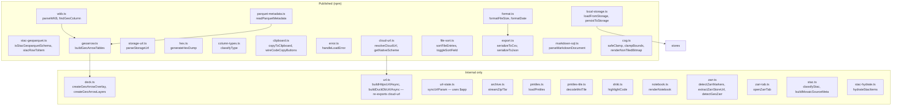

# utils/

Pure utility modules. No Svelte dependency except `url-state.ts` and `url.ts` (store-dependent).
Shared constants live in `src/lib/constants.ts` (imported by stores, query, and utils).

```mermaid
graph TD
    subgraph "Published (npm)"
        WKB[wkb.ts<br/>parseWKB, findGeoColumn]
        SGP[stac-geoparquet.ts<br/>isStacGeoparquetSchema, stacRowToItem]
        GA[geoarrow.ts<br/>buildGeoArrowTables]
        SU[storage-url.ts<br/>parseStorageUrl]
        PM[parquet-metadata.ts<br/>readParquetMetadata]
        FMT[format.ts<br/>formatFileSize, formatDate]
        HEX[hex.ts<br/>generateHexDump]
        CT[column-types.ts<br/>classifyType]
        CB[clipboard.ts<br/>copyToClipboard, wireCodeCopyButtons]
        ERR[error.ts<br/>handleLoadError]
        CU[cloud-url.ts<br/>resolveCloudUrl, getNativeScheme]
        FS[file-sort.ts<br/>sortFileEntries, toggleSortField]
        EXP[export.ts<br/>serializeToCsv, serializeToJson]
        LS[local-storage.ts<br/>loadFromStorage, persistToStorage]
        MSQL[markdown-sql.ts<br/>parseMarkdownDocument]
        COG[cog.ts<br/>safeClamp, clampBounds, renderNonTiledBitmap]
    end
    subgraph "Internal only"
        DECK[deck.ts<br/>createGeoArrowOverlay, createGeoArrowLayers]
        URL[url.ts<br/>buildHttpsUrl/Async, buildDuckDbUrl/Async — re-exports cloud-url]
        US[url-state.ts<br/>syncUrlParam — uses $app]
        ARC[archive.ts<br/>streamZip/Tar]
        PMT[pmtiles.ts<br/>loadPmtiles]
        PMTT[pmtiles-tile.ts<br/>decodeMvtTile]
        SHIKI[shiki.ts<br/>highlightCode]
        NB[notebook.ts<br/>renderNotebook]
        ZARR[zarr.ts<br/>detectZarrMarkers, extractZarrStoreUrl, detectGeoZarr]
        ZTAB[zarr-tab.ts<br/>openZarrTab]
        STAC[stac.ts<br/>classifyStac, buildMosaicSourceMeta]
        STACH[stac-hydrate.ts<br/>hydrateStacItems]
    end
    WKB --> GA
    PM --> GA
    GA --> DECK
    CU --> URL
    FMT --> EXP
    LS --> stores
```

| File | Key Exports | Used by |
|------|-------------|---------|
| `wkb.ts` | `parseWKB()`, `toBinary()`, `findGeoColumn()`, `findGeoColumnFromRows()` | TableViewer, GeoParquetMapViewer, lib/index.ts |
| `stac-geoparquet.ts` | `STAC_GEOPARQUET_REQUIRED_COLUMNS`, `isStacGeoparquetSchema()`, `flattenStacBbox()`, `resolveStacAssetHref()`, `pickStacPrimaryAsset()`, `stacRowToItem()` + types | ViewerRouter (schema sniff), query/stac-geoparquet (per-row → Item), objex-utils (re-export) |
| `geoarrow.ts` | `buildGeoArrowTables()`, `normalizeGeomType()` | TableViewer, GeoParquetMapViewer, lib/index.ts |
| `storage-url.ts` | `parseStorageUrl()`, `looksLikeUrl()`, `describeParseResult()`, `classifyUrl()`, `isKnownBucketHost()`, `STAC_API_PATH_RE`, `Defaults`, `ParsedStorageUrl`, `StorageProvider`, `UrlClassification` | ConnectionDialog, Sidebar, host-detection (isKnownBucketHost), +page.svelte (classifyUrl for STAC API path routing), lib/index.ts |
| `parquet-metadata.ts` | `readParquetMetadata()` (returns `{ schema, topLevelColumns, geo, ... }` — `schema` is leaves only, `topLevelColumns` includes struct parents like `assets`/`bbox` for stac-geoparquet sniffing), `extractEpsgFromGeoMeta()`, `extractBounds()` | TableViewer, ViewerRouter (stac-geoparquet detect), lib/index.ts |
| `format.ts` | `formatFileSize()`, `formatDate()`, `getFileExtension()`, `formatValue()`, `jsonReplacerBigInt()` | StatusBar, FileRow, ArchiveViewer, RawViewer, PmtilesTileInspector, PmtilesArchiveView, AttributeTable, TableGrid, export.ts, lib/index.ts |
| `hex.ts` | `generateHexDump()` | RawViewer, lib/index.ts |
| `column-types.ts` | `classifyType()`, `typeColor()`, `typeLabel()` | TableGrid, lib/index.ts |
| `cloud-url.ts` | `resolveCloudUrl()`, `getNativeScheme()`, `safeDecodeURIComponent()` | url.ts, FileTreeSidebar, +page.svelte, lib/index.ts |
| `file-sort.ts` | `sortFileEntries()`, `toggleSortField()`, `SortConfig`, `SortField`, `SortDirection` | files.svelte.ts, lib/index.ts |
| `export.ts` | `serializeToCsv()`, `serializeToJson()`, `escapeCsvField()`, `exportToCsv()`, `exportToJson()` | TableStatusBar, lib/index.ts |
| `local-storage.ts` | `loadFromStorage()`, `persistToStorage()` | connections.svelte.ts, settings.svelte.ts, query-history.svelte.ts, lib/index.ts |
| `markdown-sql.ts` | `parseMarkdownDocument()`, `interpolateTemplates()`, `markSqlBlocks()` | MarkdownViewer, lib/index.ts |
| `deck.ts` | `createGeoArrowOverlay()`, `createGeoArrowLayers()`, `geojsonFillColor()`, `geojsonLineColor()` | FlatGeobufViewer, GeoParquetMapViewer |
| `url.ts` | `buildHttpsUrl()`, `buildHttpsUrlAsync()`, `buildDuckDbUrl()`, `buildDuckDbUrlAsync()`, `buildStorageUrl()`, `canStreamDirectly()`. The `Async` variants presign for `signed-s3` via `storage/presign.ts` (SigV4 query-string auth) and share a private `tryPresignTab()` helper; viewers that hand the URL to an external fetcher (iframe, range reader, ``) must `await` them | TabBar, CogViewer, TableViewer, FlatGeobufViewer, ArchiveViewer, MediaViewer, CopcViewer, PdfViewer, ZarrMapViewer, StacMapViewer, ZarrViewer, CodeViewer, ImageViewer, PmtilesViewer, PmtilesMapView, TableToolbar |
| `archive.ts` | `streamZipEntriesFromUrl()`, `streamTarEntriesFromUrl()`, `listContents()` | ArchiveViewer |
| `pmtiles.ts` | `getPmtilesProtocol()`, `loadPmtiles()`, `buildPmtilesLayers()`, `TILE_TYPE_LABELS`, `COMPRESSION_LABELS`, `VectorLayerInfo`, `PmtilesMetadata` | PmtilesMapView, PmtilesArchiveView, PmtilesViewer |
| `pmtiles-tile.ts` | `decodeMvtTile()`, `tileMimeType()`, `layerHue()`, `DecodedTile`, `DecodedLayer`, `DecodedFeature` | PmtilesTileInspector |
| `shiki.ts` | `highlightCode()`, `highlightCodeReversed()`, `extensionToShikiLang()`, `getTheme()`, `getReversedTheme()` | PmtilesArchiveView, NotebookViewer, CodeViewer, MarkdownViewer |
| `notebook.ts` | `renderNotebook()` | NotebookViewer |
| `zarr.ts` | `ZARR_MARKER_FILES`, `detectZarrMarkers()`, `extractZarrStoreUrl()`, `fetchHierarchy()`, `probeHierarchy()`, `buildV3Tree()`, `buildV2Tree()`, `discoverV3Children()` (internal), `listS3Children()` (internal), `ensureCodecsRegistered()`, `detectGeoZarr()`, `zarrTileToImageData()`, `ZarrNode`, `ZarrHierarchy`, `GeoZarrInfo`, `DIM_LIKE_NAMES`, `formatCodecs()`, `formatChunkKeys()`, `computeChunkCount()`, `computeChunkSize()`, `computeUncompressed()`, `dtypeByteSize()`, `inferDims()`, `formatShape()` | ZarrViewer, ZarrMapViewer, FileBrowser, +page.svelte |
| `stac.ts` | `classifyStac()`, `isStacItem()`, `isStacFeatureCollection()`, `isStacCollection()`, `isStacCatalog()`, `detectMosaicCapable()`, `detectMultiCogCapable()`, `pickCogAssetHref()`, `stacItemBbox()`, `buildMosaicSourceMeta()`, `extractSentinelBandAssets()`, `hasRgbBands()`, `STAC_COG_ASSET_KEYS`, types (`StacItem`, `StacFeatureCollection`, `StacCollection`, `StacCatalog`, `StacAsset`, `StacLink`, `StacRoutableKind`, `MosaicSourceMeta`, `BandSlot`, `BandMap`) | ViewerRouter, StacTabViewer, StacMosaicViewer, MultiCogViewer, CodeViewer (STAC JSON kind detection) |
| `stac-hydrate.ts` | `hydrateStacItems()`, `absolutizeHref()`, `HydrateOptions`, `HydrateResult` | StacMosaicViewer (Catalog / Collection / FC link-walking with 12-way concurrency, 2000-item cap, progressive onBatch emission, urlToKey route-through for private-bucket catalogs) |
| `zarr-tab.ts` | `openZarrTab()` | FileBrowser, FileTreeSidebar, +page.svelte |
| `url-state.ts` | `syncUrlParam()`, `updateUrlView()`, `getUrlView()`, `getUrlPrefix()`, `hasUrlParam()`, `setRawUrlParam()`, `clearUrlState()`, `buildUrlParam()` | Sidebar, FileTreeSidebar, TableViewer, ZarrViewer, CodeViewer, PmtilesViewer, +page.svelte |
| `pdf.ts` | `loadPdfDocument()` | PdfViewer |
| `model3d.ts` | `createModelScene()`, `loadModel()` | ModelViewer |
| `markdown.ts` | `renderMarkdown()`, `detectRTL()` | MarkdownViewer |
| `map-selection.ts` | `setupSelectionLayer()`, `updateSelection()` | PmtilesMapView, MapViewer |
| `host-detection.ts` | `detectHostBucket()` | stores/connections, Sidebar |
| `connection-identity.ts` | `connectionIdentityKey()`, `isSameConnectionIdentity()`, `normalizeEndpoint()`, `normalizeProvider()`, `ConnectionIdentityInput` | stores/connections, lib/index.ts |
| `evidence-context.ts` | `EvidenceContext` | MarkdownViewer |
| `clipboard.ts` | `copyToClipboard()`, `wireCodeCopyButtons()` | TabBar, CodeViewer, NotebookViewer, MarkdownViewer, lib/index.ts |
| `cog.ts` | `safeClamp()`, `clampBounds()`, `buildDataTypeLabel()`, `fitCogBounds()`, `getMaxTextureSize()`, `cleanupNativeBitmap()`, `renderNonTiledBitmap()`, `SF_LABELS`, `CogInfo`, `GeoBounds`, `BandConfig`, `PixelValue`, `ColorRampId` (= `ColormapName`, 107 entries), `defaultBandConfig()` (caps RGB defaults at bandCount ≤ 4; default single-band ramp is `terrain` for int/float, `viridis` for uint), `isDefaultBandConfig()`, `needsCustomPipelineForConfig()` (forces CPU path when `geotiff.count > 4`, or `=== 4` in RGB mode to bake alpha=255 and avoid band-4-as-alpha), `CustomGetTileDataOptions` + `HISTOGRAM_BIN_COUNT`, `createConfigurableGetTileData(geotiff, config, opts?)` (RGB bakes RGBA; single-band normalizes band N into `r`, reserves `r=0` for nodata, emits a 64-bin histogram via `opts.onHistogram`), `createCustomGetTileData(geotiff, opts?)`, `buildCustomRenderTile(config, rescale?)` (RGB → `{image}`; single-band → `[Sampler2DArrayPrecision, FilterNoDataVal, LinearRescale?, Colormap]` with sprite-backed `colormapTexture` + `colormapIndex` looked up via `COLORMAP_INDEX[config.colorRamp]`), `readPixelAtLngLat()`, `resolveProj4Def()`, `createEpsgResolver()`, `RescaleConfig`, `DEFAULT_RESCALE`, `isRescaleActive()`, `createRescaledPipeline()`, `buildBandRenderPipeline()` (FilterNoDataVal + LinearRescale composer for MultiCOGLayer/mosaic callers), `BandRenderPipelineOptions`, `CogTagInfo`, `inspectCogTags()`, `normalizeCogGeotiff()`, `ResolvedCogPipeline`, `SelectCogPipelineOptions` (adds `onHistogram`), `selectCogPipeline()`. The old `COLOR_RAMP_STOPS` / `interpolateRamp` / `rampToGradientCss` / `customRenderTile` exports were retired when single-band rendering moved to the GPU sprite; the file-top comment in `cog.ts` points future readers to the sprite path. `Sampler2DArrayPrecision` is a local-only shader-module shim that prepends `precision highp sampler2DArray;` at `fs:#decl` to work around a missing precision qualifier in `@developmentseed/deck.gl-raster@0.6.0-alpha.1`'s `Colormap` module (remove once upstream fixes). | CogViewer, CogControls, StacMosaicViewer, MultiCogViewer, lib/index.ts |
| `colormap-sprite.ts` | `loadColormapSprite()` (session-level `Promise<ImageData>` decode of `@developmentseed/deck.gl-raster/gpu-modules/colormaps.png` — 256×107 PNG, 107 ramps, ~16 KB), `getColormapTexture(device)` (per-device `sampler2DArray` Texture, WeakMap-cached so viewers share one upload), `spriteBackgroundStyle(name, heightPx)` (CSS `background-image` + `background-size` + `background-position` string that renders one sprite row at a target pixel height), `COLORMAP_SPRITE_URL` / `COLORMAP_SPRITE_WIDTH` / `COLORMAP_SPRITE_LAYERS` (raw sprite metadata for UI overrides), `COLORMAP_NAMES` (107-entry sorted `ColormapName[]`). Re-exports `COLORMAP_INDEX` + `ColormapName` from `@developmentseed/deck.gl-raster/gpu-modules`. Single entry point for GPU colormap rendering; used by `cog.ts::buildCustomRenderTile` single-band branch and `CogControls.svelte`. | cog.ts, CogControls.svelte |
| `geometry-type.ts` | `parseGeometryTypeCrs()`, `isWgs84Crs()`, `buildTransformExpr()`, `wrapWkbWithCrs()`, `GeometryTypeInfo` | query/wasm.ts, TableViewer |
| `error.ts` | `handleLoadError()` | ImageViewer, MediaViewer, RawViewer, CodeViewer, PdfViewer, ModelViewer, MarkdownViewer, NotebookViewer, lib/index.ts |
