# utils/

Pure utility modules. No Svelte dependency except `url-state.ts` and `analytics.ts`.

```mermaid
graph TD
    subgraph "Published (npm)"
        WKB[wkb.ts<br/>parseWKB, findGeoColumn]
        GA[geoarrow.ts<br/>buildGeoArrowTables]
        SU[storage-url.ts<br/>parseStorageUrl]
        PM[parquet-metadata.ts<br/>readParquetMetadata]
        FMT[format.ts<br/>formatFileSize, formatDate]
        HEX[hex.ts<br/>generateHexDump]
        CT[column-types.ts<br/>classifyType]
    end
    subgraph "Internal only"
        DECK[deck.ts<br/>createDeckOverlay, createGeoArrowOverlay]
        URL[url.ts<br/>buildHttpsUrl, buildDuckDbUrl]
        US[url-state.ts<br/>syncUrlParam — uses $app]
        ARC[archive.ts<br/>streamZip/Tar]
        PMT[pmtiles.ts<br/>loadPmtiles]
        SHIKI[shiki.ts<br/>highlightCode]
        NB[notebook.ts<br/>renderNotebook]
        ZARR[zarr.ts<br/>fetchConsolidated]
    end
    WKB --> GA
    PM --> GA
    GA --> DECK
```

| File | Key Exports | Used by |
|------|-------------|---------|
| `wkb.ts` | `parseWKB()`, `toBinary()`, `findGeoColumn()`, `findGeoColumnFromRows()` | TableViewer, GeoParquetMapViewer, lib/index.ts |
| `geoarrow.ts` | `buildGeoArrowTables()`, `normalizeGeomType()` | TableViewer, GeoParquetMapViewer, lib/index.ts |
| `storage-url.ts` | `parseStorageUrl()`, `looksLikeUrl()`, `Defaults` | ConnectionDialog, Sidebar, lib/index.ts |
| `parquet-metadata.ts` | `readParquetMetadata()`, `extractEpsgFromGeoMeta()`, `extractBounds()` | TableViewer, lib/index.ts |
| `format.ts` | `formatFileSize()`, `formatDate()`, `getFileExtension()` | StatusBar, FileRow, ArchiveViewer, RawViewer, lib/index.ts |
| `hex.ts` | `generateHexDump()` | RawViewer, lib/index.ts |
| `column-types.ts` | `classifyType()`, `typeColor()`, `typeLabel()` | TableGrid, lib/index.ts |
| `deck.ts` | `createDeckOverlay()`, `createGeoArrowOverlay()`, `createGeoArrowLayers()` | FlatGeobufViewer, GeoParquetMapViewer |
| `url.ts` | `buildHttpsUrl()`, `buildDuckDbUrl()`, `canStreamDirectly()` | TabBar, FileTreeSidebar, CogViewer, TableViewer, FlatGeobufViewer, ArchiveViewer, MediaViewer, CopcViewer, PdfViewer, ZarrMapViewer, StacMapViewer, ZarrViewer, CodeViewer, ImageViewer, PmtilesViewer, TableToolbar |
| `archive.ts` | `streamZipEntriesFromUrl()`, `streamTarEntriesFromUrl()`, `listContents()` | ArchiveViewer |
| `pmtiles.ts` | `loadPmtiles()`, `buildPmtilesLayers()` | PmtilesMapView, PmtilesArchiveView, PmtilesViewer |
| `shiki.ts` | `highlightCode()`, `extensionToShikiLang()` | PmtilesArchiveView, NotebookViewer, CodeViewer |
| `notebook.ts` | `renderNotebook()` | NotebookViewer |
| `zarr.ts` | `fetchConsolidated()`, `probeWithZarrita()` | ZarrViewer |
| `url-state.ts` | `syncUrlParam()`, `updateUrlView()` | Sidebar, FileTreeSidebar, TableViewer, ZarrViewer, CodeViewer, PmtilesViewer, +page.svelte |
| `analytics.ts` | `initAnalytics()`, `capturePageview()` | +layout.svelte |
| `export.ts` | `exportToCsv()`, `exportToJson()` | TableStatusBar |
| `pdf.ts` | `loadPdfDocument()` | PdfViewer |
| `model3d.ts` | `createModelScene()`, `loadModel()` | ModelViewer |
| `markdown.ts` | `renderMarkdown()`, `detectRTL()` | MarkdownViewer |
| `map-selection.ts` | `setupSelectionLayer()`, `updateSelection()` | PmtilesMapView, MapViewer |
| `host-detection.ts` | `detectHostBucket()` | stores/connections, Sidebar |
| `markdown-sql.ts` | `parseMarkdownDocument()`, `interpolateTemplates()` | MarkdownViewer |
| `evidence-context.ts` | `EvidenceContext` | MarkdownViewer |
